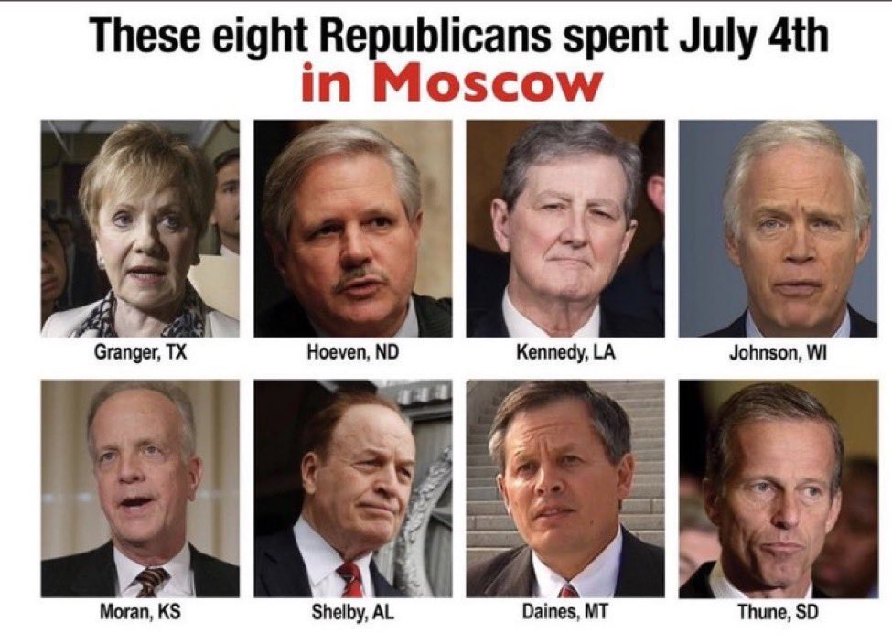
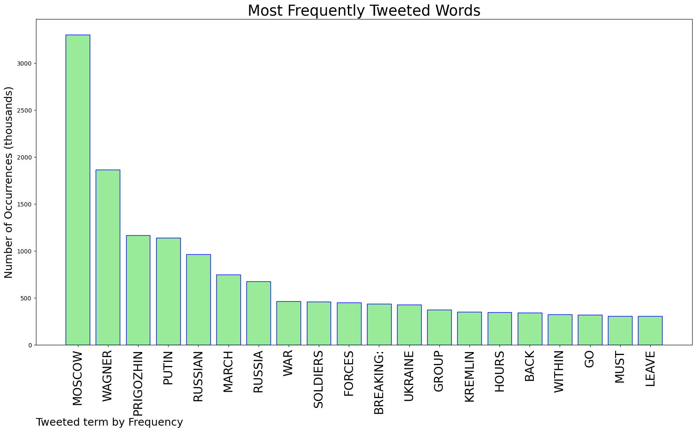
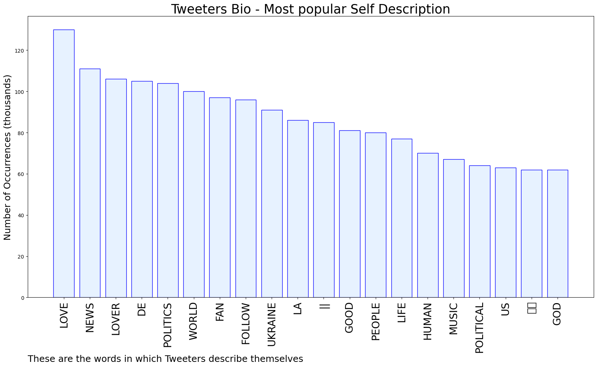

# MURCHIE85 TWITTER PROCESSING 
&#x1F34E; **TOPIC = "Moscow"**

## AUTOMATED RESEARCH SUMMARY

*note: Image pulled from web automatically, not connected to author.
  
<b> This report is AUTOMATED and not hand crafted, it is designed for pulling metrics on a given keyword or hashtag and performs a series of reporting and analysis.</b>

|                **Sample-Tweets**        |
| :-------------: |
| RT @mfa_russia: ⭐️ #OTD in 1945, a historic parade was held in Moscow to mark the USSR’s triumph over Nazi Germany in the Great Patriotic W… |
| RT @ABarbashin: One takeaway - if you have an army you can nearly reach Moscow in less than 24 hours from the border of Ukraine. |
| RT @visegrad24: Crazy to think we were just 200km short from getting to live tweet the Battle of Moscow 2023. |

The most popular user is: **Arroyo523751942**

 RT @pauldarketh: help finish it, just connect and verify your wallet. 👇

🔗 https://t.co/gKgBPSUhnJ

#Putin #KiaraAdvani #UFCJacksonville #W…

## RELATED METRICS 
| Metric | Value |
| ------------- | ------------- |
| #1 Most tweeted to  | **DefenceU** |
| #2 Most tweeted to  | **visegrad24** |
| #3 Most tweeted to  | **Osinttechnical** |
| NewProfiles (less than 10 days) | 0.14%  |
| Tweeters with < 10 followers  | 3.2%|
| Tweeters with > 1000000 followers  | 0.1%  |

## MOST POPULAR TWEET TERMS 

| Popularity Rank  | Term |
| ------------- | ------------- |
| first  | **MOSCOW**  |
| second  | **WAGNER**  |
| third  | **PRIGOZHIN** |
| fourth  | **PUTIN**  |
| fifth  | **RUSSIAN**  |

## Twitter Bio Analysis
### SENTIMENT ANALYSIS

VIEWS WERE : **SUBJECTIVE**  (40.0%) & **NEGATIVELY-SUBJECTIVE** (13.33%) **OBJECTIVE** (46.67%)

### TWEET SAMPLE 
| Random value picked from array |
| ------------- |
|RT @amuse: PEACE: Looks like the coup in Russia is over. The CIA's operation seems to have failed. Wagner leader Prigozhin ‘agrees to STAND… |

### MOST RETWEETED 

| The most retweeted user is: **Arroyo523751942**  |
| ------------- |
| RT @pauldarketh: help finish it, just connect and verify your wallet. 👇🔗 https://t.co/gKgBPSUhnJ#Putin #KiaraAdvani #UFCJacksonville #W… |

### CONCLUSION & EXTERNAL ANALYSIS

*This is my [Adam McMurchie`s] opinion on the data from the tweets, it serves as no objective truth.Since the tweets themselves are a mixture of fact & opinion. 
Authors analytical summary on request.
**RECOMMENDATIONS** WILL BE UPDATED IN NEXT  24 HOURS  