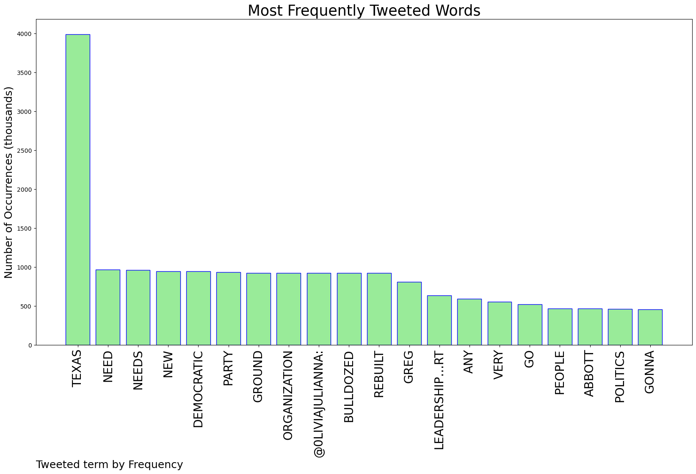
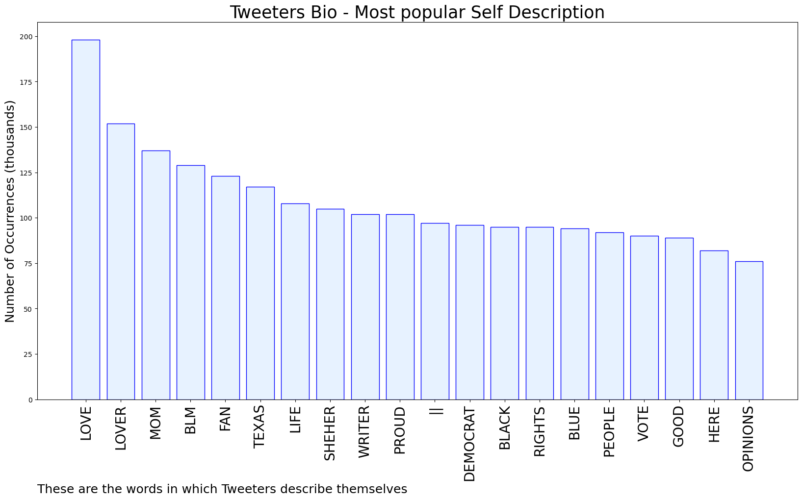

# MURCHIE85 TWITTER PROCESSING 
&#x1F34E; **TOPIC = "Not in Texas"**

## AUTOMATED RESEARCH SUMMARY

*note: Image pulled from web automatically, not connected to author.
  
<b> This report is AUTOMATED and not hand crafted, it is designed for pulling metrics on a given keyword or hashtag and performs a series of reporting and analysis.</b>

|                **Sample-Tweets**        |
| :-------------: |
| RT @haze_tkn: Also got my first tekken medal! Might not mean much but it was huge for me especially considering I was able to make some clu… |
| @alexisniiic Don't worry, our governor is very kind to refugees. He let's them in at record numbers to have the bes… https://t.co/26rAlp5WdM |
| Yeah may not be this red tsunami bullshit #they were clamoring about, but it’s hitting hard on the red states like here in #Texas. |

The most popular user is: **Tower4rm_Texas**

 RT @RealJayWilliams: Kyrie Irving thoughts:

I do NOT take the position that I speak for ALL black people. I speak for myself &amp; my experien…

## RELATED METRICS 
| Metric | Value |
| ------------- | ------------- |
| #1 Most tweeted to  | **0liviajulianna** |
| #2 Most tweeted to  | **JuJuBreauxD** |
| #3 Most tweeted to  | **SaraGonzalesTX** |
| NewProfiles (less than 10 days) | 0.82%  |
| Tweeters with < 10 followers  | 4.46%|
| Tweeters with > 1000000 followers  | 0.0%  |

## MOST POPULAR TWEET TERMS 

| Popularity Rank  | Term |
| ------------- | ------------- |
| first  | **TEXAS**  |
| second  | **NEED**  |
| third  | **NEEDS** |
| fourth  | **NEW**  |
| fifth  | **DEMOCRATIC**  |

## Twitter Bio Analysis
### SENTIMENT ANALYSIS

VIEWS WERE : **SUBJECTIVE**  (40.0%) & **NEGATIVELY-SUBJECTIVE** (13.33%) **OBJECTIVE** (46.67%)

### TWEET SAMPLE 
| Random value picked from array |
| ------------- |
|RT @Paultx890: @qtseven No actually it is not.  And that is the problem. These vote numbers from across the state are different from how Te… |

### MOST RETWEETED 

| The most retweeted user is: **Tower4rm_Texas**  |
| ------------- |
| RT @RealJayWilliams: Kyrie Irving thoughts:I do NOT take the position that I speak for ALL black people. I speak for myself &amp; my experien… |

### CONCLUSION & EXTERNAL ANALYSIS

*This is my [Adam McMurchie`s] opinion on the data from the tweets, it serves as no objective truth.Since the tweets themselves are a mixture of fact & opinion. 
Authors analytical summary on request.
**RECOMMENDATIONS** WILL BE UPDATED IN NEXT  24 HOURS  