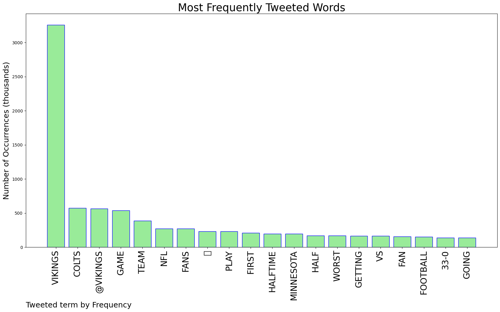
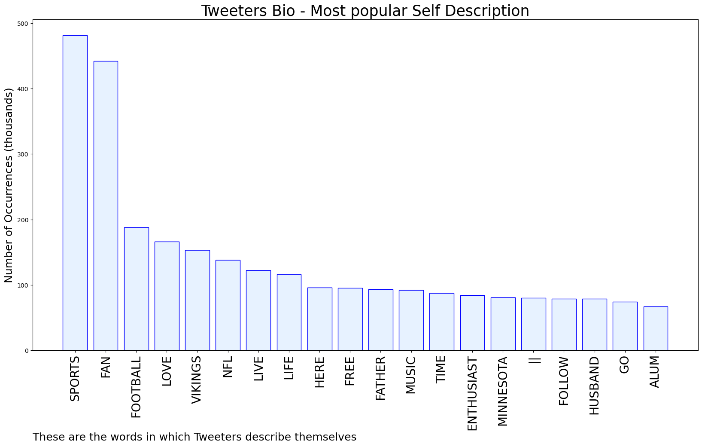

# MURCHIE85 TWITTER PROCESSING 
&#x1F34E; **TOPIC = "Vikings"**

## AUTOMATED RESEARCH SUMMARY

*note: Image pulled from web automatically, not connected to author.
  
<b> This report is AUTOMATED and not hand crafted, it is designed for pulling metrics on a given keyword or hashtag and performs a series of reporting and analysis.</b>

|                **Sample-Tweets**        |
| :-------------: |
| I wonder how many bet on the Vikings cause WOW! |
| Please don’t  associate me with the Minnesota Vikings anymore. All jokes aside |
| @voguish The Vikings trying forget all 33 right now 😂 |

The most popular user is: **CiNDER_JOE**

 RT @Vikings: Iconic. https://t.co/LiaJjsWjd8

## RELATED METRICS 
| Metric | Value |
| ------------- | ------------- |
| #1 Most tweeted to  | **Vikings** |
| #2 Most tweeted to  | **BaldyNFL** |
| #3 Most tweeted to  | **nflstreamhub** |
| NewProfiles (less than 10 days) | 0.86%  |
| Tweeters with < 10 followers  | 6.32%|
| Tweeters with > 1000000 followers  | 0.06%  |

## MOST POPULAR TWEET TERMS 

| Popularity Rank  | Term |
| ------------- | ------------- |
| first  | **VIKINGS**  |
| second  | **COLTS**  |
| third  | **@VIKINGS** |
| fourth  | **GAME**  |
| fifth  | **TEAM**  |

## Twitter Bio Analysis
### SENTIMENT ANALYSIS

VIEWS WERE : **SUBJECTIVE**  (40.0%) & **NEGATIVELY-SUBJECTIVE** (13.33%) **OBJECTIVE** (46.67%)

### TWEET SAMPLE 
| Random value picked from array |
| ------------- |
|RT @WillRagatz: Officials blew this play dead, costing the Vikings a touchdown. Pittman was still fighting for yards. Absurd call. https://… |

### MOST RETWEETED 

| The most retweeted user is: **CiNDER_JOE**  |
| ------------- |
| RT @Vikings: Iconic. https://t.co/LiaJjsWjd8 |

### CONCLUSION & EXTERNAL ANALYSIS

*This is my [Adam McMurchie`s] opinion on the data from the tweets, it serves as no objective truth.Since the tweets themselves are a mixture of fact & opinion. 
Authors analytical summary on request.
**RECOMMENDATIONS** WILL BE UPDATED IN NEXT  24 HOURS  