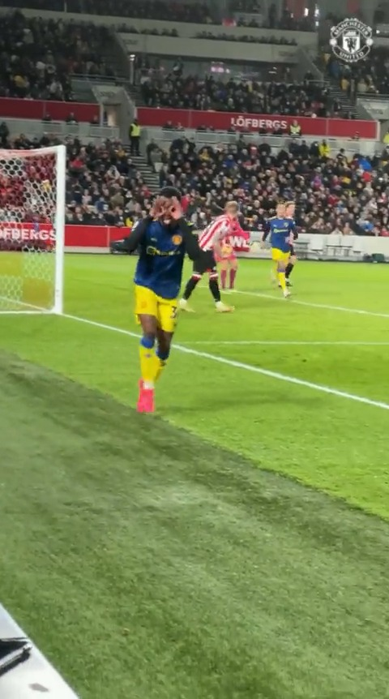
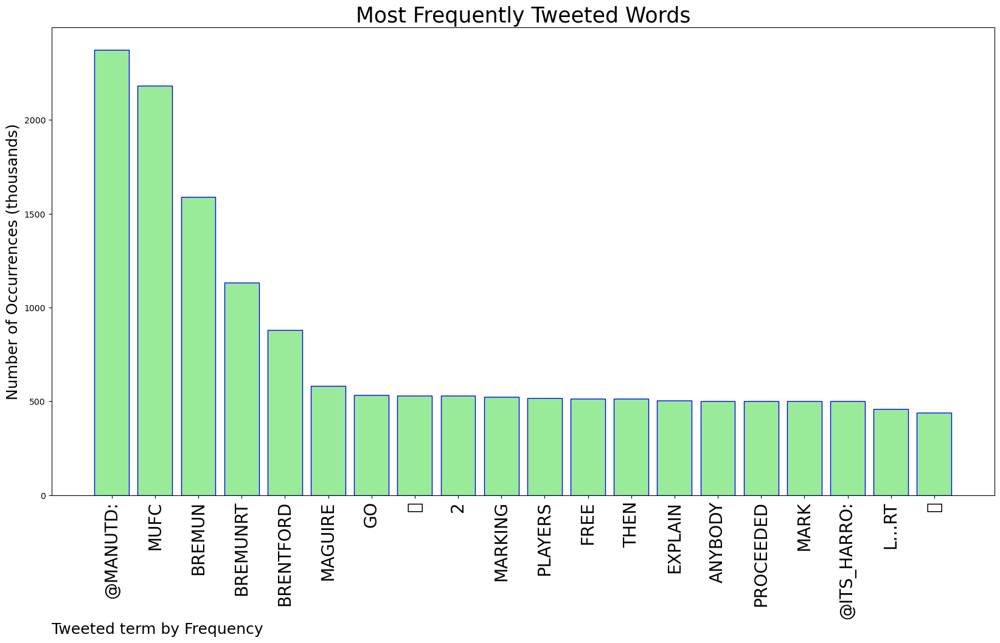
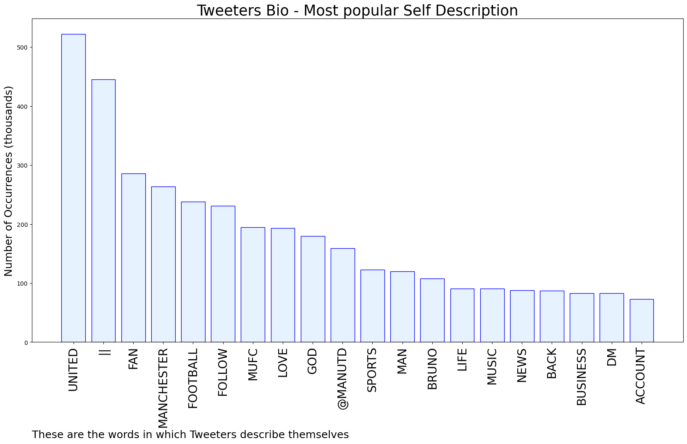

# MURCHIE85 TWITTER PROCESSING 
&#x1F34E; **TOPIC = "#BREMUN"**

## AUTOMATED RESEARCH SUMMARY

*note: Image pulled from web automatically, not connected to author.
  
<b> This report is AUTOMATED and not hand crafted, it is designed for pulling metrics on a given keyword or hashtag and performs a series of reporting and analysis.</b>

|                **Sample-Tweets**        |
| :-------------: |
| RT @ManUtd: Things you love to see! 😍👏#MUFC | #BREMUN https://t.co/PlebBkLZFh |
| RT @OfficialFPL: #BREMUN BONUS POINTS AS IT STANDS3 - Fernandes2 - Toney, Greenwood#FPL https://t.co/Y5uQDLs4AX |
| RT @ManUtd: Praise for our second-half performance! 🌟💬 @DalotDiogo#MUFC | #BREMUN |

The most popular user is: **FGamadid**

 RT @ManUtd: 🚨 Presenting United's line-up for #BREMUN... 

#MUFC | #PL

## RELATED METRICS 
| Metric | Value |
| ------------- | ------------- |
| #1 Most tweeted to  | **ManUtd** |
| #2 Most tweeted to  | **Its_Harro** |
| #3 Most tweeted to  | **Creative_DMS** |
| NewProfiles (less than 10 days) | 1.34%  |
| Tweeters with < 10 followers  | 5.0%|
| Tweeters with > 1000000 followers  | 0.14%  |

## MOST POPULAR TWEET TERMS 

| Popularity Rank  | Term |
| ------------- | ------------- |
| first  | **@MANUTD:**  |
| second  | **MUFC**  |
| third  | **BREMUN** |
| fourth  | **BREMUNRT**  |
| fifth  | **BRENTFORD**  |

## Twitter Bio Analysis
### SENTIMENT ANALYSIS

VIEWS WERE : **SUBJECTIVE**  (46.67%) & **NEGATIVELY-SUBJECTIVE** (6.67%) **OBJECTIVE** (46.67%)

### TWEET SAMPLE 
| Random value picked from array |
| ------------- |
|RT @ManUtd: Does Ralf see @B_Fernandes8 in the no.8 or no.10 role moving forward for United? 🤔Our interim boss has revealed his thoughts… |

### MOST RETWEETED 

| The most retweeted user is: **FGamadid**  |
| ------------- |
| RT @ManUtd: 🚨 Presenting United's line-up for #BREMUN... #MUFC | #PL |

### CONCLUSION & EXTERNAL ANALYSIS

*This is my [Adam McMurchie`s] opinion on the data from the tweets, it serves as no objective truth.Since the tweets themselves are a mixture of fact & opinion. 
Authors analytical summary on request.
**RECOMMENDATIONS** WILL BE UPDATED IN NEXT  24 HOURS  