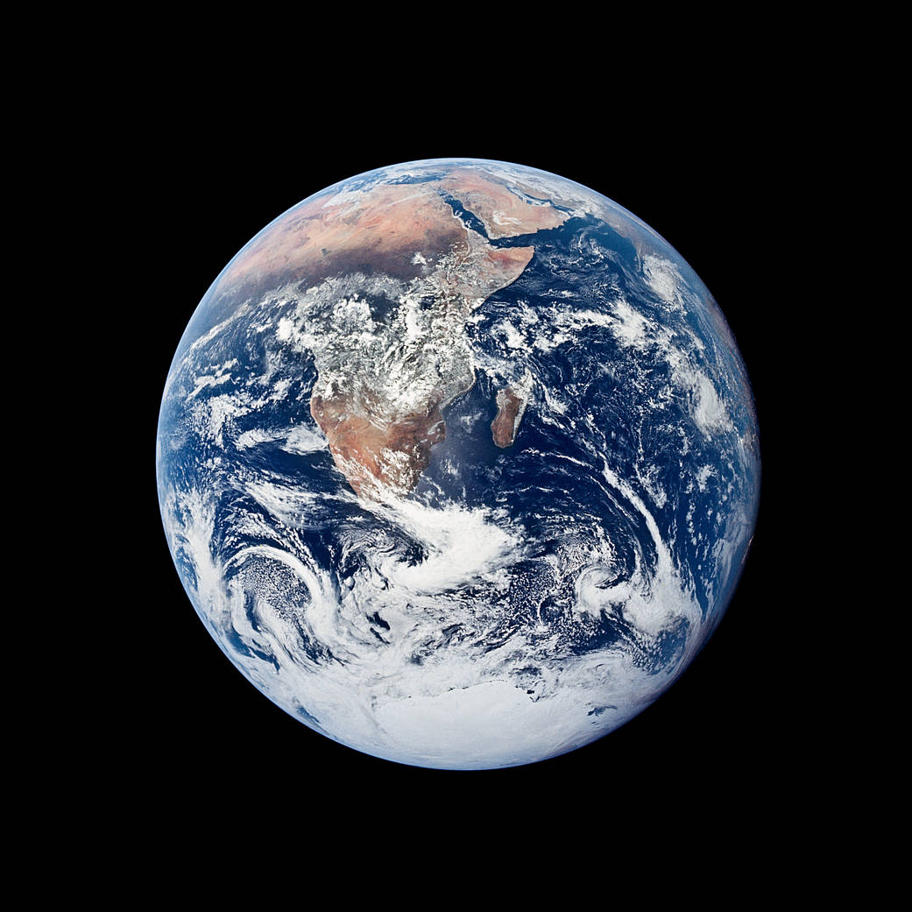
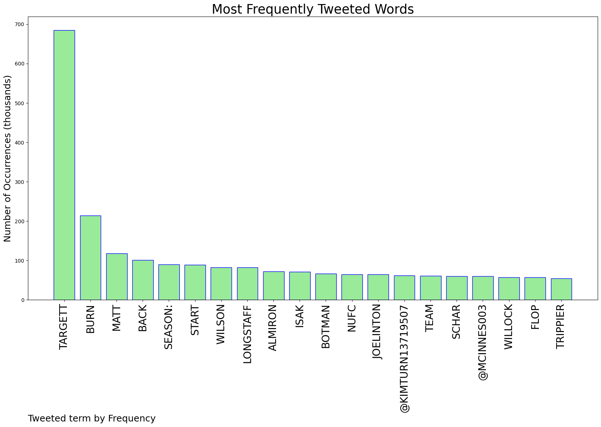
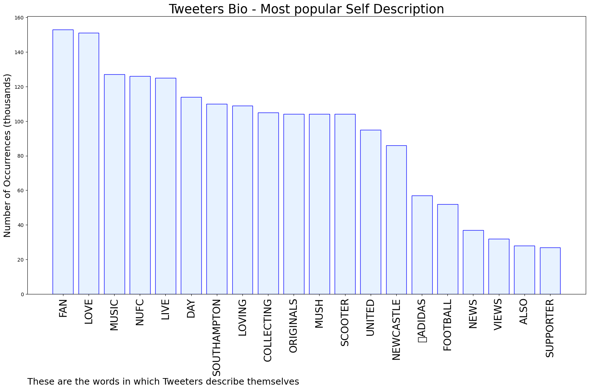

# MURCHIE85 TWITTER PROCESSING 
&#x1F34E; **TOPIC = "Targett"**

## AUTOMATED RESEARCH SUMMARY

*note: Image pulled from web automatically, not connected to author.
  
<b> This report is AUTOMATED and not hand crafted, it is designed for pulling metrics on a given keyword or hashtag and performs a series of reporting and analysis.</b>

|                **Sample-Tweets**        |
| :-------------: |
| @JInufc18 targett is sexy |
| #BBCFootball very surprised to see Dan Burn retaining his place, given (a) how badly he played against Villa and (b… https://t.co/eVVHxQWqhS |
| @Edit_Kev @heycallumwilson a relationship that existed and performed very well best part of last season. I’m sure b… https://t.co/bACCIeojB8 |

The most popular user is: **targett_deb**

 RT @NASAEarth: Share if you love Earth. 💚 #EarthDay https://t.co/OptY8Qj3zy

## RELATED METRICS 
| Metric | Value |
| ------------- | ------------- |
| #1 Most tweeted to  | **NUFC** |
| #2 Most tweeted to  | **targett_daniel** |
| #3 Most tweeted to  | **KimTurn13719507** |
| NewProfiles (less than 10 days) | 0.0%  |
| Tweeters with < 10 followers  | 2.92%|
| Tweeters with > 1000000 followers  | 0.08%  |

## MOST POPULAR TWEET TERMS 

| Popularity Rank  | Term |
| ------------- | ------------- |
| first  | **TARGETT**  |
| second  | **BURN**  |
| third  | **MATT** |
| fourth  | **BACK**  |
| fifth  | **SEASON:**  |

## Twitter Bio Analysis
### SENTIMENT ANALYSIS

VIEWS WERE : **SUBJECTIVE**  (20.0%) & **NEGATIVELY-SUBJECTIVE** (13.33%) **OBJECTIVE** (66.67%)

### TWEET SAMPLE 
| Random value picked from array |
| ------------- |
|#NUFC line-up to face Spurs: Pope; Trippier, Schar, Botman, Burn; Guimaraes, Longstaff, Willock; Murphy, Joelinton,… https://t.co/wwcABgsUUA |

### MOST RETWEETED 

| The most retweeted user is: **targett_deb**  |
| ------------- |
| RT @NASAEarth: Share if you love Earth. 💚 #EarthDay https://t.co/OptY8Qj3zy |

### CONCLUSION & EXTERNAL ANALYSIS

*This is my [Adam McMurchie`s] opinion on the data from the tweets, it serves as no objective truth.Since the tweets themselves are a mixture of fact & opinion. 
Authors analytical summary on request.
**RECOMMENDATIONS** WILL BE UPDATED IN NEXT  24 HOURS  