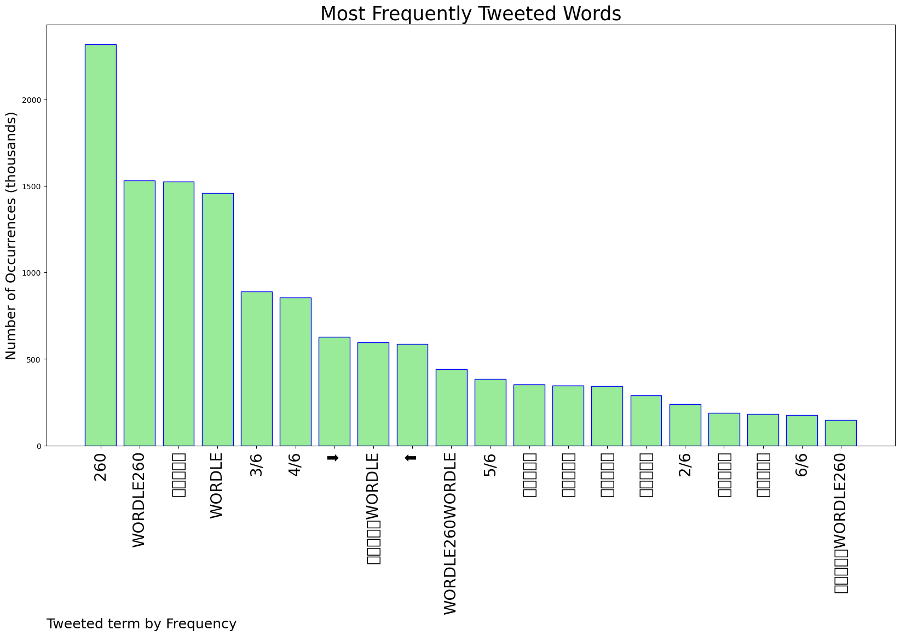
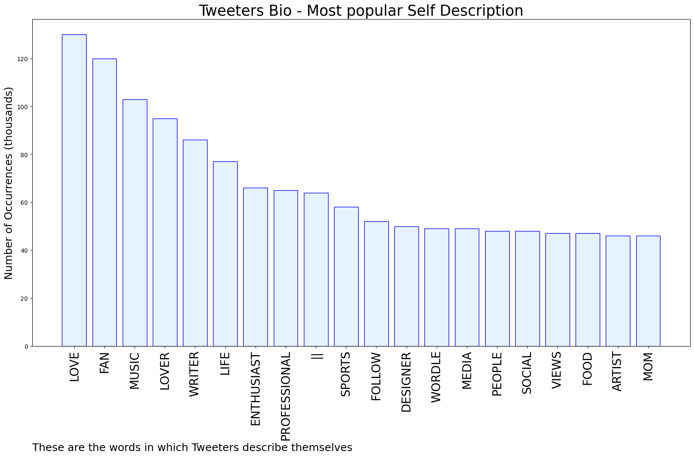

# MURCHIE85 TWITTER PROCESSING 
&#x1F34E; **TOPIC = "#Wordle260"**

## AUTOMATED RESEARCH SUMMARY

*note: Image pulled from web automatically, not connected to author.
  
<b> This report is AUTOMATED and not hand crafted, it is designed for pulling metrics on a given keyword or hashtag and performs a series of reporting and analysis.</b>

|                **Sample-Tweets**        |
| :-------------: |
| #Wordle260 Wordle 260 3/6⬛⬛🟨⬛🟨⬛🟨🟨⬛🟨🟩🟩🟩🟩🟩day is off to a good start |
| This is what happens when some words use only one vowel and too many consonants #Wordle #Wordle260 Wordle 260 5/6… https://t.co/voJpSCWEfc |
| Wordle 260 4/6#Wordle260⬛⬛⬛⬛🟨🟨⬛⬛⬛⬛⬛🟨🟨🟨🟩🟩🟩🟩🟩🟩 |

The most popular user is: **napstergastly**

 RT @bgay4real: me at 12:01 AM getting the daily Wordle correct in less than six tries:

#Wordle260 https://t.co/VbwIxtkd5Y

## RELATED METRICS 
| Metric | Value |
| ------------- | ------------- |
| #1 Most tweeted to  | **bgay4real** |
| #2 Most tweeted to  | **asamant93** |
| #3 Most tweeted to  | **nytimes** |
| NewProfiles (less than 10 days) | 1.22%  |
| Tweeters with < 10 followers  | 13.35%|
| Tweeters with > 1000000 followers  | 0.0%  |

## MOST POPULAR TWEET TERMS 

| Popularity Rank  | Term |
| ------------- | ------------- |
| first  | **260**  |
| second  | **WORDLE260**  |
| third  | **🟩🟩🟩🟩🟩** |
| fourth  | **WORDLE**  |
| fifth  | **3/6**  |

## Twitter Bio Analysis
### SENTIMENT ANALYSIS

VIEWS WERE : **SUBJECTIVE**  (20.0%) & **NEGATIVELY-SUBJECTIVE** (20.0%) **OBJECTIVE** (60.0%)

### TWEET SAMPLE 
| Random value picked from array |
| ------------- |
|#Wordle #Wordle260 #Sunday Wordle 260 3/6⬜🟨⬜⬜⬜🟨🟨⬜🟨🟩🟩🟩🟩🟩🟩 |

### MOST RETWEETED 

| The most retweeted user is: **napstergastly**  |
| ------------- |
| RT @bgay4real: me at 12:01 AM getting the daily Wordle correct in less than six tries:#Wordle260 https://t.co/VbwIxtkd5Y |

### CONCLUSION & EXTERNAL ANALYSIS

*This is my [Adam McMurchie`s] opinion on the data from the tweets, it serves as no objective truth.Since the tweets themselves are a mixture of fact & opinion. 
Authors analytical summary on request.
**RECOMMENDATIONS** WILL BE UPDATED IN NEXT  24 HOURS  