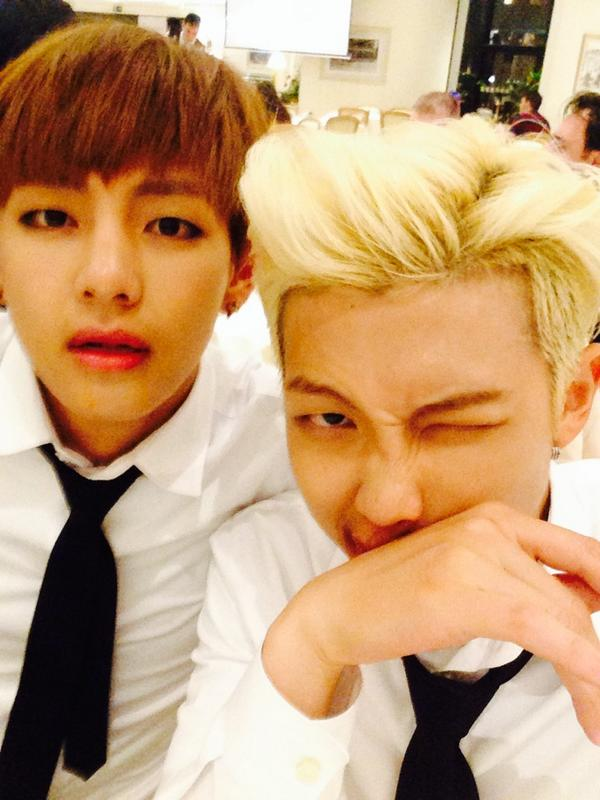
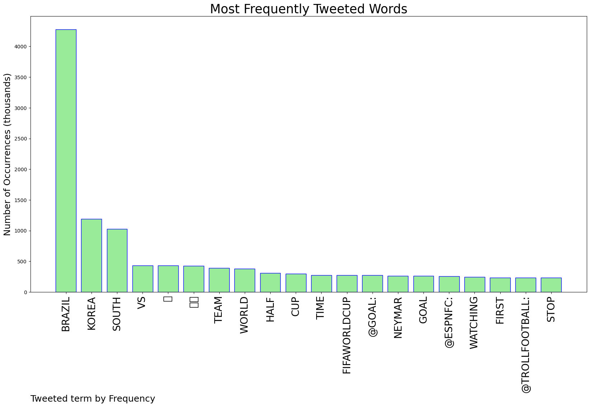
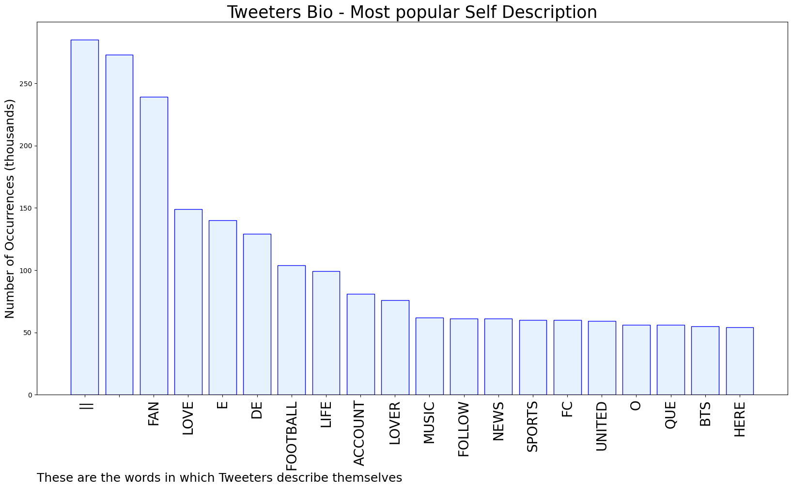

# MURCHIE85 TWITTER PROCESSING 
&#x1F34E; **TOPIC = "Brazil"**

## AUTOMATED RESEARCH SUMMARY

*note: Image pulled from web automatically, not connected to author.
  
<b> This report is AUTOMATED and not hand crafted, it is designed for pulling metrics on a given keyword or hashtag and performs a series of reporting and analysis.</b>

|                **Sample-Tweets**        |
| :-------------: |
| RT @FIFAWorldCup: Brazil take a four-goal lead into the break 👏#FIFAWorldCup | #Qatar2022 |
| Brazil is Braziling today. The men had the game on lock before the half hour mark yc |
| ⚽FIFA World CupBrazil vs South Korea FIFA World Cup🔴𝙇𝙄𝙑𝙀🔴 https://t.co/0tkfE3NRdd🔴𝙇𝙄𝙑𝙀🔴 https://t.co/IFUtfAOnLZ… https://t.co/yfihaejpjf |

The most popular user is: **ltiseuphoria**

 RT @BTS_twt: thx brazil!! http://t.co/FFfREhBb3o

## RELATED METRICS 
| Metric | Value |
| ------------- | ------------- |
| #1 Most tweeted to  | **goal** |
| #2 Most tweeted to  | **ESPNFC** |
| #3 Most tweeted to  | **TrollFootball** |
| NewProfiles (less than 10 days) | 1.8%  |
| Tweeters with < 10 followers  | 7.1%|
| Tweeters with > 1000000 followers  | 0.06%  |

## MOST POPULAR TWEET TERMS 

| Popularity Rank  | Term |
| ------------- | ------------- |
| first  | **BRAZIL**  |
| second  | **KOREA**  |
| third  | **SOUTH** |
| fourth  | **VS**  |
| fifth  | **⚽️**  |

## Twitter Bio Analysis
### SENTIMENT ANALYSIS

VIEWS WERE : **SUBJECTIVE**  (53.33%) & **NEGATIVELY-SUBJECTIVE** (13.33%) **OBJECTIVE** (33.33%)

### TWEET SAMPLE 
| Random value picked from array |
| ------------- |
|RT @hinacantora: HELLO HEYOON JEONG ?? 🚨 ARE YOU OKAY?? 🚨 OR ARE YOU BUSY CRYING WATCHING KOREA 🇰🇷 LOSE? LMAOO BRAZIL ZIL ZIL 🇧🇷🇧🇷🇧🇷🇧🇷🇧🇷 |

### MOST RETWEETED 

| The most retweeted user is: **ltiseuphoria**  |
| ------------- |
| RT @BTS_twt: thx brazil!! http://t.co/FFfREhBb3o |

### CONCLUSION & EXTERNAL ANALYSIS

*This is my [Adam McMurchie`s] opinion on the data from the tweets, it serves as no objective truth.Since the tweets themselves are a mixture of fact & opinion. 
Authors analytical summary on request.
**RECOMMENDATIONS** WILL BE UPDATED IN NEXT  24 HOURS  