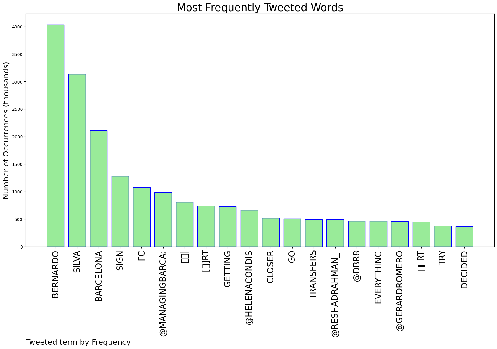
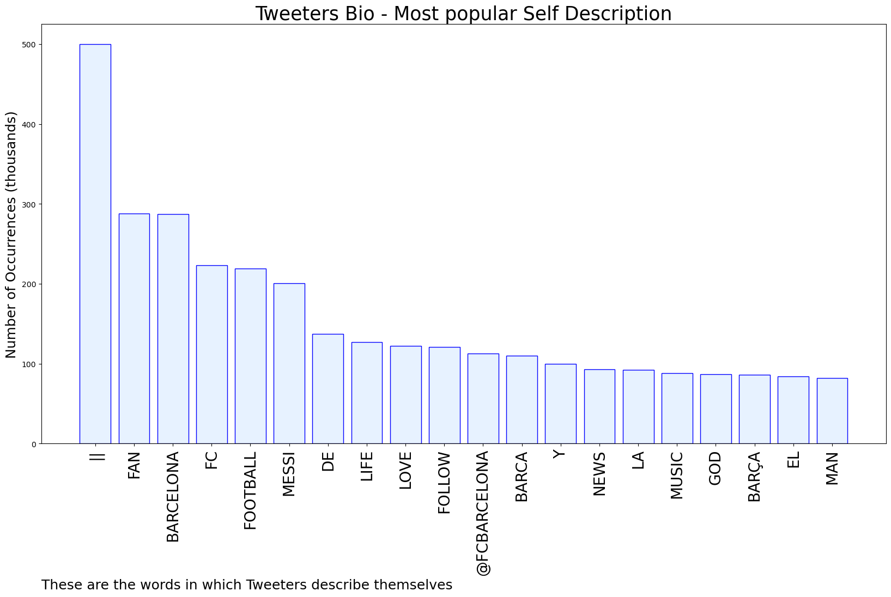

# MURCHIE85 TWITTER PROCESSING 
&#x1F34E; **TOPIC = "Bernardo"**

## AUTOMATED RESEARCH SUMMARY

*note: Image pulled from web automatically, not connected to author.
  
<b> This report is AUTOMATED and not hand crafted, it is designed for pulling metrics on a given keyword or hashtag and performs a series of reporting and analysis.</b>

|                **Sample-Tweets**        |
| :-------------: |
| RT @ReshadRahman_: ❗️Barcelona will try their absolute best to sign Bernardo Silva. @DBR8 #Transfers 🇵🇹 |
| RT @ReshadRahman_: ❗️Barcelona will try their absolute best to sign Bernardo Silva. @DBR8 #Transfers 🇵🇹 |
| RT @ManagingBarca: 🚨🚨| Bernardo Silva is getting closer to FC Barcelona.@gerardromero [🎖️] |

The most popular user is: **bernardo__55**

 RT @ThePunnyWorld: My wife told me to take the spider out instead of killing him.

Went out. Had a few drinks. Nice guy. He's a web designe…

## RELATED METRICS 
| Metric | Value |
| ------------- | ------------- |
| #1 Most tweeted to  | **ManagingBarca** |
| #2 Most tweeted to  | **HelenaCondis** |
| #3 Most tweeted to  | **gerardromero** |
| NewProfiles (less than 10 days) | 1.2%  |
| Tweeters with < 10 followers  | 4.9%|
| Tweeters with > 1000000 followers  | 0.02%  |

## MOST POPULAR TWEET TERMS 

| Popularity Rank  | Term |
| ------------- | ------------- |
| first  | **BERNARDO**  |
| second  | **SILVA**  |
| third  | **BARCELONA** |
| fourth  | **SIGN**  |
| fifth  | **FC**  |

## Twitter Bio Analysis
### SENTIMENT ANALYSIS

VIEWS WERE : **SUBJECTIVE**  (20.0%) & **NEGATIVELY-SUBJECTIVE** (0.0%) **OBJECTIVE** (80.0%)

### TWEET SAMPLE 
| Random value picked from array |
| ------------- |
|RT @ReshadRahman_: (🌕) Bernardo Silva remains as Barcelona’s great goal. @HelenaCondis #Transfers 🇵🇹 |

### MOST RETWEETED 

| The most retweeted user is: **bernardo__55**  |
| ------------- |
| RT @ThePunnyWorld: My wife told me to take the spider out instead of killing him.Went out. Had a few drinks. Nice guy. He's a web designe… |

### CONCLUSION & EXTERNAL ANALYSIS

*This is my [Adam McMurchie`s] opinion on the data from the tweets, it serves as no objective truth.Since the tweets themselves are a mixture of fact & opinion. 
Authors analytical summary on request.
**RECOMMENDATIONS** WILL BE UPDATED IN NEXT  24 HOURS  