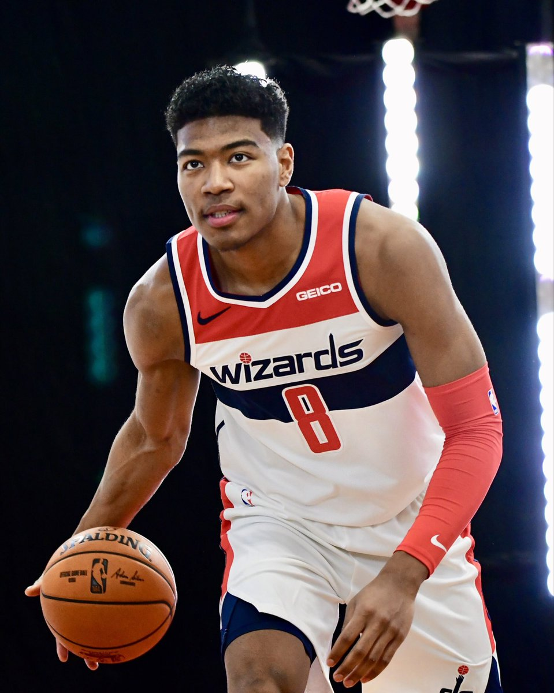
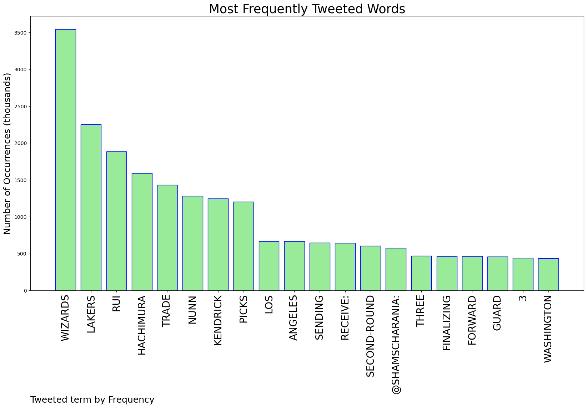
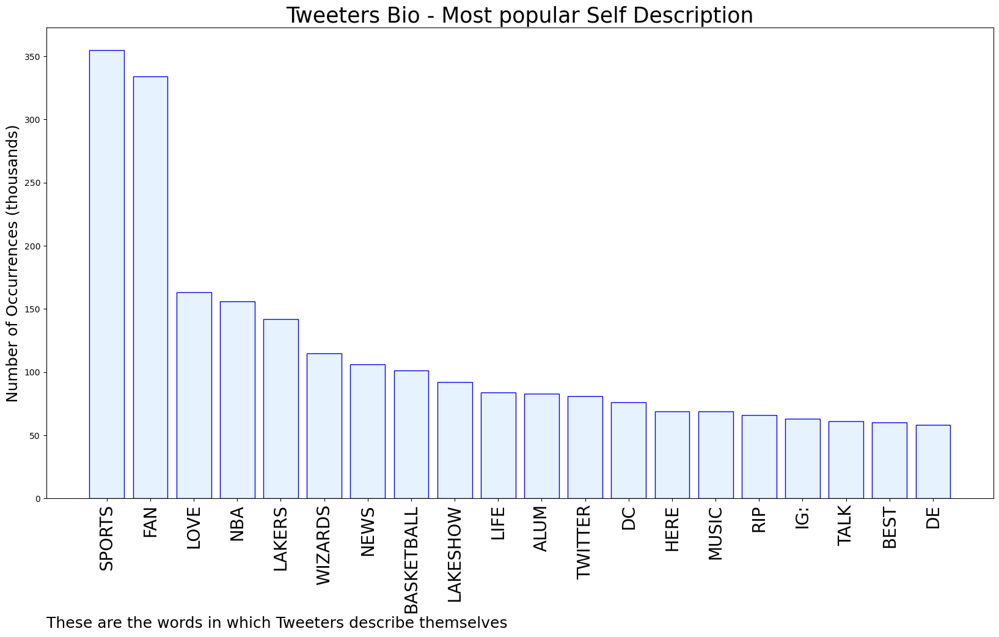
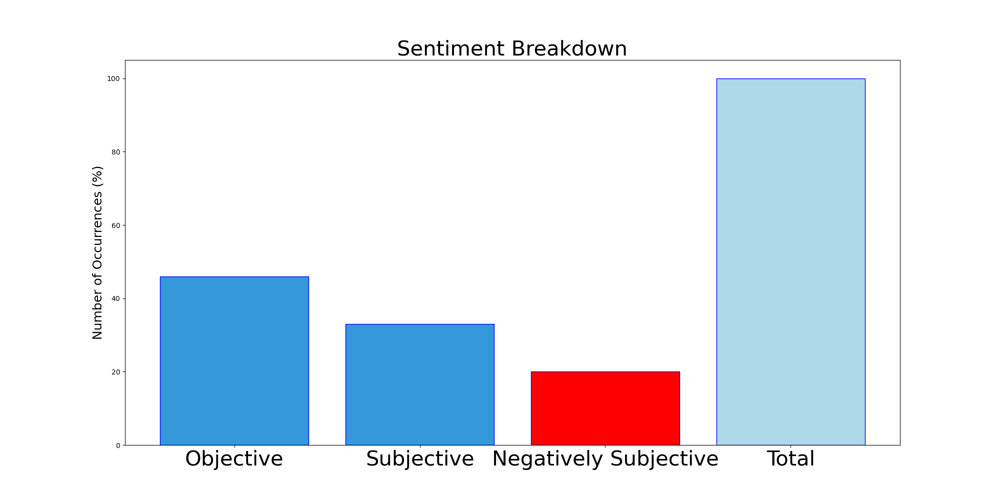

# MURCHIE85 TWITTER PROCESSING 
&#x1F34E; **TOPIC = "Wizards"**

## AUTOMATED RESEARCH SUMMARY

*note: Image pulled from web automatically, not connected to author.
  
<b> This report is AUTOMATED and not hand crafted, it is designed for pulling metrics on a given keyword or hashtag and performs a series of reporting and analysis.</b>

|                **Sample-Tweets**        |
| :-------------: |
| RT @BobbyMarks42: Trade breakdownThe 2028 2nd could be the Wizards own that was sent to LAL as part of the Westbrook trade. https://t.co/… |
| No the Wizards Lakers got the positive end 😒 https://t.co/c1gJYwqM13 |
| @LegionHoops wizards should be in the top five imo |

The most popular user is: **Mrho3in1sti**

 RT @WizardLandSui: Good day wizards, over the last few days we’ve been incommunicado, not without a reason as we’ve been working and we’re…

## RELATED METRICS 
| Metric | Value |
| ------------- | ------------- |
| #1 Most tweeted to  | **ShamsCharania** |
| #2 Most tweeted to  | **wojespn** |
| #3 Most tweeted to  | **LegionHoops** |
| NewProfiles (less than 10 days) | 0.2%  |
| Tweeters with < 10 followers  | 4.06%|
| Tweeters with > 1000000 followers  | 0.12%  |

## MOST POPULAR TWEET TERMS 

| Popularity Rank  | Term |
| ------------- | ------------- |
| first  | **WIZARDS**  |
| second  | **LAKERS**  |
| third  | **RUI** |
| fourth  | **HACHIMURA**  |
| fifth  | **TRADE**  |

## Twitter Bio Analysis
### SENTIMENT ANALYSIS

VIEWS WERE : **SUBJECTIVE**  (33.33%) & **NEGATIVELY-SUBJECTIVE** (20.0%) **OBJECTIVE** (46.67%)

### TWEET SAMPLE 
| Random value picked from array |
| ------------- |
|@ShamsCharania @TheAthletic @Stadium Wtf are the wizards thinking |

### MOST RETWEETED 

| The most retweeted user is: **Mrho3in1sti**  |
| ------------- |
| RT @WizardLandSui: Good day wizards, over the last few days we’ve been incommunicado, not without a reason as we’ve been working and we’re… |

### CONCLUSION & EXTERNAL ANALYSIS

*This is my [Adam McMurchie`s] opinion on the data from the tweets, it serves as no objective truth.Since the tweets themselves are a mixture of fact & opinion. 
Authors analytical summary on request.
**RECOMMENDATIONS** WILL BE UPDATED IN NEXT  24 HOURS  