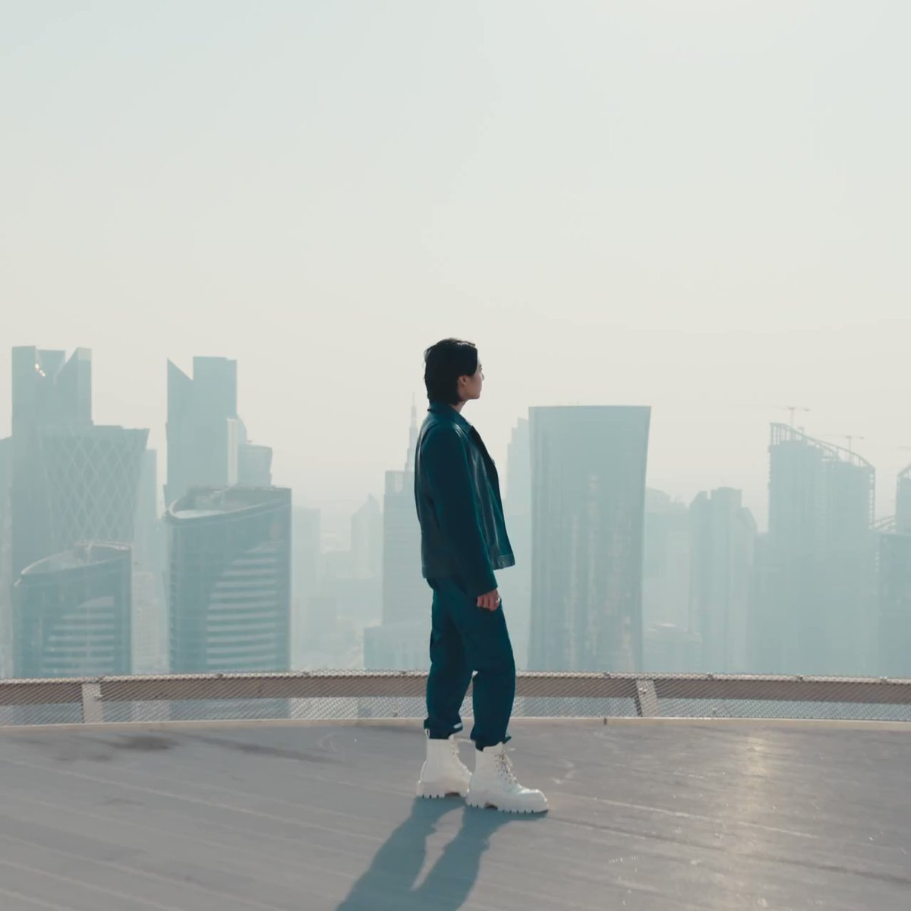
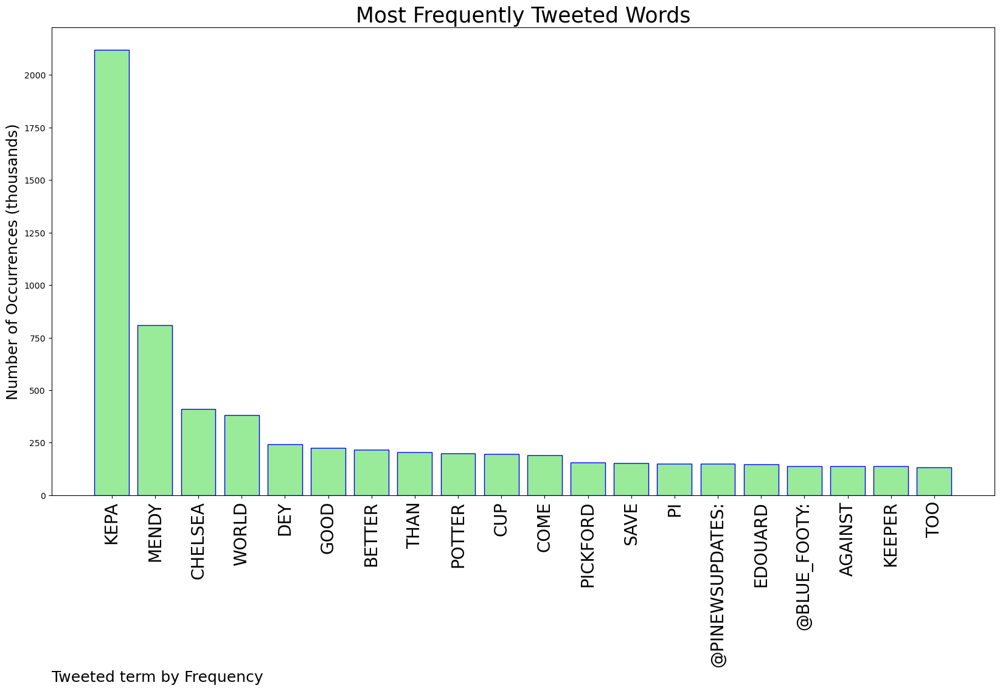
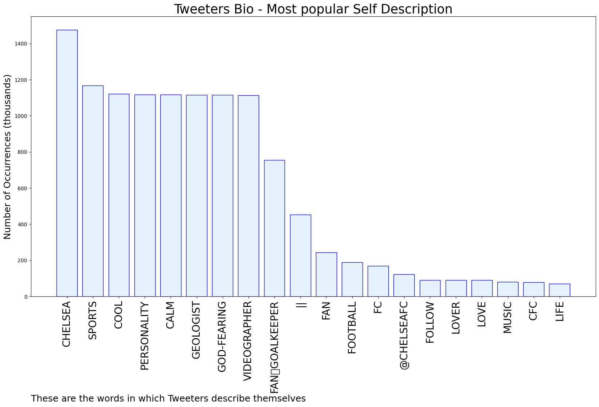

# MURCHIE85 TWITTER PROCESSING 
&#x1F34E; **TOPIC = "Kepa"**

## AUTOMATED RESEARCH SUMMARY

*note: Image pulled from web automatically, not connected to author.
  
<b> This report is AUTOMATED and not hand crafted, it is designed for pulling metrics on a given keyword or hashtag and performs a series of reporting and analysis.</b>

|                **Sample-Tweets**        |
| :-------------: |
| Welp that’s why Kepa is playing for Chelsea right now. Sucks for Sénégal, they’re a good side otherwise but they ar… https://t.co/isP8udoDVe |
| RT @ChessyHour: Who remembers when people said that Hazard made Kepa look better than he was in that Sarri season As a way to explain the… |
| RT @anjolaaa17: Today is blessed 😌🤲 |

The most popular user is: **kepa_thekeeper**

 RT @Cristiano: Victory is a State of Mind. A long tradition of crafting trunks photographed by @annieleibovitz for @LouisVuitton https://t.…

## RELATED METRICS 
| Metric | Value |
| ------------- | ------------- |
| #1 Most tweeted to  | **Kepa_Dotmors** |
| #2 Most tweeted to  | **Blue_Footy** |
| #3 Most tweeted to  | **FrankKhalidUK** |
| NewProfiles (less than 10 days) | 0.7%  |
| Tweeters with < 10 followers  | 4.0%|
| Tweeters with > 1000000 followers  | 0.0%  |

## MOST POPULAR TWEET TERMS 

| Popularity Rank  | Term |
| ------------- | ------------- |
| first  | **KEPA**  |
| second  | **MENDY**  |
| third  | **CHELSEA** |
| fourth  | **WORLD**  |
| fifth  | **DEY**  |

## Twitter Bio Analysis
### SENTIMENT ANALYSIS

VIEWS WERE : **SUBJECTIVE**  (46.67%) & **NEGATIVELY-SUBJECTIVE** (0.0%) **OBJECTIVE** (53.33%)

### TWEET SAMPLE 
| Random value picked from array |
| ------------- |
|I so much want this man to lift the World Cup😍 https://t.co/bVy3mgEQm6 |

### MOST RETWEETED 

| The most retweeted user is: **kepa_thekeeper**  |
| ------------- |
| RT @Cristiano: Victory is a State of Mind. A long tradition of crafting trunks photographed by @annieleibovitz for @LouisVuitton https://t.… |

### CONCLUSION & EXTERNAL ANALYSIS

*This is my [Adam McMurchie`s] opinion on the data from the tweets, it serves as no objective truth.Since the tweets themselves are a mixture of fact & opinion. 
Authors analytical summary on request.
**RECOMMENDATIONS** WILL BE UPDATED IN NEXT  24 HOURS  