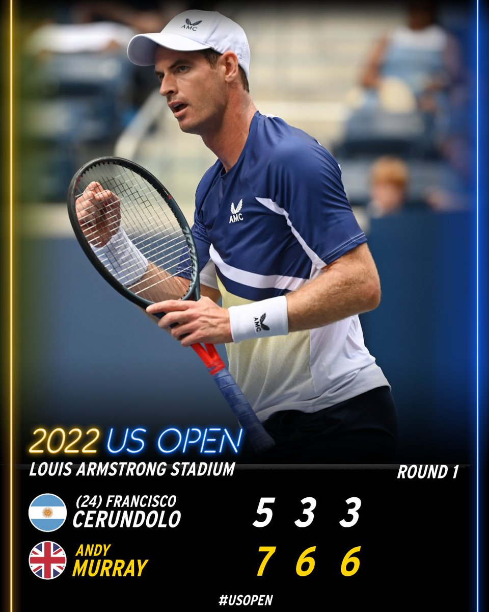
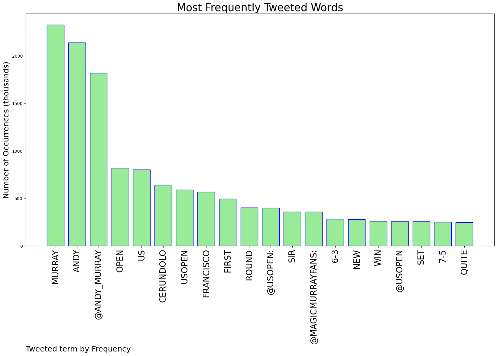
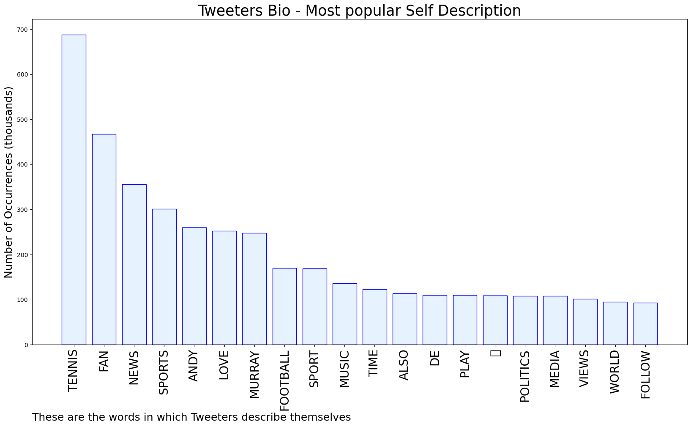
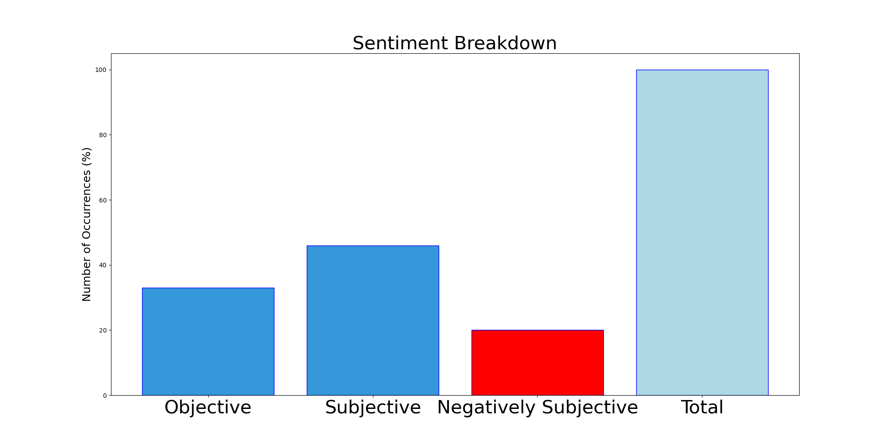

# MURCHIE85 TWITTER PROCESSING 
&#x1F34E; **TOPIC = "Andy Murray"**

## AUTOMATED RESEARCH SUMMARY

*note: Image pulled from web automatically, not connected to author.
  
<b> This report is AUTOMATED and not hand crafted, it is designed for pulling metrics on a given keyword or hashtag and performs a series of reporting and analysis.</b>

|                **Sample-Tweets**        |
| :-------------: |
| Looking good @andy_murray. Straight set win on Day1 of #USOpen2022 |
| Looking forward to the US Open. Good luck, Andy Murray and all the Brits playing in your first round later today… https://t.co/RArZQxfgLA |
| RT @MagicMurrayFans: Incredible point from @andy_murray and Matteo Berrettini during their practice in New York 🙂 (🎥 fieryfoodfashionista i… |

The most popular user is: **ari_shapiro**

 RT @ari_shapiro: I’ll always remember Roger Federer for his legendary consistency, Rafael Nadal for his clay court mastery, Andy Murray for…

## RELATED METRICS 
| Metric | Value |
| ------------- | ------------- |
| #1 Most tweeted to  | **andy_murray** |
| #2 Most tweeted to  | **usopen** |
| #3 Most tweeted to  | **MagicMurrayFans** |
| NewProfiles (less than 10 days) | 1.2%  |
| Tweeters with < 10 followers  | 6.38%|
| Tweeters with > 1000000 followers  | 0.44%  |

## MOST POPULAR TWEET TERMS 

| Popularity Rank  | Term |
| ------------- | ------------- |
| first  | **MURRAY**  |
| second  | **ANDY**  |
| third  | **@ANDY_MURRAY** |
| fourth  | **OPEN**  |
| fifth  | **US**  |

## Twitter Bio Analysis
### SENTIMENT ANALYSIS

VIEWS WERE : **SUBJECTIVE**  (46.67%) & **NEGATIVELY-SUBJECTIVE** (20.0%) **OBJECTIVE** (33.33%)

### TWEET SAMPLE 
| Random value picked from array |
| ------------- |
|@simonrbriggs The Great Andy Murray. I loved watching his rise to greatness and its been sad watching him drift int… https://t.co/WdunbtJpU8 |

### MOST RETWEETED 

| The most retweeted user is: **ari_shapiro**  |
| ------------- |
| RT @ari_shapiro: I’ll always remember Roger Federer for his legendary consistency, Rafael Nadal for his clay court mastery, Andy Murray for… |

### CONCLUSION & EXTERNAL ANALYSIS

*This is my [Adam McMurchie`s] opinion on the data from the tweets, it serves as no objective truth.Since the tweets themselves are a mixture of fact & opinion. 
Authors analytical summary on request.
**RECOMMENDATIONS** WILL BE UPDATED IN NEXT  24 HOURS  