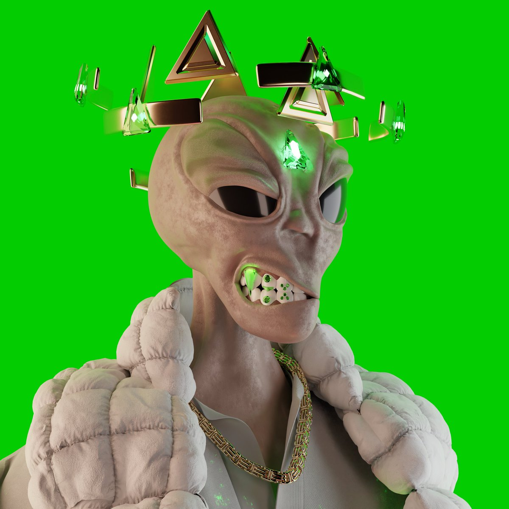
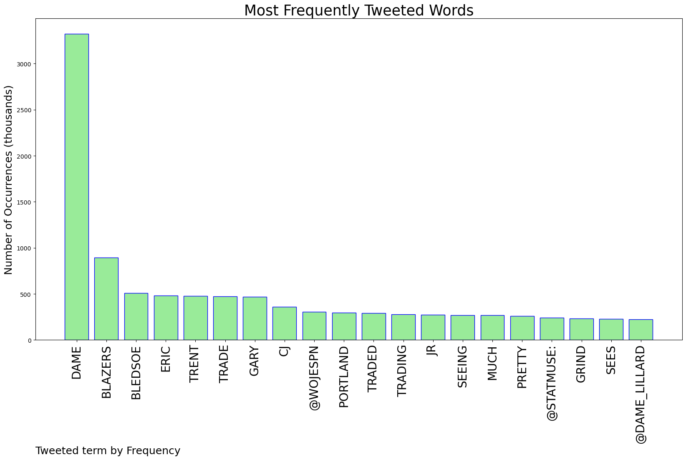
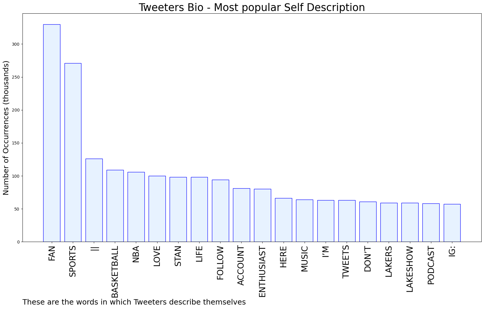
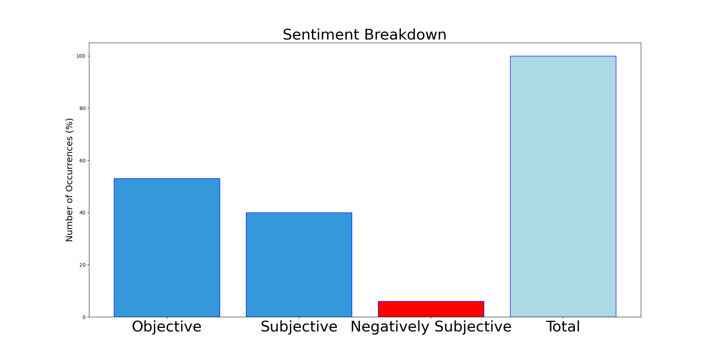

# MURCHIE85 TWITTER PROCESSING 
&#x1F34E; **TOPIC = "Dame"**

## AUTOMATED RESEARCH SUMMARY

*note: Image pulled from web automatically, not connected to author.
  
<b> This report is AUTOMATED and not hand crafted, it is designed for pulling metrics on a given keyword or hashtag and performs a series of reporting and analysis.</b>

|                **Sample-Tweets**        |
| :-------------: |
| Only way the Lakers can fix this is find a way to steal Dame Lillard from the Blazers lol |
| Where we going?? @Dame_Lillard |
| @drewyoungtwt Hercules and Hunchback of Notre Dame are tied for Disney movies with no bad songs |

The most popular user is: **keeyahhhhh**

 RT @DigiPenNews: Floyd Norman became Disney's first Black cartoonist in 1957. He's still there at 86 with a stunning filmography behind him…

## RELATED METRICS 
| Metric | Value |
| ------------- | ------------- |
| #1 Most tweeted to  | **wojespn** |
| #2 Most tweeted to  | **Dame_Lillard** |
| #3 Most tweeted to  | **statmuse** |
| NewProfiles (less than 10 days) | 0.5%  |
| Tweeters with < 10 followers  | 2.5%|
| Tweeters with > 1000000 followers  | 0.0%  |

## MOST POPULAR TWEET TERMS 

| Popularity Rank  | Term |
| ------------- | ------------- |
| first  | **DAME**  |
| second  | **BLAZERS**  |
| third  | **BLEDSOE** |
| fourth  | **ERIC**  |
| fifth  | **TRENT**  |

## Twitter Bio Analysis
### SENTIMENT ANALYSIS

VIEWS WERE : **SUBJECTIVE**  (40.0%) & **NEGATIVELY-SUBJECTIVE** (6.67%) **OBJECTIVE** (53.33%)

### TWEET SAMPLE 
| Random value picked from array |
| ------------- |
|u guys think Dame getting traded before the deadline? https://t.co/DjajU6YHbx |

### MOST RETWEETED 

| The most retweeted user is: **keeyahhhhh**  |
| ------------- |
| RT @DigiPenNews: Floyd Norman became Disney's first Black cartoonist in 1957. He's still there at 86 with a stunning filmography behind him… |

### CONCLUSION & EXTERNAL ANALYSIS

*This is my [Adam McMurchie`s] opinion on the data from the tweets, it serves as no objective truth.Since the tweets themselves are a mixture of fact & opinion. 
Authors analytical summary on request.
**RECOMMENDATIONS** WILL BE UPDATED IN NEXT  24 HOURS  