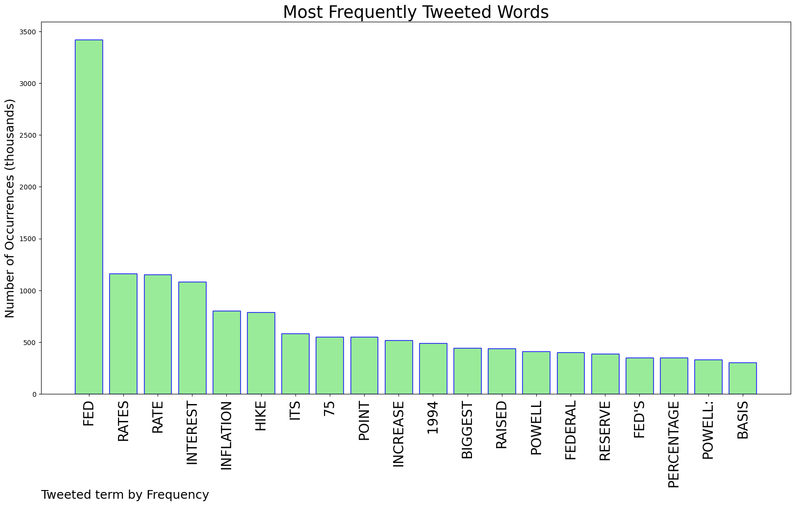
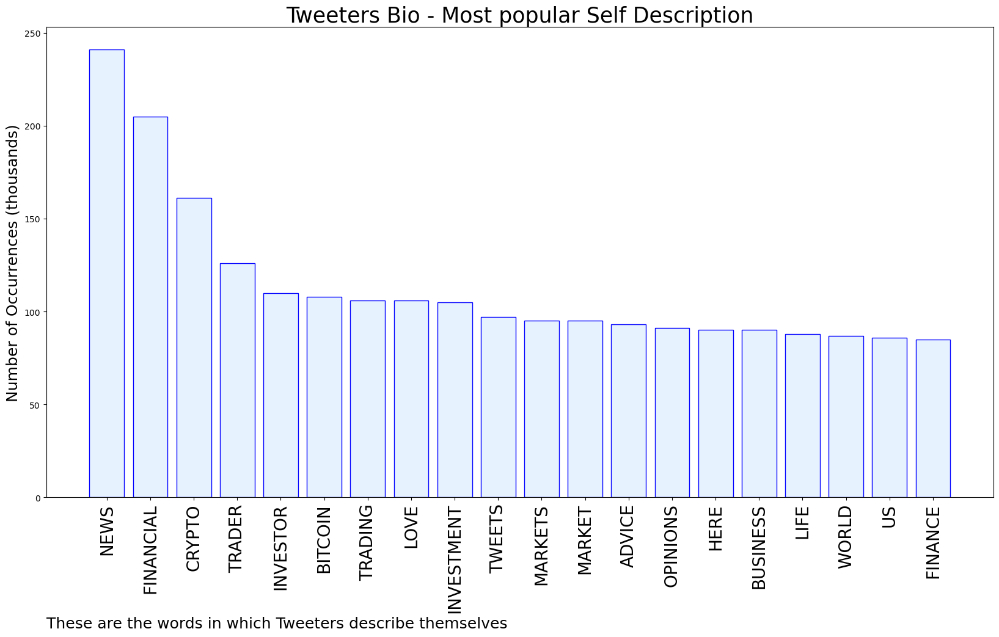

# MURCHIE85 TWITTER PROCESSING 
&#x1F34E; **TOPIC = "The Fed"**

## AUTOMATED RESEARCH SUMMARY

*note: Image pulled from web automatically, not connected to author.
  
<b> This report is AUTOMATED and not hand crafted, it is designed for pulling metrics on a given keyword or hashtag and performs a series of reporting and analysis.</b>

|                **Sample-Tweets**        |
| :-------------: |
| Fed Meeting Live Updates: Interest Rates Raised 0.75 Percentage Point - The Wall Street Journal https://t.co/Lc0E1kTHE1 via @GoogleNews |
| @cadeharkins86 @zerohedge Watch the bond market...If the Fed can dump those MBS bonds then all good... If not, well, who knows anymore.. |
| RT @Financialjuice1: FED'S POWELL: THIS CONTINUES THE APPROACH OF EXPEDITIOUSLY RAISING RATES. |

The most popular user is: **Astulious**

 RT @Rainmaker1973: Crested mynas, as many other birds, are born altricially, which means young are underdeveloped at the time of birth, the…

## RELATED METRICS 
| Metric | Value |
| ------------- | ------------- |
| #1 Most tweeted to  | **zerohedge** |
| #2 Most tweeted to  | **business** |
| #3 Most tweeted to  | **PeterSchiff** |
| NewProfiles (less than 10 days) | 0.74%  |
| Tweeters with < 10 followers  | 4.56%|
| Tweeters with > 1000000 followers  | 0.44%  |

## MOST POPULAR TWEET TERMS 

| Popularity Rank  | Term |
| ------------- | ------------- |
| first  | **FED**  |
| second  | **RATES**  |
| third  | **RATE** |
| fourth  | **INTEREST**  |
| fifth  | **INFLATION**  |

## Twitter Bio Analysis
### SENTIMENT ANALYSIS

VIEWS WERE : **SUBJECTIVE**  (40.0%) & **NEGATIVELY-SUBJECTIVE** (13.33%) **OBJECTIVE** (46.67%)

### TWEET SAMPLE 
| Random value picked from array |
| ------------- |
|Powell says the Fed could hike rates by 0.75 percentage point again in July https://t.co/KhahYys1aC |

### MOST RETWEETED 

| The most retweeted user is: **Astulious**  |
| ------------- |
| RT @Rainmaker1973: Crested mynas, as many other birds, are born altricially, which means young are underdeveloped at the time of birth, the… |

### CONCLUSION & EXTERNAL ANALYSIS

*This is my [Adam McMurchie`s] opinion on the data from the tweets, it serves as no objective truth.Since the tweets themselves are a mixture of fact & opinion. 
Authors analytical summary on request.
**RECOMMENDATIONS** WILL BE UPDATED IN NEXT  24 HOURS  