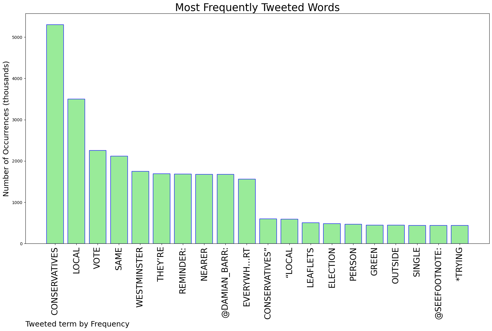
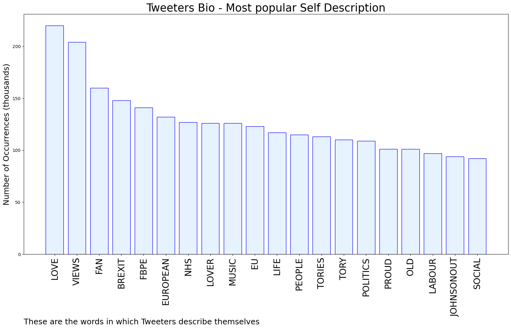
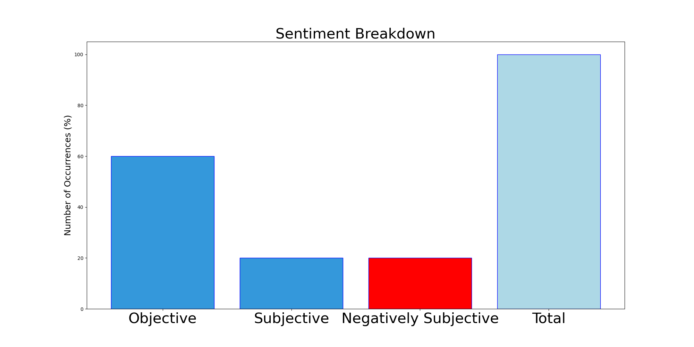

# MURCHIE85 TWITTER PROCESSING 
&#x1F34E; **TOPIC = "Local Conservatives"**

## AUTOMATED RESEARCH SUMMARY

*note: Image pulled from web automatically, not connected to author.
  
<b> This report is AUTOMATED and not hand crafted, it is designed for pulling metrics on a given keyword or hashtag and performs a series of reporting and analysis.</b>

|                **Sample-Tweets**        |
| :-------------: |
| RT @seefootnote: Local conservatives *trying to hand out leaflets outside Willesden Green tube. Not a single person will take one. One woma… |
| RT @Conservatives: Tomorrow, your choice is clear.Conservative councils who deliver better local services and the lowest council tax or L… |
| RT @DMinghella: If you voted for a party calling themselves 'Local Conservatives', you'd be voting for people who couldn't even be honest a… |

The most popular user is: **kentishsal**

 RT @Damian_Barr: A reminder: local Conservatives are the same as Conservatives in Westminster.  They’re just nearer. Vote them out, everywh…

## RELATED METRICS 
| Metric | Value |
| ------------- | ------------- |
| #1 Most tweeted to  | **Damian_Barr** |
| #2 Most tweeted to  | **seefootnote** |
| #3 Most tweeted to  | **AngelaRayner** |
| NewProfiles (less than 10 days) | 0.14%  |
| Tweeters with < 10 followers  | 2.12%|
| Tweeters with > 1000000 followers  | 0.0%  |

## MOST POPULAR TWEET TERMS 

| Popularity Rank  | Term |
| ------------- | ------------- |
| first  | **CONSERVATIVES**  |
| second  | **LOCAL**  |
| third  | **VOTE** |
| fourth  | **SAME**  |
| fifth  | **WESTMINSTER**  |

## Twitter Bio Analysis
### SENTIMENT ANALYSIS

VIEWS WERE : **SUBJECTIVE**  (20.0%) & **NEGATIVELY-SUBJECTIVE** (20.0%) **OBJECTIVE** (60.0%)

### TWEET SAMPLE 
| Random value picked from array |
| ------------- |
|RT @Damian_Barr: A reminder: local Conservatives are the same as Conservatives in Westminster.  They’re just nearer. Vote them out, everywh… |

### MOST RETWEETED 

| The most retweeted user is: **kentishsal**  |
| ------------- |
| RT @Damian_Barr: A reminder: local Conservatives are the same as Conservatives in Westminster.  They’re just nearer. Vote them out, everywh… |

### CONCLUSION & EXTERNAL ANALYSIS

*This is my [Adam McMurchie`s] opinion on the data from the tweets, it serves as no objective truth.Since the tweets themselves are a mixture of fact & opinion. 
Authors analytical summary on request.
**RECOMMENDATIONS** WILL BE UPDATED IN NEXT  24 HOURS  