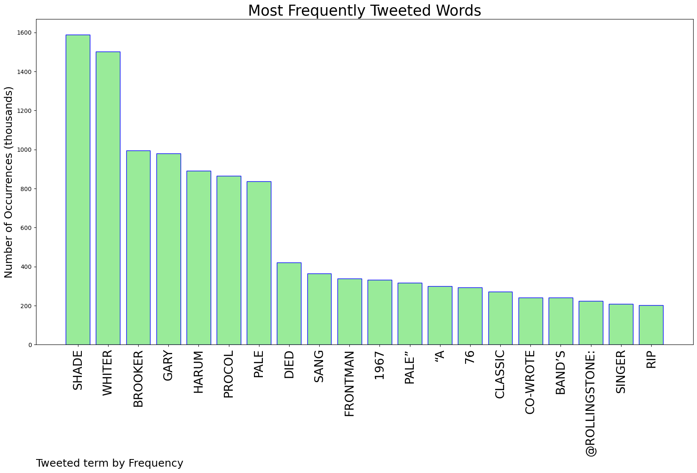
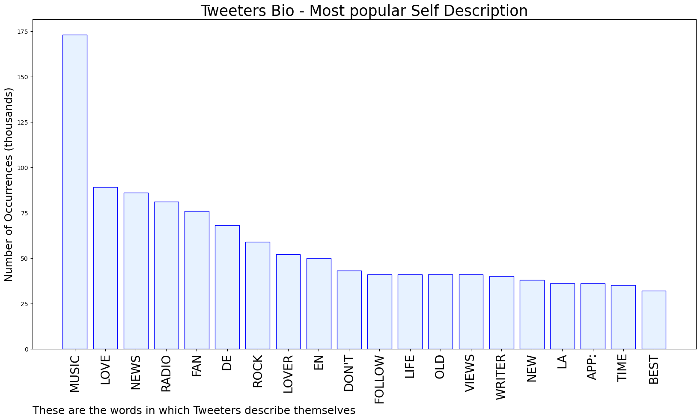
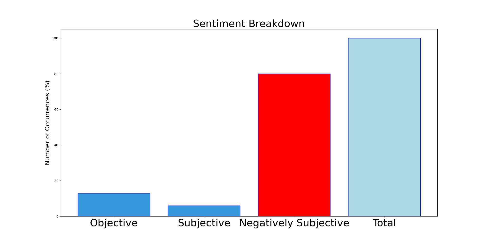

# MURCHIE85 TWITTER PROCESSING 
&#x1F34E; **TOPIC = "Whiter Shade of Pale"**

## AUTOMATED RESEARCH SUMMARY

*note: Image pulled from web automatically, not connected to author.
  
<b> This report is AUTOMATED and not hand crafted, it is designed for pulling metrics on a given keyword or hashtag and performs a series of reporting and analysis.</b>

|                **Sample-Tweets**        |
| :-------------: |
| RT @Lyricoftheday4: #TDIM #GaryBrooker #RIP #lyricsoftheday #vinylrecords "And so it was that lateras the miller told his talethat her… |
| RT @RollingStone: Procol Harum frontman Gary Brooker, who co-wrote and sang the band’s 1967 classic “A Whiter Shade of Pale,” has died afte… |
| #Nowplaying  on Affinity Radio Procol Harum - A Whiter Shade of Pale [*][Single Version][Mono] so why not Listen He… https://t.co/ZhIELrzqQd |

The most popular user is: **uninihil**

 RT @RollingStone: Procol Harum frontman Gary Brooker, who co-wrote and sang the band’s 1967 classic “A Whiter Shade of Pale,” has died afte…

## RELATED METRICS 
| Metric | Value |
| ------------- | ------------- |
| #1 Most tweeted to  | **RollingStone** |
| #2 Most tweeted to  | **YouTube** |
| #3 Most tweeted to  | **ThatEricAlper** |
| NewProfiles (less than 10 days) | 0.22%  |
| Tweeters with < 10 followers  | 2.08%|
| Tweeters with > 1000000 followers  | 0.38%  |

## MOST POPULAR TWEET TERMS 

| Popularity Rank  | Term |
| ------------- | ------------- |
| first  | **SHADE**  |
| second  | **WHITER**  |
| third  | **BROOKER** |
| fourth  | **GARY**  |
| fifth  | **HARUM**  |

## Twitter Bio Analysis
### SENTIMENT ANALYSIS

VIEWS WERE : **SUBJECTIVE**  (6.67%) & **NEGATIVELY-SUBJECTIVE** (80.0%) **OBJECTIVE** (13.33%)

### TWEET SAMPLE 
| Random value picked from array |
| ------------- |
|RT @MartinKnight_: R. I. P. Gary Brooker who has skipped the light fandango. Procol Harum’s A Whiter Shade Of Pale wrong footed the pop mus… |

### MOST RETWEETED 

| The most retweeted user is: **uninihil**  |
| ------------- |
| RT @RollingStone: Procol Harum frontman Gary Brooker, who co-wrote and sang the band’s 1967 classic “A Whiter Shade of Pale,” has died afte… |

### CONCLUSION & EXTERNAL ANALYSIS

*This is my [Adam McMurchie`s] opinion on the data from the tweets, it serves as no objective truth.Since the tweets themselves are a mixture of fact & opinion. 
Authors analytical summary on request.
**RECOMMENDATIONS** WILL BE UPDATED IN NEXT  24 HOURS  