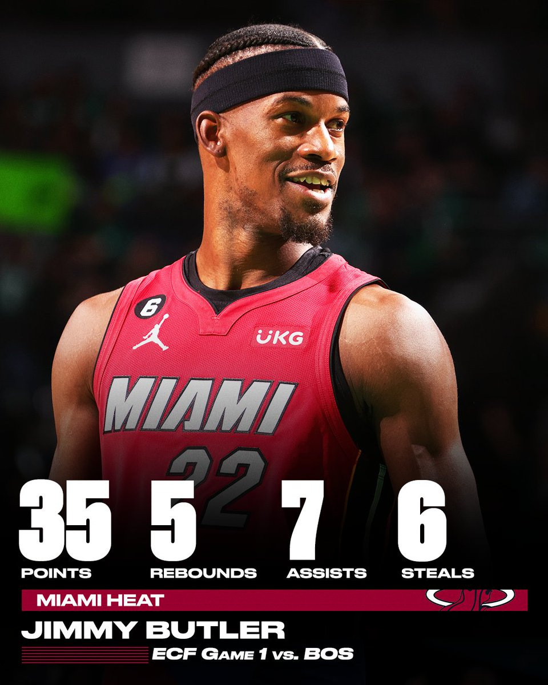
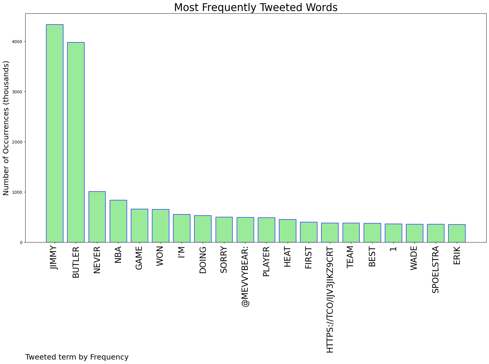
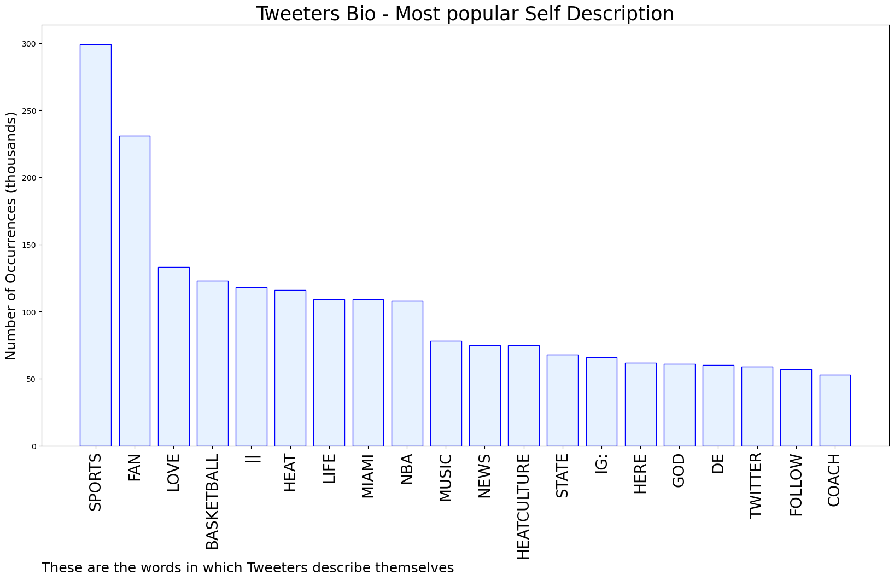

# MURCHIE85 TWITTER PROCESSING 
&#x1F34E; **TOPIC = "Jimmy Butler"**

## AUTOMATED RESEARCH SUMMARY

*note: Image pulled from web automatically, not connected to author.
  
<b> This report is AUTOMATED and not hand crafted, it is designed for pulling metrics on a given keyword or hashtag and performs a series of reporting and analysis.</b>

|                **Sample-Tweets**        |
| :-------------: |
| RT @NBA: "That's what anybody wants out of life...to be wanted, be appreciated..."Jimmy Butler thanks his teammates, coaches, and the @Mi… |
| RT @SportsCenter: Jimmy Butler's mentality 📈 https://t.co/k7NKqKWV21 |
| RT @StoolGreenie: Jimmy Butler vs Celtics defenders:vs Jayson Tatum: 22 possessions / 0 points / 0-2vs Al Horford: 18 possessions / 5 p… |

The most popular user is: **Martin2302**

 RT @Brendan_Tobin: What sets you apart from the typical 8-seed
Jimmy Butler: we got Kyle Lowry 
Kyle Lowry: STFU 😂😂😂 https://t.co/AVWUY4PnOZ

## RELATED METRICS 
| Metric | Value |
| ------------- | ------------- |
| #1 Most tweeted to  | **mevvybear** |
| #2 Most tweeted to  | **BenStinar** |
| #3 Most tweeted to  | **ClutchPointsApp** |
| NewProfiles (less than 10 days) | 0.16%  |
| Tweeters with < 10 followers  | 4.3%|
| Tweeters with > 1000000 followers  | 0.08%  |

## MOST POPULAR TWEET TERMS 

| Popularity Rank  | Term |
| ------------- | ------------- |
| first  | **JIMMY**  |
| second  | **BUTLER**  |
| third  | **NEVER** |
| fourth  | **NBA**  |
| fifth  | **GAME**  |

## Twitter Bio Analysis
### SENTIMENT ANALYSIS

VIEWS WERE : **SUBJECTIVE**  (66.67%) & **NEGATIVELY-SUBJECTIVE** (13.33%) **OBJECTIVE** (20.0%)

### TWEET SAMPLE 
| Random value picked from array |
| ------------- |
|RT @taylorcsnow: Jimmy Butler on Marcus Smart: "He was making all the right plays ... He defended incredibly well. Made shots, too. I think… |

### MOST RETWEETED 

| The most retweeted user is: **Martin2302**  |
| ------------- |
| RT @Brendan_Tobin: What sets you apart from the typical 8-seedJimmy Butler: we got Kyle Lowry Kyle Lowry: STFU 😂😂😂 https://t.co/AVWUY4PnOZ |

### CONCLUSION & EXTERNAL ANALYSIS

*This is my [Adam McMurchie`s] opinion on the data from the tweets, it serves as no objective truth.Since the tweets themselves are a mixture of fact & opinion. 
Authors analytical summary on request.
**RECOMMENDATIONS** WILL BE UPDATED IN NEXT  24 HOURS  