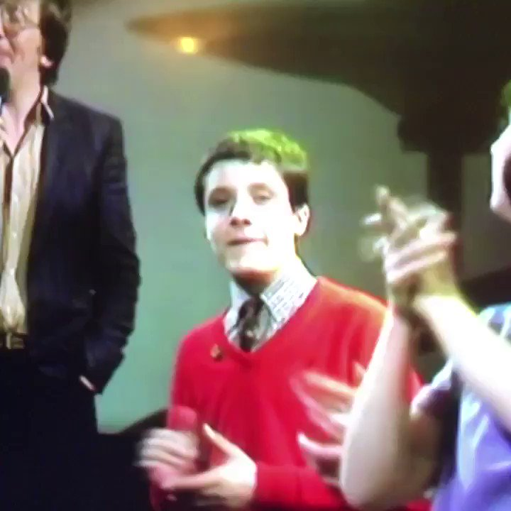
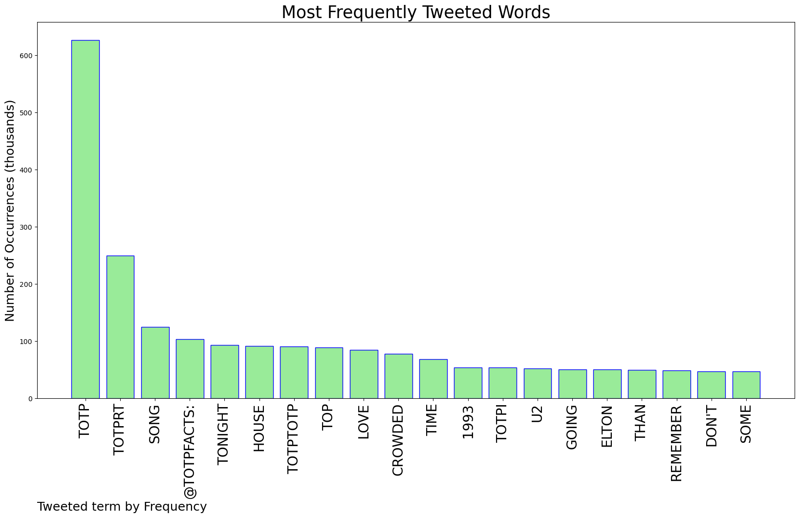
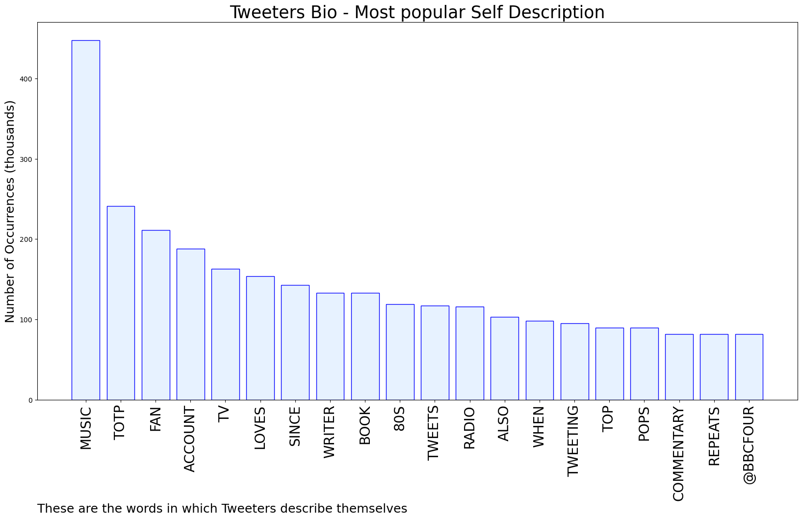

# MURCHIE85 TWITTER PROCESSING 
&#x1F34E; **TOPIC = "#TOTP"**

## AUTOMATED RESEARCH SUMMARY

*note: Image pulled from web automatically, not connected to author.
  
<b> This report is AUTOMATED and not hand crafted, it is designed for pulling metrics on a given keyword or hashtag and performs a series of reporting and analysis.</b>

|                **Sample-Tweets**        |
| :-------------: |
| As expected #totp |
| @deathofbuckley I censor his name cause I don’t wanna be part of his Twitter comments compilation videos that he does on #TOTP… 😂 |
| #totp Greetings! I am mostly doing the Ethical Thing. Mostly. https://t.co/FvCBOplZcX |

The most popular user is: **neilsmiles**

 RT @neilsmiles: Anthea Turner's on #totp tonight which reminds me of the time she congratulated the KLF on being number one and "looking li…

## RELATED METRICS 
| Metric | Value |
| ------------- | ------------- |
| #1 Most tweeted to  | **TOTPFacts** |
| #2 Most tweeted to  | **neilsmiles** |
| #3 Most tweeted to  | **FubsyShabaroon** |
| NewProfiles (less than 10 days) | 0.04%  |
| Tweeters with < 10 followers  | 4.26%|
| Tweeters with > 1000000 followers  | 0.0%  |

## MOST POPULAR TWEET TERMS 

| Popularity Rank  | Term |
| ------------- | ------------- |
| first  | **TOTP**  |
| second  | **TOTPRT**  |
| third  | **SONG** |
| fourth  | **@TOTPFACTS:**  |
| fifth  | **TONIGHT**  |

## Twitter Bio Analysis
### SENTIMENT ANALYSIS

VIEWS WERE : **SUBJECTIVE**  (13.33%) & **NEGATIVELY-SUBJECTIVE** (26.67%) **OBJECTIVE** (60.0%)

### TWEET SAMPLE 
| Random value picked from array |
| ------------- |
|Elton and Kiki. Strong scarf game.  #TOTP |

### MOST RETWEETED 

| The most retweeted user is: **neilsmiles**  |
| ------------- |
| RT @neilsmiles: Anthea Turner's on #totp tonight which reminds me of the time she congratulated the KLF on being number one and "looking li… |

### CONCLUSION & EXTERNAL ANALYSIS

*This is my [Adam McMurchie`s] opinion on the data from the tweets, it serves as no objective truth.Since the tweets themselves are a mixture of fact & opinion. 
Authors analytical summary on request.
**RECOMMENDATIONS** WILL BE UPDATED IN NEXT  24 HOURS  