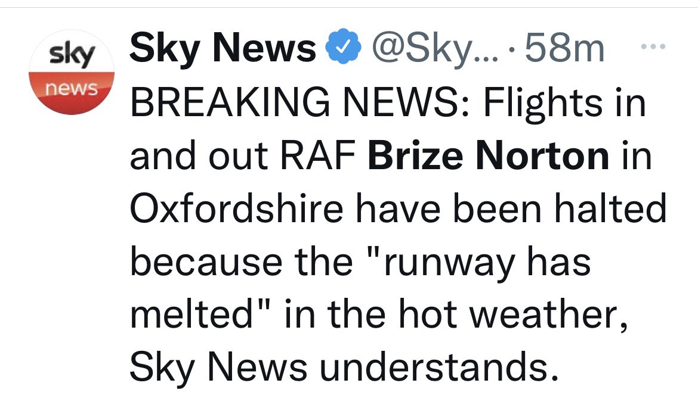
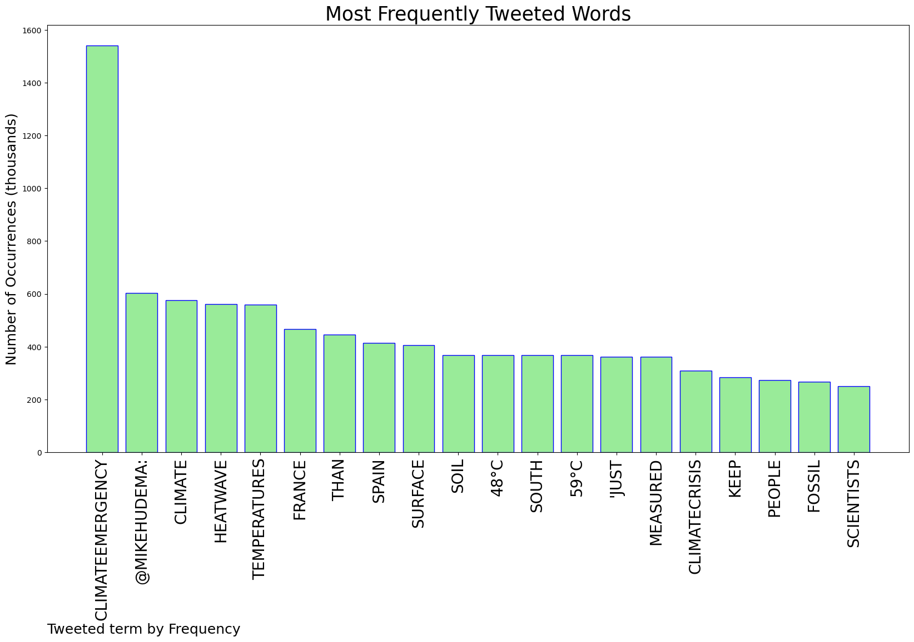
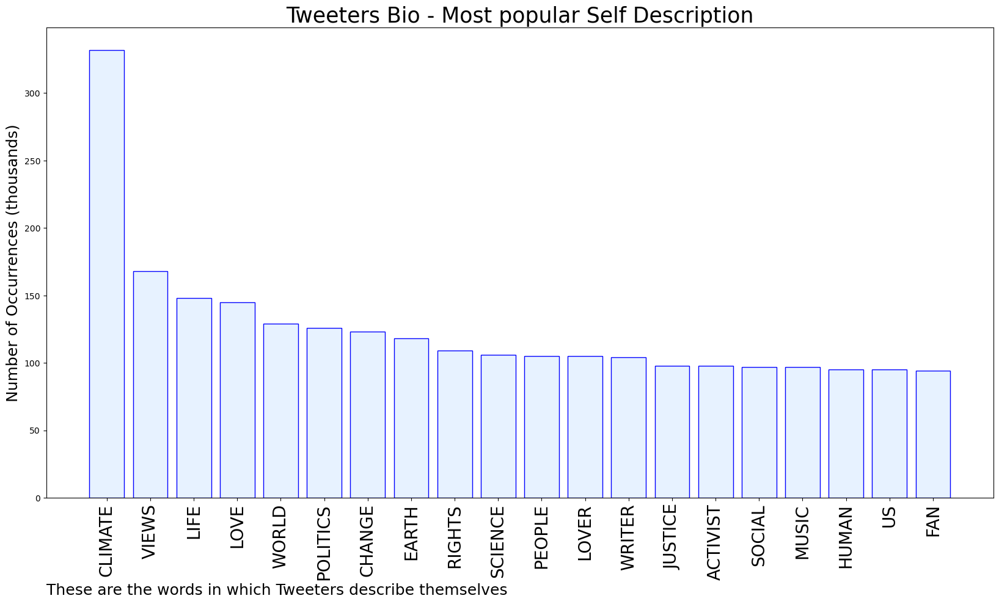

# MURCHIE85 TWITTER PROCESSING 
&#x1F34E; **TOPIC = "#ClimateEmergency"**

## AUTOMATED RESEARCH SUMMARY

*note: Image pulled from web automatically, not connected to author.
  
<b> This report is AUTOMATED and not hand crafted, it is designed for pulling metrics on a given keyword or hashtag and performs a series of reporting and analysis.</b>

|                **Sample-Tweets**        |
| :-------------: |
| RT @eco_woolston: It was not forecast to be above the temperature of the human body today but when is the forecast accurate. #hottestdayoft… |
| Breaking: 1.7 million member strong American Federation of Teachers passes groundbreaking resolution calling for al… https://t.co/Q3OOs7FIKT |
| We travelled through France every summer of my childhood, en route to my Mum’s home city of Barcelona. I don’t reme… https://t.co/Alsw3h7DY1 |

The most popular user is: **WCodyEdwards**

 RT @kirstinferguson: The clever people at @NASA have created this deceptively simple yet highly effective data visualisation showing monthl…

## RELATED METRICS 
| Metric | Value |
| ------------- | ------------- |
| #1 Most tweeted to  | **MikeHudema** |
| #2 Most tweeted to  | **CarolineLucas** |
| #3 Most tweeted to  | **XRebellionUK** |
| NewProfiles (less than 10 days) | 0.3%  |
| Tweeters with < 10 followers  | 2.24%|
| Tweeters with > 1000000 followers  | 0.02%  |

## MOST POPULAR TWEET TERMS 

| Popularity Rank  | Term |
| ------------- | ------------- |
| first  | **CLIMATEEMERGENCY**  |
| second  | **@MIKEHUDEMA:**  |
| third  | **CLIMATE** |
| fourth  | **HEATWAVE**  |
| fifth  | **TEMPERATURES**  |

## Twitter Bio Analysis
### SENTIMENT ANALYSIS

VIEWS WERE : **SUBJECTIVE**  (40.0%) & **NEGATIVELY-SUBJECTIVE** (26.67%) **OBJECTIVE** (33.33%)

### TWEET SAMPLE 
| Random value picked from array |
| ------------- |
|RT @XRebellionUK: With thousands evacuated in France as wildfires rip across Europe, here's how the state are responding to those demanding… |

### MOST RETWEETED 

| The most retweeted user is: **WCodyEdwards**  |
| ------------- |
| RT @kirstinferguson: The clever people at @NASA have created this deceptively simple yet highly effective data visualisation showing monthl… |

### CONCLUSION & EXTERNAL ANALYSIS

*This is my [Adam McMurchie`s] opinion on the data from the tweets, it serves as no objective truth.Since the tweets themselves are a mixture of fact & opinion. 
Authors analytical summary on request.
**RECOMMENDATIONS** WILL BE UPDATED IN NEXT  24 HOURS  