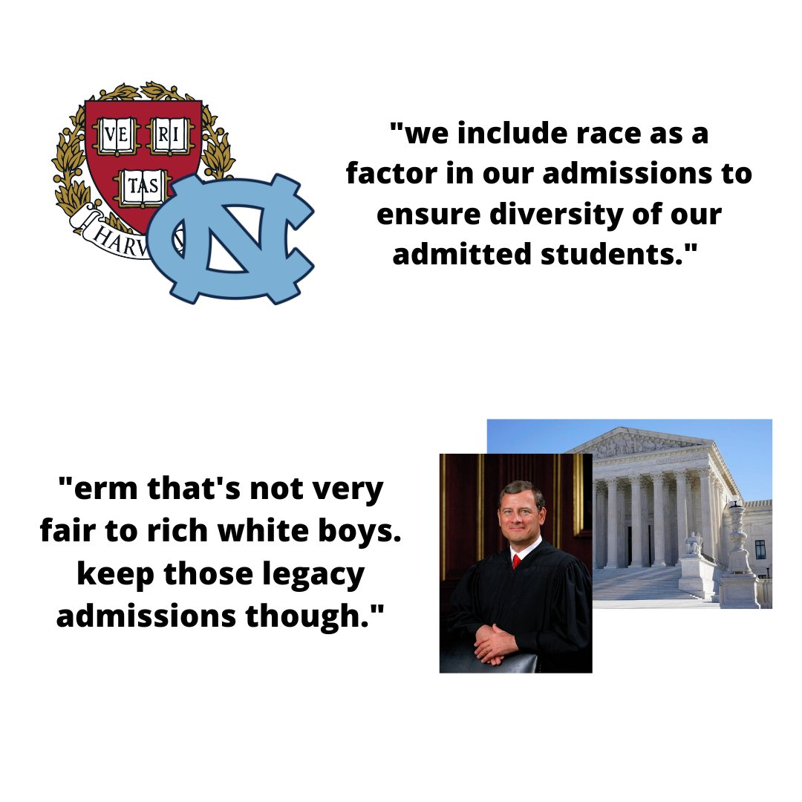
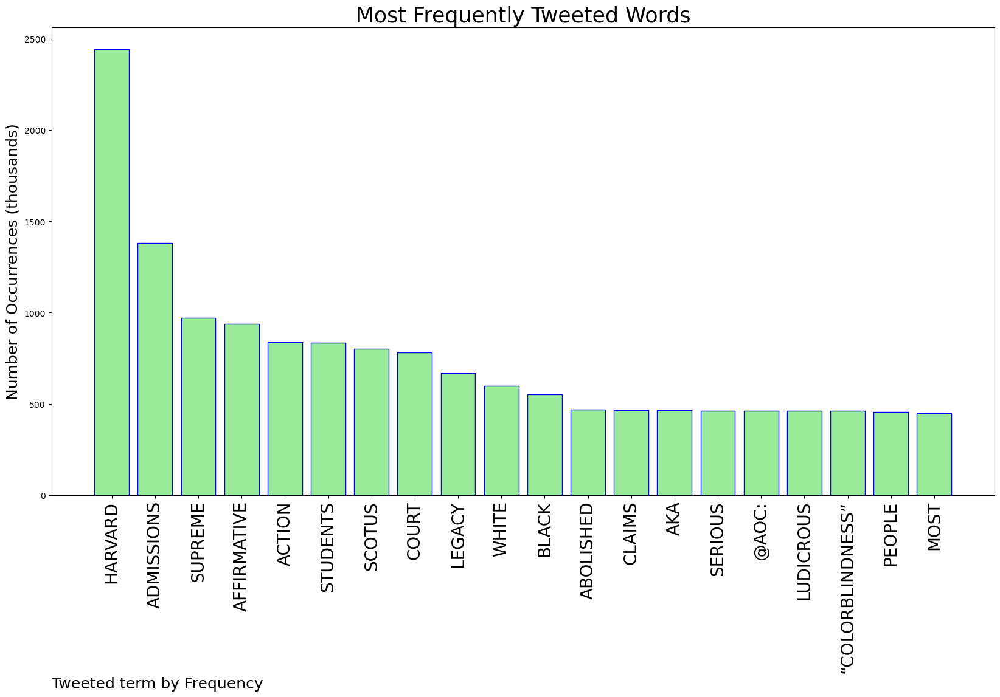
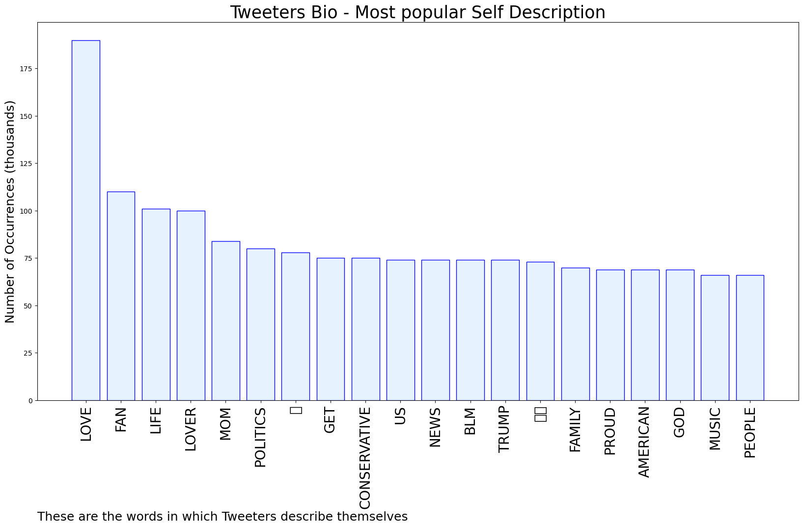
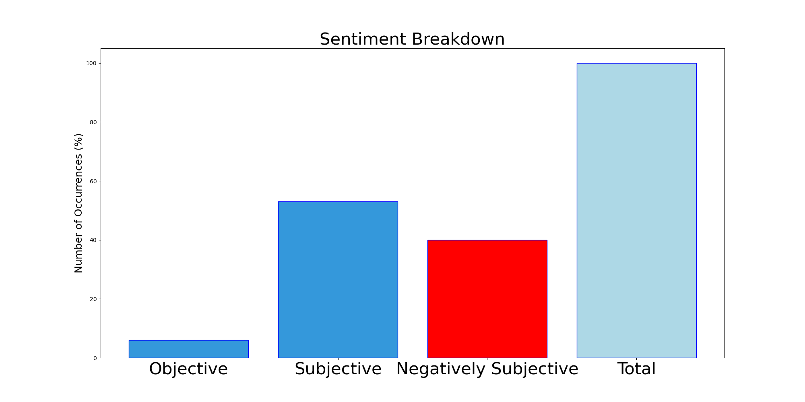

# MURCHIE85 TWITTER PROCESSING 
&#x1F34E; **TOPIC = "Harvard"**

## AUTOMATED RESEARCH SUMMARY

*note: Image pulled from web automatically, not connected to author.
  
<b> This report is AUTOMATED and not hand crafted, it is designed for pulling metrics on a given keyword or hashtag and performs a series of reporting and analysis.</b>

|                **Sample-Tweets**        |
| :-------------: |
| RT @charliekirk11: BREAKING: Along with giving Harvard a bloody nose, the Supreme Court has also unanimously strengthened the right of Chri… |
| RT @BettyBowers: The people against affirmative action had no problem with Jared Kushner's felonious daddy getting dim-bulb Jared into Harv… |
| RT @JoeyMannarinoUS: Barack Obama just claimed that Black people were “systematically excluded from most of America’s key institutions.”… |

The most popular user is: **mudlock**

 RT @samswey: Reminder: Harvard admits more white students with legacy preferences than the total number of black students admitted each yea…

## RELATED METRICS 
| Metric | Value |
| ------------- | ------------- |
| #1 Most tweeted to  | **AOC** |
| #2 Most tweeted to  | **JoeyMannarinoUS** |
| #3 Most tweeted to  | **CalltoActivism** |
| NewProfiles (less than 10 days) | 0.12%  |
| Tweeters with < 10 followers  | 3.02%|
| Tweeters with > 1000000 followers  | 0.08%  |

## MOST POPULAR TWEET TERMS 

| Popularity Rank  | Term |
| ------------- | ------------- |
| first  | **HARVARD**  |
| second  | **ADMISSIONS**  |
| third  | **SUPREME** |
| fourth  | **AFFIRMATIVE**  |
| fifth  | **ACTION**  |

## Twitter Bio Analysis
### SENTIMENT ANALYSIS

VIEWS WERE : **SUBJECTIVE**  (53.33%) & **NEGATIVELY-SUBJECTIVE** (40.0%) **OBJECTIVE** (6.67%)

### TWEET SAMPLE 
| Random value picked from array |
| ------------- |
|@Nextd00rNeighbO @nhannahjones So study hard, get good grades, high scores on the SATs, and get into top schools on… https://t.co/ZDpoYWPOlO |

### MOST RETWEETED 

| The most retweeted user is: **mudlock**  |
| ------------- |
| RT @samswey: Reminder: Harvard admits more white students with legacy preferences than the total number of black students admitted each yea… |

### CONCLUSION & EXTERNAL ANALYSIS

*This is my [Adam McMurchie`s] opinion on the data from the tweets, it serves as no objective truth.Since the tweets themselves are a mixture of fact & opinion. 
Authors analytical summary on request.
**RECOMMENDATIONS** WILL BE UPDATED IN NEXT  24 HOURS  