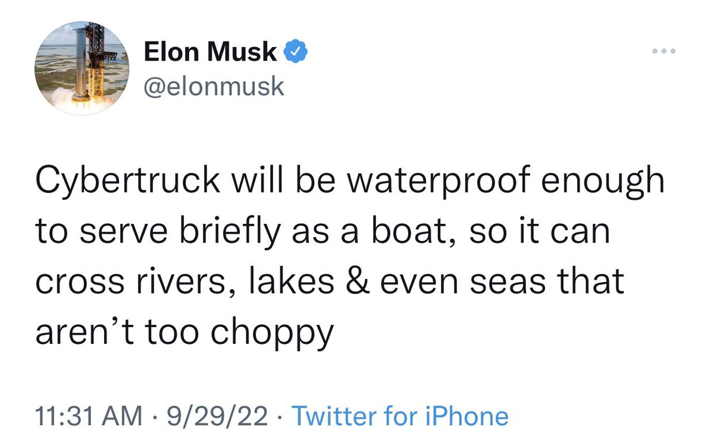
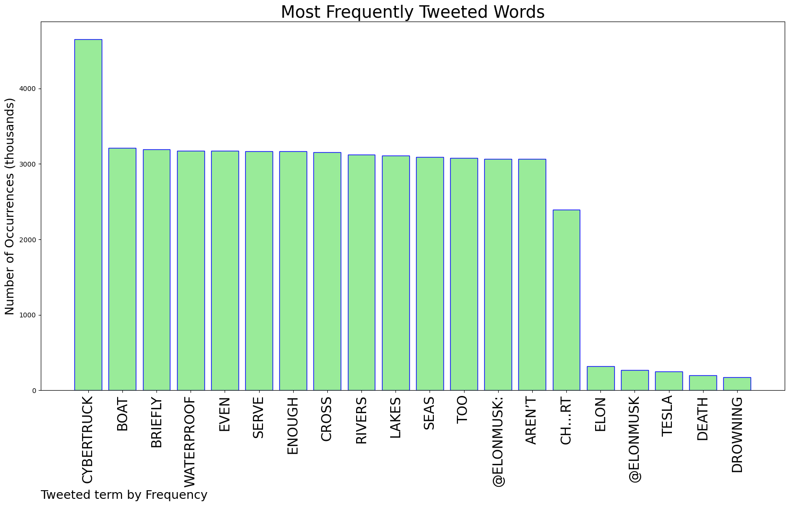
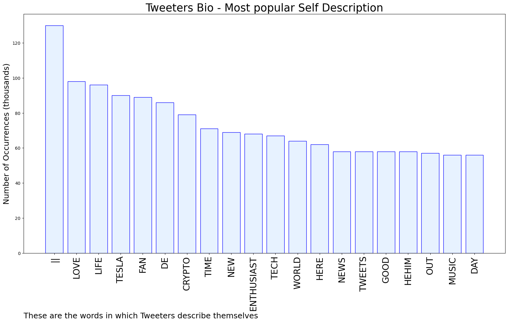

# MURCHIE85 TWITTER PROCESSING 
&#x1F34E; **TOPIC = "Cybertruck"**

## AUTOMATED RESEARCH SUMMARY

*note: Image pulled from web automatically, not connected to author.
  
<b> This report is AUTOMATED and not hand crafted, it is designed for pulling metrics on a given keyword or hashtag and performs a series of reporting and analysis.</b>

|                **Sample-Tweets**        |
| :-------------: |
| RT @elonmusk: Cybertruck will be waterproof enough to serve briefly as a boat, so it can cross rivers, lakes &amp; even seas that aren’t too ch… |
| RT @elonmusk: Cybertruck will be waterproof enough to serve briefly as a boat, so it can cross rivers, lakes &amp; even seas that aren’t too ch… |
| @elonmusk Sure, the same way the glass of the Cybertruck is unshatterable?  The same way 'Autopilot' actually works as intended? |

The most popular user is: **IIIIINASTYIIIII**

 RT @elonmusk: Cybertruck will be waterproof enough to serve briefly as a boat, so it can cross rivers, lakes &amp; even seas that aren’t too ch…

## RELATED METRICS 
| Metric | Value |
| ------------- | ------------- |
| #1 Most tweeted to  | **elonmusk** |
| #2 Most tweeted to  | **nathanTbernard** |
| #3 Most tweeted to  | **PPathole** |
| NewProfiles (less than 10 days) | 1.8%  |
| Tweeters with < 10 followers  | 8.34%|
| Tweeters with > 1000000 followers  | 0.04%  |

## MOST POPULAR TWEET TERMS 

| Popularity Rank  | Term |
| ------------- | ------------- |
| first  | **CYBERTRUCK**  |
| second  | **BOAT**  |
| third  | **BRIEFLY** |
| fourth  | **WATERPROOF**  |
| fifth  | **EVEN**  |

## Twitter Bio Analysis
### SENTIMENT ANALYSIS

VIEWS WERE : **SUBJECTIVE**  (26.67%) & **NEGATIVELY-SUBJECTIVE** (0.0%) **OBJECTIVE** (73.33%)

### TWEET SAMPLE 
| Random value picked from array |
| ------------- |
|RT @elonmusk: Cybertruck will be waterproof enough to serve briefly as a boat, so it can cross rivers, lakes &amp; even seas that aren’t too ch… |

### MOST RETWEETED 

| The most retweeted user is: **IIIIINASTYIIIII**  |
| ------------- |
| RT @elonmusk: Cybertruck will be waterproof enough to serve briefly as a boat, so it can cross rivers, lakes &amp; even seas that aren’t too ch… |

### CONCLUSION & EXTERNAL ANALYSIS

*This is my [Adam McMurchie`s] opinion on the data from the tweets, it serves as no objective truth.Since the tweets themselves are a mixture of fact & opinion. 
Authors analytical summary on request.
**RECOMMENDATIONS** WILL BE UPDATED IN NEXT  24 HOURS  