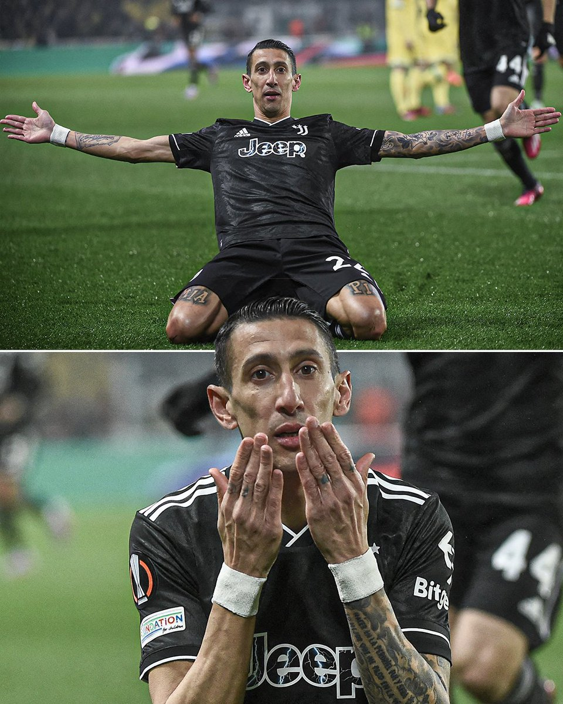
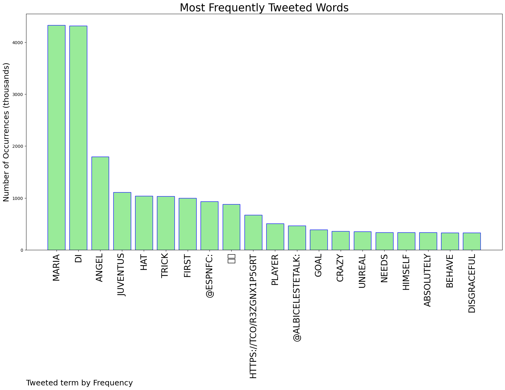

# MURCHIE85 TWITTER PROCESSING 
&#x1F34E; **TOPIC = "Di Maria"**

## AUTOMATED RESEARCH SUMMARY

*note: Image pulled from web automatically, not connected to author.
  
<b> This report is AUTOMATED and not hand crafted, it is designed for pulling metrics on a given keyword or hashtag and performs a series of reporting and analysis.</b>

|                **Sample-Tweets**        |
| :-------------: |
| RT @ESPNFC: ANGEL DI MARIA HAS HIS FIRST JUVENTUS HAT TRICK 👏🦓 https://t.co/r3ZGnx1p5G |
| RT @ESPNFC: ANGEL DI MARIA HAS HIS FIRST JUVENTUS HAT TRICK 👏🦓 https://t.co/r3ZGnx1p5G |
| RT @StoolFootball: Angel Di Maria needs to learn to behave himself.That is absolutely disgraceful. https://t.co/uNelzwbFI9 |

The most popular user is: **BIG_Winning1**

 RT @AlbicelesteTalk: Di Maria is unreal, crazy player.

 https://t.co/4d2OHTnCqa

## RELATED METRICS 
| Metric | Value |
| ------------- | ------------- |
| #1 Most tweeted to  | **ESPNFC** |
| #2 Most tweeted to  | **AlbicelesteTalk** |
| #3 Most tweeted to  | **StoolFootball** |
| NewProfiles (less than 10 days) | 0.32%  |
| Tweeters with < 10 followers  | 3.72%|
| Tweeters with > 1000000 followers  | 0.12%  |

## MOST POPULAR TWEET TERMS 

| Popularity Rank  | Term |
| ------------- | ------------- |
| first  | **MARIA**  |
| second  | **DI**  |
| third  | **ANGEL** |
| fourth  | **JUVENTUS**  |
| fifth  | **HAT**  |

## Twitter Bio Analysis
### SENTIMENT ANALYSIS

VIEWS WERE : **SUBJECTIVE**  (33.33%) & **NEGATIVELY-SUBJECTIVE** (6.67%) **OBJECTIVE** (60.0%)

### TWEET SAMPLE 
| Random value picked from array |
| ------------- |
|RT @AlbicelesteTalk: Di Maria HATTRICK!! ⚽️⚽️⚽️ |

### MOST RETWEETED 

| The most retweeted user is: **BIG_Winning1**  |
| ------------- |
| RT @AlbicelesteTalk: Di Maria is unreal, crazy player. https://t.co/4d2OHTnCqa |

### CONCLUSION & EXTERNAL ANALYSIS

*This is my [Adam McMurchie`s] opinion on the data from the tweets, it serves as no objective truth.Since the tweets themselves are a mixture of fact & opinion. 
Authors analytical summary on request.
**RECOMMENDATIONS** WILL BE UPDATED IN NEXT  24 HOURS  