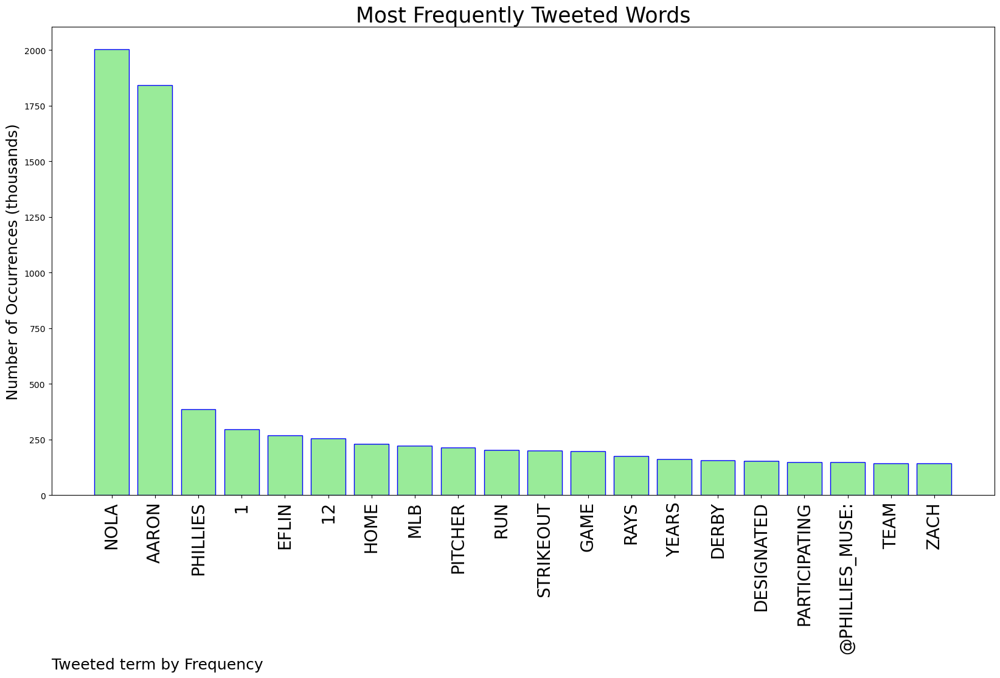
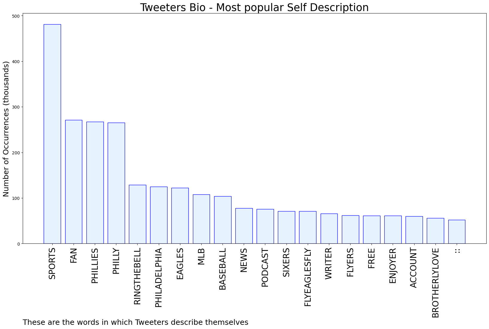

# MURCHIE85 TWITTER PROCESSING 
&#x1F34E; **TOPIC = "Aaron Nola"**

## AUTOMATED RESEARCH SUMMARY

*note: Image pulled from web automatically, not connected to author.
  
<b> This report is AUTOMATED and not hand crafted, it is designed for pulling metrics on a given keyword or hashtag and performs a series of reporting and analysis.</b>

|                **Sample-Tweets**        |
| :-------------: |
| RT @MattGelb: Aaron Nola has allowed 20 homers this season, one more than all of last season. Of those 20, 11 are solo homers. |
| RT @MarcFarzetta: Aaron Nola+Phillies out-duel Zach Eflin | Don't know what the 76ers are doing? Neither do they https://t.co/jZ5jEn8duo |
| Is Aaron Nola the best MLB player of all time? He cashed the taco by himself 😂 https://t.co/ROqU2Rrail |

The most popular user is: **Mr_Aaron_Jordan**

 RT @KryssyLaReina: Van Van in the NOLA baby!  https://t.co/6NiKCruhA6

## RELATED METRICS 
| Metric | Value |
| ------------- | ------------- |
| #1 Most tweeted to  | **Phillies_Muse** |
| #2 Most tweeted to  | **Phillies** |
| #3 Most tweeted to  | **TalkinBaseball_** |
| NewProfiles (less than 10 days) | 0.2%  |
| Tweeters with < 10 followers  | 2.76%|
| Tweeters with > 1000000 followers  | 0.12%  |

## MOST POPULAR TWEET TERMS 

| Popularity Rank  | Term |
| ------------- | ------------- |
| first  | **NOLA**  |
| second  | **AARON**  |
| third  | **PHILLIES** |
| fourth  | **1**  |
| fifth  | **EFLIN**  |

## Twitter Bio Analysis
### SENTIMENT ANALYSIS

VIEWS WERE : **SUBJECTIVE**  (33.33%) & **NEGATIVELY-SUBJECTIVE** (0.0%) **OBJECTIVE** (66.67%)

### TWEET SAMPLE 
| Random value picked from array |
| ------------- |
|RT @PhilliesNotes: With his 30th career double-digit strikeout game, Aaron Nola moved into sole possession of third place in Phillies franc… |

### MOST RETWEETED 

| The most retweeted user is: **Mr_Aaron_Jordan**  |
| ------------- |
| RT @KryssyLaReina: Van Van in the NOLA baby!  https://t.co/6NiKCruhA6 |

### CONCLUSION & EXTERNAL ANALYSIS

*This is my [Adam McMurchie`s] opinion on the data from the tweets, it serves as no objective truth.Since the tweets themselves are a mixture of fact & opinion. 
Authors analytical summary on request.
**RECOMMENDATIONS** WILL BE UPDATED IN NEXT  24 HOURS  