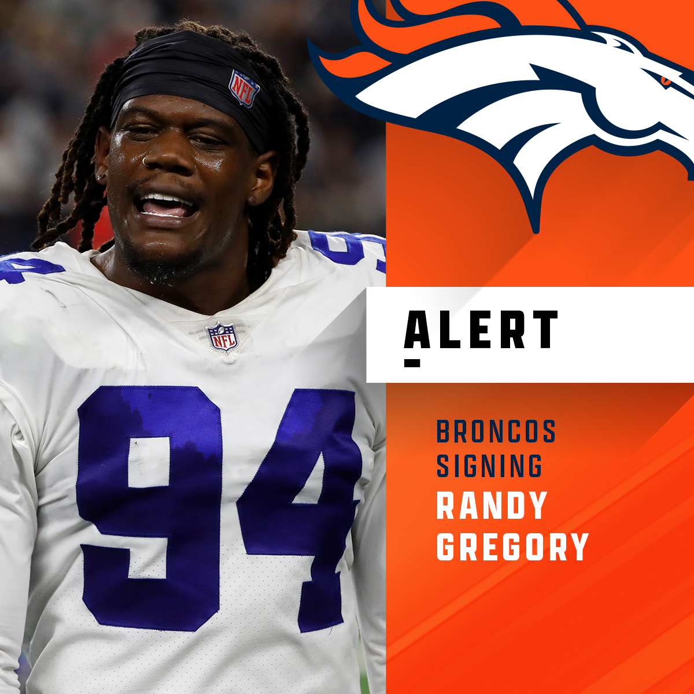
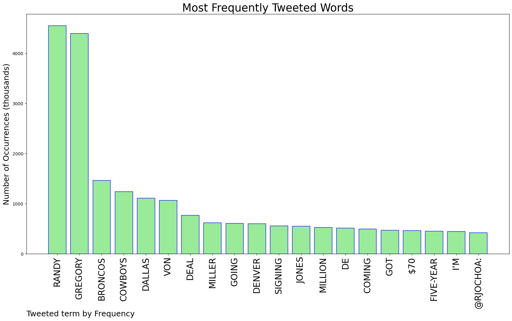
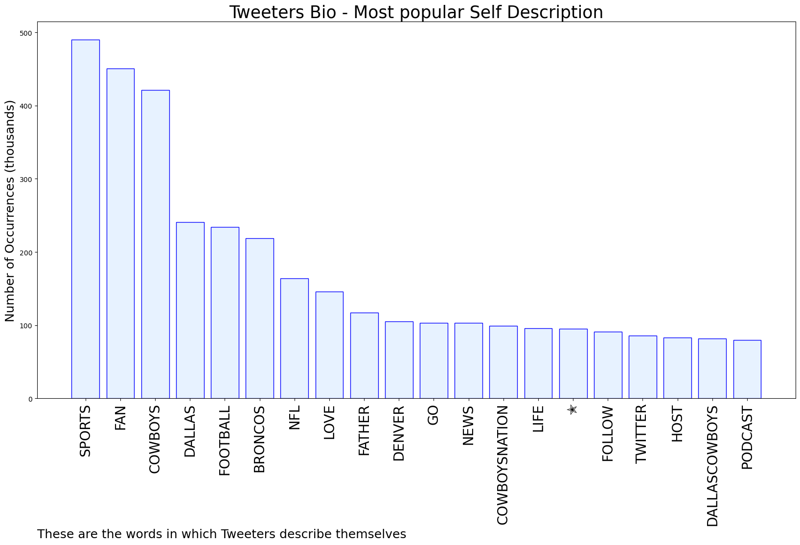

# MURCHIE85 TWITTER PROCESSING 
&#x1F34E; **TOPIC = "Randy Gregory"**

## AUTOMATED RESEARCH SUMMARY

*note: Image pulled from web automatically, not connected to author.
  
<b> This report is AUTOMATED and not hand crafted, it is designed for pulling metrics on a given keyword or hashtag and performs a series of reporting and analysis.</b>

|                **Sample-Tweets**        |
| :-------------: |
| RT @Marcus_Mosher: Losing Amari Cooper + Randy Gregory in the same offseason is rough. |
| RT @Marcus_Mosher: Losing Amari Cooper + Randy Gregory in the same offseason is rough. |
| RT @FanDuel: Cowboys: 𝙒𝙚'𝙫𝙚 agreed to a deal with Randy Gregory Randy Gregory: https://t.co/HtIlciTNMz |

The most popular user is: **ArtrellH**

 RT @AdamSchefter: Cowboys are re-signing DE Randy Gregory to a five-year, $70 million deal that includes $28 million guaranteed, per source.

## RELATED METRICS 
| Metric | Value |
| ------------- | ------------- |
| #1 Most tweeted to  | **SlaterNFL** |
| #2 Most tweeted to  | **rjochoa** |
| #3 Most tweeted to  | **NFL** |
| NewProfiles (less than 10 days) | 0.84%  |
| Tweeters with < 10 followers  | 3.32%|
| Tweeters with > 1000000 followers  | 0.12%  |

## MOST POPULAR TWEET TERMS 

| Popularity Rank  | Term |
| ------------- | ------------- |
| first  | **RANDY**  |
| second  | **GREGORY**  |
| third  | **BRONCOS** |
| fourth  | **COWBOYS**  |
| fifth  | **DALLAS**  |

## Twitter Bio Analysis
### SENTIMENT ANALYSIS

VIEWS WERE : **SUBJECTIVE**  (13.33%) & **NEGATIVELY-SUBJECTIVE** (6.67%) **OBJECTIVE** (80.0%)

### TWEET SAMPLE 
| Random value picked from array |
| ------------- |
|RT @JoRo_NFL: If the Broncos had Randy Gregory as their top edge rusher all the smoke about Chandler Jones looks pretty interesting in hind… |

### MOST RETWEETED 

| The most retweeted user is: **ArtrellH**  |
| ------------- |
| RT @AdamSchefter: Cowboys are re-signing DE Randy Gregory to a five-year, $70 million deal that includes $28 million guaranteed, per source. |

### CONCLUSION & EXTERNAL ANALYSIS

*This is my [Adam McMurchie`s] opinion on the data from the tweets, it serves as no objective truth.Since the tweets themselves are a mixture of fact & opinion. 
Authors analytical summary on request.
**RECOMMENDATIONS** WILL BE UPDATED IN NEXT  24 HOURS  