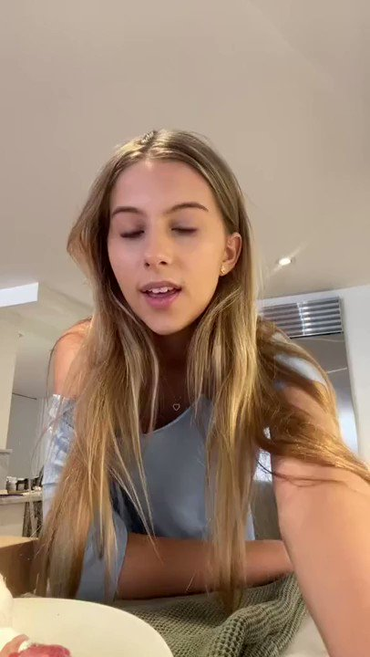
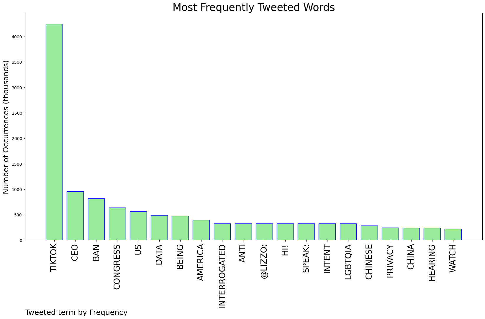
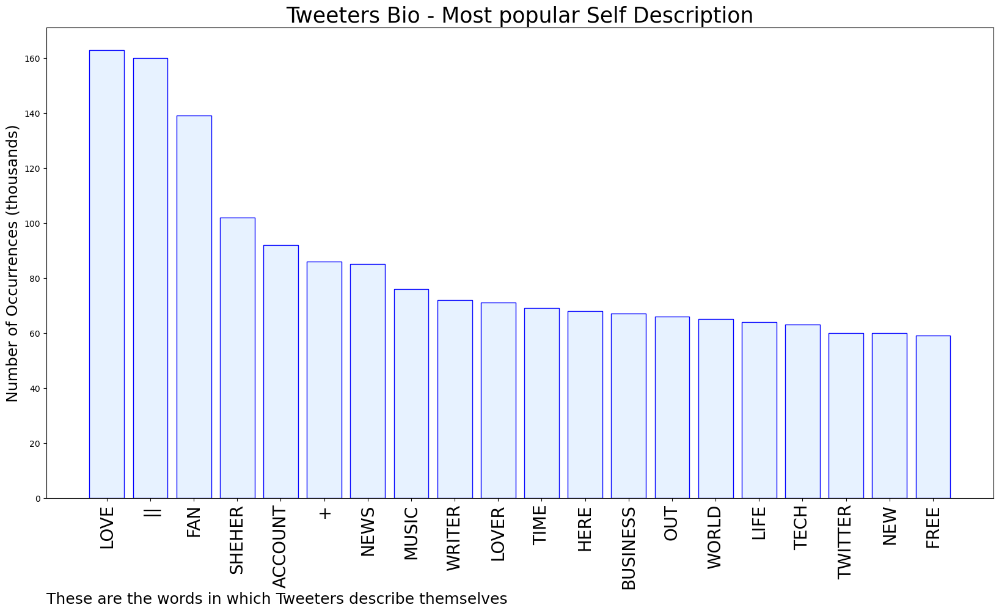

# MURCHIE85 TWITTER PROCESSING 
&#x1F34E; **TOPIC = "TikTok"**

## AUTOMATED RESEARCH SUMMARY

*note: Image pulled from web automatically, not connected to author.
  
<b> This report is AUTOMATED and not hand crafted, it is designed for pulling metrics on a given keyword or hashtag and performs a series of reporting and analysis.</b>

|                **Sample-Tweets**        |
| :-------------: |
| i made a new tiktok account and i think you should follow it :) https://t.co/6qr2SwPOl0 |
| @nojumper Jarret Allen is going to crush the glass tonight.https://t.co/WRvpcQT96D |
| RT @boblatta: I just pressed TikTok’s CEO about whether or not the Chinese Communist Party has access to U.S. user data. He ADMITTED Chin… |

The most popular user is: **JamesMahonn**

 RT @d1rtydan: A guy on reddit reversed engineered #TikTok

Here’s what he found on the data it collects on you

It’s far worse than just st…

## RELATED METRICS 
| Metric | Value |
| ------------- | ------------- |
| #1 Most tweeted to  | **lizzo** |
| #2 Most tweeted to  | **Esqueer_** |
| #3 Most tweeted to  | **lovedoveclarke** |
| NewProfiles (less than 10 days) | 0.36%  |
| Tweeters with < 10 followers  | 5.74%|
| Tweeters with > 1000000 followers  | 0.18%  |

## MOST POPULAR TWEET TERMS 

| Popularity Rank  | Term |
| ------------- | ------------- |
| first  | **TIKTOK**  |
| second  | **CEO**  |
| third  | **BAN** |
| fourth  | **CONGRESS**  |
| fifth  | **US**  |

## Twitter Bio Analysis
### SENTIMENT ANALYSIS

VIEWS WERE : **SUBJECTIVE**  (33.33%) & **NEGATIVELY-SUBJECTIVE** (20.0%) **OBJECTIVE** (46.67%)

### TWEET SAMPLE 
| Random value picked from array |
| ------------- |
|RT @brandypapii: This is my favourite TikTok from last year https://t.co/WAZSq6rKsX |

### MOST RETWEETED 

| The most retweeted user is: **JamesMahonn**  |
| ------------- |
| RT @d1rtydan: A guy on reddit reversed engineered #TikTokHere’s what he found on the data it collects on youIt’s far worse than just st… |

### CONCLUSION & EXTERNAL ANALYSIS

*This is my [Adam McMurchie`s] opinion on the data from the tweets, it serves as no objective truth.Since the tweets themselves are a mixture of fact & opinion. 
Authors analytical summary on request.
**RECOMMENDATIONS** WILL BE UPDATED IN NEXT  24 HOURS  