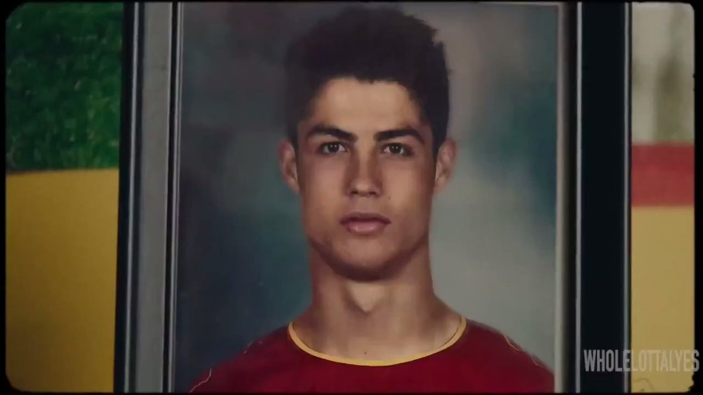
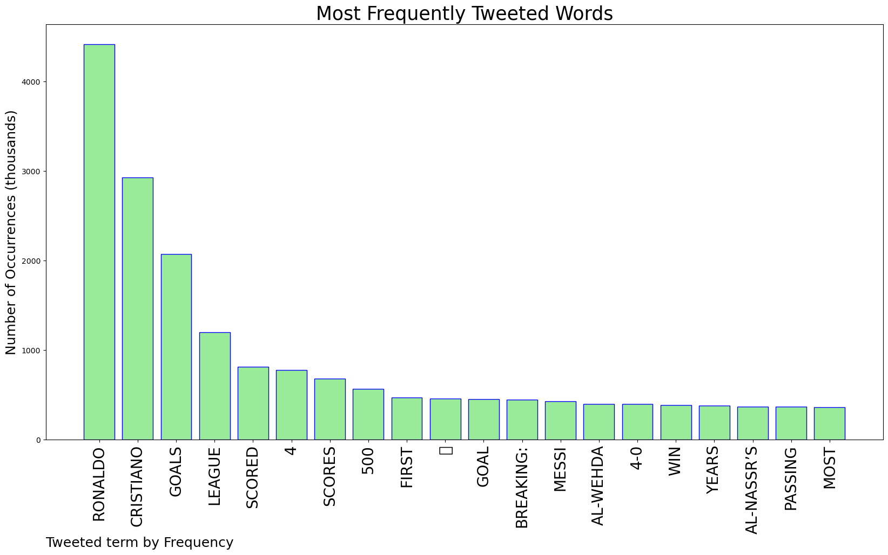
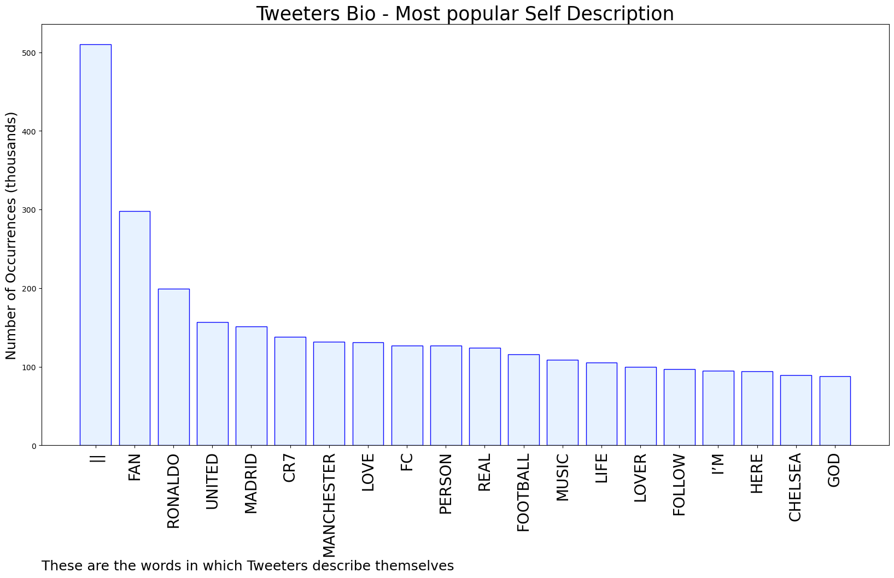

# MURCHIE85 TWITTER PROCESSING 
&#x1F34E; **TOPIC = "Ronaldo"**

## AUTOMATED RESEARCH SUMMARY

*note: Image pulled from web automatically, not connected to author.
  
<b> This report is AUTOMATED and not hand crafted, it is designed for pulling metrics on a given keyword or hashtag and performs a series of reporting and analysis.</b>

|                **Sample-Tweets**        |
| :-------------: |
| RT @goal: CRISTIANO RONALDO SCORES HIS FIRST HAT-TRICK FOR AL-NASSR 😤 https://t.co/yf7GsphTH9 |
| @UberFacts Not Uber facts dignifying ronaldoLmao |
| RT @goal: Cristiano Ronaldo has scored at least four goals in one game for the ELEVENTH time 🐐 https://t.co/s2EByCHpbq |

The most popular user is: **huntu97**

 RT @ishowspeedsui: Ok I finally admit it. Messi is the 2nd best of all time after Ronaldo🐐

## RELATED METRICS 
| Metric | Value |
| ------------- | ------------- |
| #1 Most tweeted to  | **piersmorgan** |
| #2 Most tweeted to  | **CristianoXtra_** |
| #3 Most tweeted to  | **ESPNFC** |
| NewProfiles (less than 10 days) | 0.36%  |
| Tweeters with < 10 followers  | 4.34%|
| Tweeters with > 1000000 followers  | 0.06%  |

## MOST POPULAR TWEET TERMS 

| Popularity Rank  | Term |
| ------------- | ------------- |
| first  | **RONALDO**  |
| second  | **CRISTIANO**  |
| third  | **GOALS** |
| fourth  | **LEAGUE**  |
| fifth  | **SCORED**  |

## Twitter Bio Analysis
### SENTIMENT ANALYSIS

VIEWS WERE : **SUBJECTIVE**  (26.67%) & **NEGATIVELY-SUBJECTIVE** (20.0%) **OBJECTIVE** (53.33%)

### TWEET SAMPLE 
| Random value picked from array |
| ------------- |
|RT @ghanayesu: If Cristiano Ronaldo is your Goat like This. ❤️ https://t.co/Hm08s1o9AV |

### MOST RETWEETED 

| The most retweeted user is: **huntu97**  |
| ------------- |
| RT @ishowspeedsui: Ok I finally admit it. Messi is the 2nd best of all time after Ronaldo🐐 |

### CONCLUSION & EXTERNAL ANALYSIS

*This is my [Adam McMurchie`s] opinion on the data from the tweets, it serves as no objective truth.Since the tweets themselves are a mixture of fact & opinion. 
Authors analytical summary on request.
**RECOMMENDATIONS** WILL BE UPDATED IN NEXT  24 HOURS  