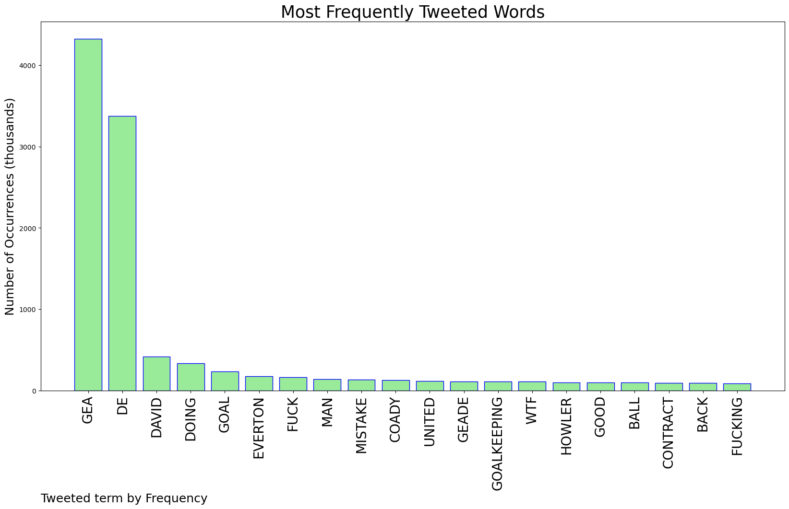
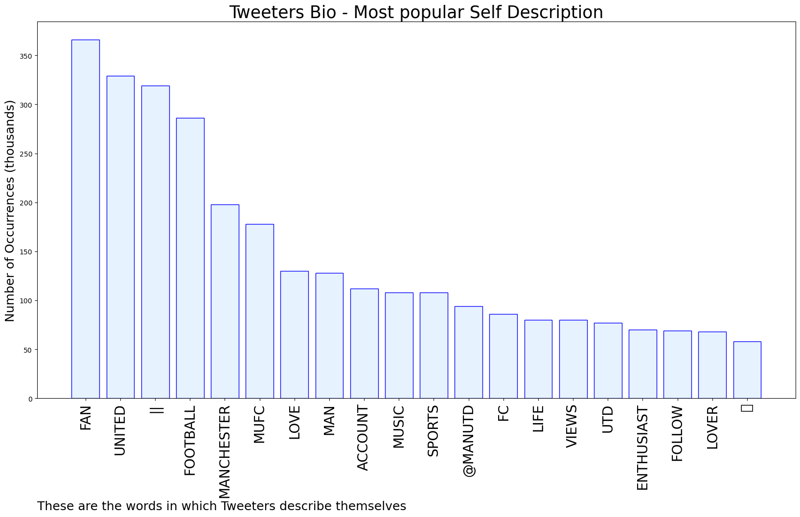

# MURCHIE85 TWITTER PROCESSING 
&#x1F34E; **TOPIC = "De Gea"**

## AUTOMATED RESEARCH SUMMARY

*note: Image pulled from web automatically, not connected to author.
  
<b> This report is AUTOMATED and not hand crafted, it is designed for pulling metrics on a given keyword or hashtag and performs a series of reporting and analysis.</b>

|                **Sample-Tweets**        |
| :-------------: |
| RT @lauriewhitwell: Very curious goalkeeping by David de Gea.#MUFC |
| And they're gonna give De Gea an extension?! |
| Yeah David de Gea can't be for real💀 |

The most popular user is: **LeoCarter27**

 RT @centredevils: David de Gea Appreciation Tweet. 

He has been IMMENSE this season ❤️ https://t.co/T9nBfT5nC4

## RELATED METRICS 
| Metric | Value |
| ------------- | ------------- |
| #1 Most tweeted to  | **DannyAaronsFUT** |
| #2 Most tweeted to  | **ManUtd** |
| #3 Most tweeted to  | **markgoldbridge** |
| NewProfiles (less than 10 days) | 0.18%  |
| Tweeters with < 10 followers  | 2.02%|
| Tweeters with > 1000000 followers  | 0.14%  |

## MOST POPULAR TWEET TERMS 

| Popularity Rank  | Term |
| ------------- | ------------- |
| first  | **GEA**  |
| second  | **DE**  |
| third  | **DAVID** |
| fourth  | **DOING**  |
| fifth  | **GOAL**  |

## Twitter Bio Analysis
### SENTIMENT ANALYSIS

VIEWS WERE : **SUBJECTIVE**  (33.33%) & **NEGATIVELY-SUBJECTIVE** (13.33%) **OBJECTIVE** (53.33%)

### TWEET SAMPLE 
| Random value picked from array |
| ------------- |
|That was a foul on Casemiro… But what is that awfulness by De Gea? |

### MOST RETWEETED 

| The most retweeted user is: **LeoCarter27**  |
| ------------- |
| RT @centredevils: David de Gea Appreciation Tweet. He has been IMMENSE this season ❤️ https://t.co/T9nBfT5nC4 |

### CONCLUSION & EXTERNAL ANALYSIS

*This is my [Adam McMurchie`s] opinion on the data from the tweets, it serves as no objective truth.Since the tweets themselves are a mixture of fact & opinion. 
Authors analytical summary on request.
**RECOMMENDATIONS** WILL BE UPDATED IN NEXT  24 HOURS  