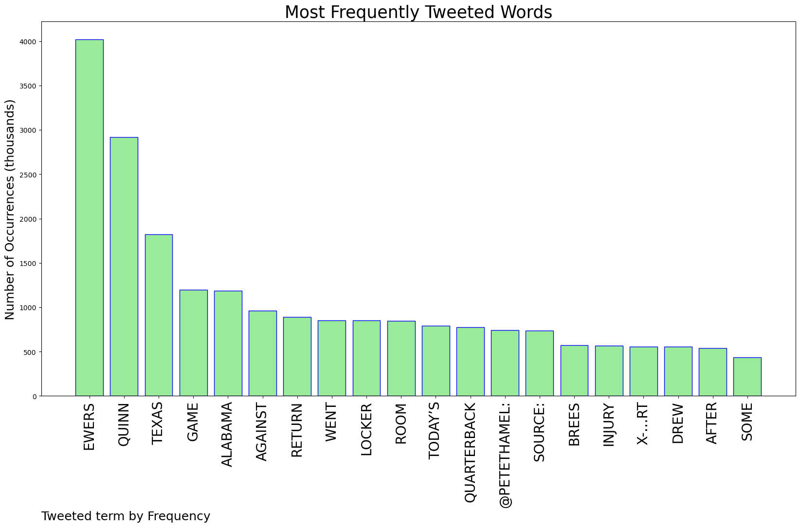
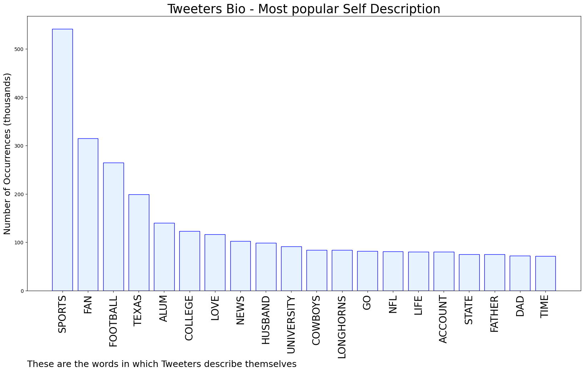

# MURCHIE85 TWITTER PROCESSING 
&#x1F34E; **TOPIC = "Ewers"**

## AUTOMATED RESEARCH SUMMARY

*note: Image pulled from web automatically, not connected to author.
  
<b> This report is AUTOMATED and not hand crafted, it is designed for pulling metrics on a given keyword or hashtag and performs a series of reporting and analysis.</b>

|                **Sample-Tweets**        |
| :-------------: |
| RT @PFF: Drew Brees offers some advice on Quinn Ewers injury 😳 https://t.co/gG1t0URvVj |
| RT @247Sports: JUST IN: Quinn Ewers will not return to the Texas-Alabama game after going to the locker room for an X-ray, per @PeteThamel.… |
| RT @SimoneEli_TV: This gets called a penalty bc officials get too wrapped up in the moment and how things “appear” — it’s football, it’s a… |

The most popular user is: **LurkRussell**

 RT @Stuckey2: Quinn Ewers before and after playing Alabama https://t.co/px9Eg8IsiP

## RELATED METRICS 
| Metric | Value |
| ------------- | ------------- |
| #1 Most tweeted to  | **PeteThamel** |
| #2 Most tweeted to  | **BleacherReport** |
| #3 Most tweeted to  | **barstoolsports** |
| NewProfiles (less than 10 days) | 0.6%  |
| Tweeters with < 10 followers  | 3.56%|
| Tweeters with > 1000000 followers  | 0.22%  |

## MOST POPULAR TWEET TERMS 

| Popularity Rank  | Term |
| ------------- | ------------- |
| first  | **EWERS**  |
| second  | **QUINN**  |
| third  | **TEXAS** |
| fourth  | **GAME**  |
| fifth  | **ALABAMA**  |

## Twitter Bio Analysis
### SENTIMENT ANALYSIS

VIEWS WERE : **SUBJECTIVE**  (40.0%) & **NEGATIVELY-SUBJECTIVE** (20.0%) **OBJECTIVE** (40.0%)

### TWEET SAMPLE 
| Random value picked from array |
| ------------- |
|RT @PeteThamel: Source: Texas quarterback Quinn Ewers will not return to today’s game against Alabama. He went to the locker room for an X-… |

### MOST RETWEETED 

| The most retweeted user is: **LurkRussell**  |
| ------------- |
| RT @Stuckey2: Quinn Ewers before and after playing Alabama https://t.co/px9Eg8IsiP |

### CONCLUSION & EXTERNAL ANALYSIS

*This is my [Adam McMurchie`s] opinion on the data from the tweets, it serves as no objective truth.Since the tweets themselves are a mixture of fact & opinion. 
Authors analytical summary on request.
**RECOMMENDATIONS** WILL BE UPDATED IN NEXT  24 HOURS  