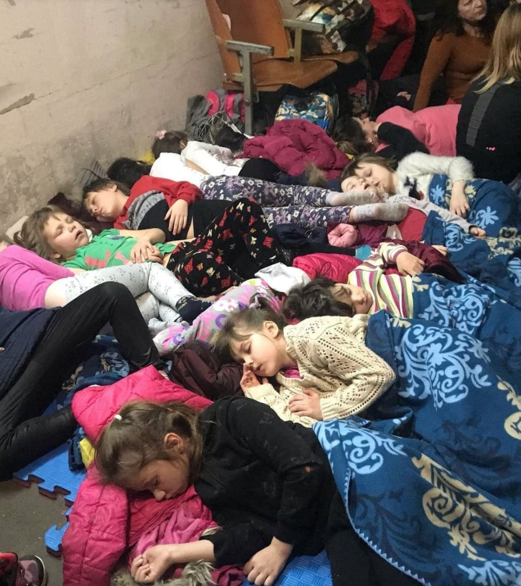
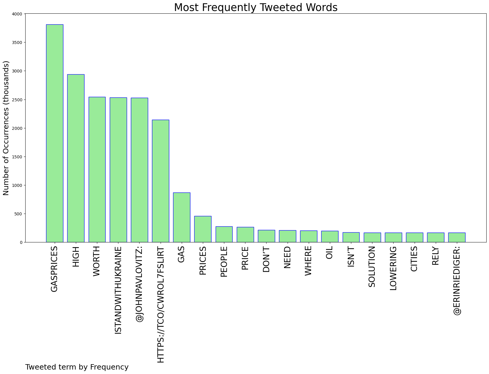
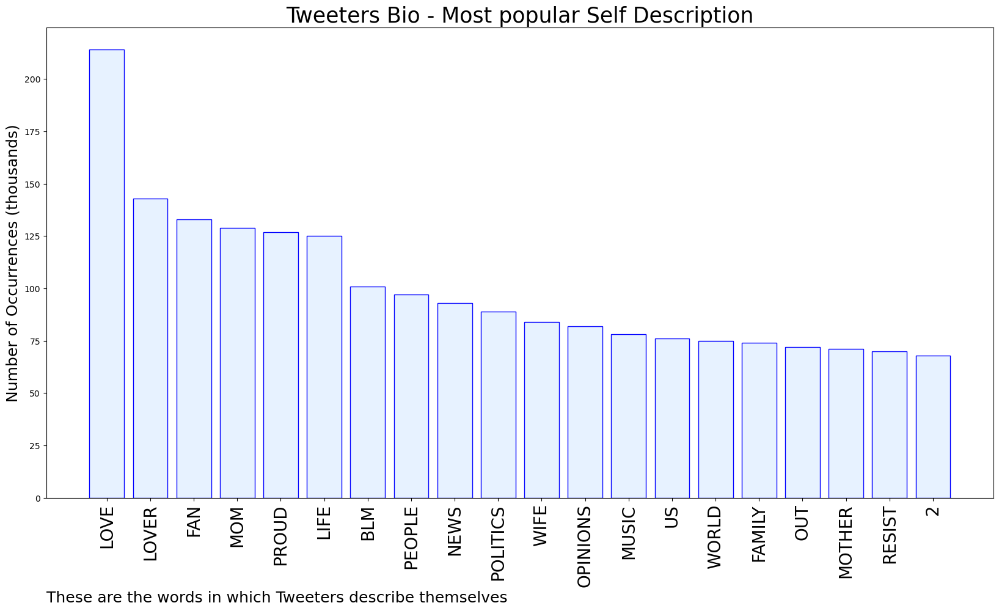

# MURCHIE85 TWITTER PROCESSING 
&#x1F34E; **TOPIC = "#gasprices"**

## AUTOMATED RESEARCH SUMMARY

*note: Image pulled from web automatically, not connected to author.
  
<b> This report is AUTOMATED and not hand crafted, it is designed for pulling metrics on a given keyword or hashtag and performs a series of reporting and analysis.</b>

|                **Sample-Tweets**        |
| :-------------: |
| RT @johnpavlovitz: They are worth high #gasprices.#IStandWithUkraine https://t.co/cWrOL7fSlI |
| RT @bernicebuffalo: In 2020, @NewUrbanism came to #buffalo for a #mobility conf. Buffalo committed to adopting #ebikes and #escooters . Whe… |
| RT @johnpavlovitz: They are worth high #gasprices.#IStandWithUkraine https://t.co/cWrOL7fSlI |

The most popular user is: **proputzr715**

 RT @johnpavlovitz: They are worth high #gasprices.

#IStandWithUkraine https://t.co/cWrOL7fSlI

## RELATED METRICS 
| Metric | Value |
| ------------- | ------------- |
| #1 Most tweeted to  | **johnpavlovitz** |
| #2 Most tweeted to  | **erinriediger** |
| #3 Most tweeted to  | **RepDougCollins** |
| NewProfiles (less than 10 days) | 1.88%  |
| Tweeters with < 10 followers  | 7.14%|
| Tweeters with > 1000000 followers  | 0.04%  |

## MOST POPULAR TWEET TERMS 

| Popularity Rank  | Term |
| ------------- | ------------- |
| first  | **GASPRICES**  |
| second  | **HIGH**  |
| third  | **WORTH** |
| fourth  | **ISTANDWITHUKRAINE**  |
| fifth  | **@JOHNPAVLOVITZ:**  |

## Twitter Bio Analysis
### SENTIMENT ANALYSIS

VIEWS WERE : **SUBJECTIVE**  (40.0%) & **NEGATIVELY-SUBJECTIVE** (6.67%) **OBJECTIVE** (53.33%)

### TWEET SAMPLE 
| Random value picked from array |
| ------------- |
|How has everyone weeks gone? 😁We've had an amazing week at One Energy, welcoming lots of new members to the famil… https://t.co/wZHt9CjzHp |

### MOST RETWEETED 

| The most retweeted user is: **proputzr715**  |
| ------------- |
| RT @johnpavlovitz: They are worth high #gasprices.#IStandWithUkraine https://t.co/cWrOL7fSlI |

### CONCLUSION & EXTERNAL ANALYSIS

*This is my [Adam McMurchie`s] opinion on the data from the tweets, it serves as no objective truth.Since the tweets themselves are a mixture of fact & opinion. 
Authors analytical summary on request.
**RECOMMENDATIONS** WILL BE UPDATED IN NEXT  24 HOURS  