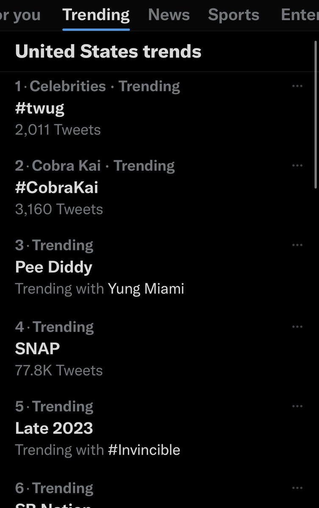
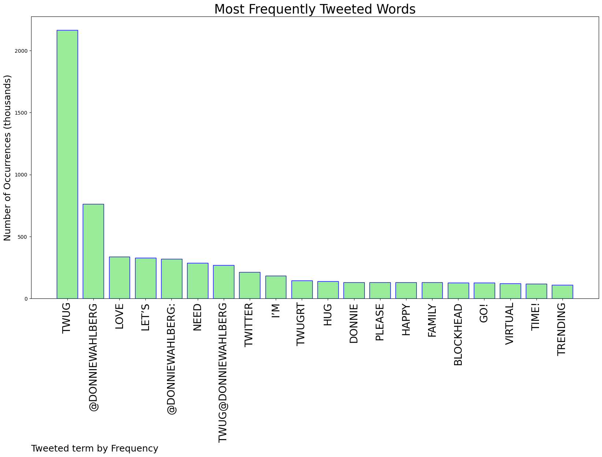
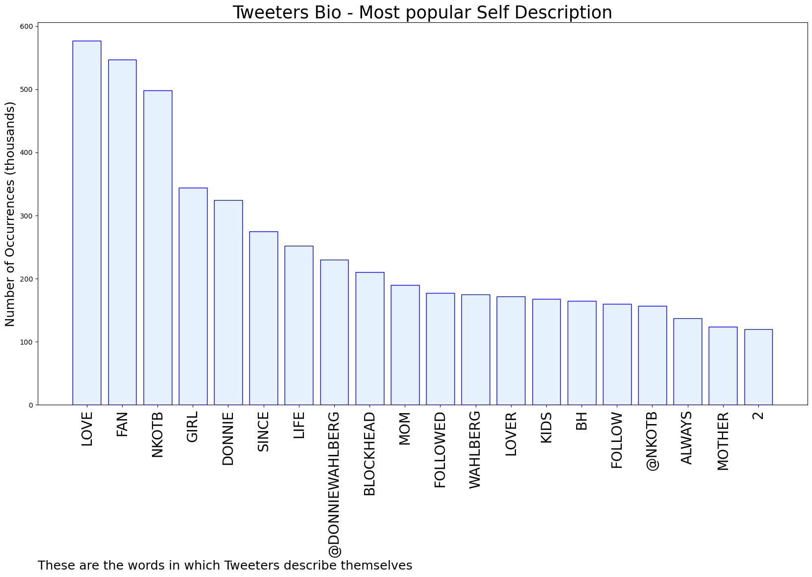

# MURCHIE85 TWITTER PROCESSING 
&#x1F34E; **TOPIC = "#twug"**

## AUTOMATED RESEARCH SUMMARY

*note: Image pulled from web automatically, not connected to author.
  
<b> This report is AUTOMATED and not hand crafted, it is designed for pulling metrics on a given keyword or hashtag and performs a series of reporting and analysis.</b>

|                **Sample-Tweets**        |
| :-------------: |
| RT @sylvia_joliet: @DonnieWahlberg I'm having a really bad day today please can I get a #twug |
| RT @DonnieWahlberg: Worldwide #twug fest! ❤️🌎 |
| @DonnieWahlberg #TWUG love you @DonnieWahlberg 🤖❤️♾️💫✨ https://t.co/obCIrBBRFY |

The most popular user is: **Jadwiga19760909**

 RT @DonnieWahlberg: Blockhead Family,

I’m delivering a virtual twitter hug (aka #twug) to all those in need. It’s #TWUG time!

Let’s goooo…

## RELATED METRICS 
| Metric | Value |
| ------------- | ------------- |
| #1 Most tweeted to  | **DonnieWahlberg** |
| #2 Most tweeted to  | **UniqueNatasha08** |
| #3 Most tweeted to  | **jennyraej1979** |
| NewProfiles (less than 10 days) | 0.73%  |
| Tweeters with < 10 followers  | 3.08%|
| Tweeters with > 1000000 followers  | 1.07%  |

## MOST POPULAR TWEET TERMS 

| Popularity Rank  | Term |
| ------------- | ------------- |
| first  | **TWUG**  |
| second  | **@DONNIEWAHLBERG**  |
| third  | **LOVE** |
| fourth  | **LET’S**  |
| fifth  | **@DONNIEWAHLBERG:**  |

## Twitter Bio Analysis
### SENTIMENT ANALYSIS

VIEWS WERE : **SUBJECTIVE**  (26.67%) & **NEGATIVELY-SUBJECTIVE** (0.0%) **OBJECTIVE** (73.33%)

### TWEET SAMPLE 
| Random value picked from array |
| ------------- |
|@DonnieWahlberg Can you see me now? @DonnieWahlberg #TWUG https://t.co/5NUNNEdQg8 |

### MOST RETWEETED 

| The most retweeted user is: **Jadwiga19760909**  |
| ------------- |
| RT @DonnieWahlberg: Blockhead Family,I’m delivering a virtual twitter hug (aka #twug) to all those in need. It’s #TWUG time!Let’s goooo… |

### CONCLUSION & EXTERNAL ANALYSIS

*This is my [Adam McMurchie`s] opinion on the data from the tweets, it serves as no objective truth.Since the tweets themselves are a mixture of fact & opinion. 
Authors analytical summary on request.
**RECOMMENDATIONS** WILL BE UPDATED IN NEXT  24 HOURS  