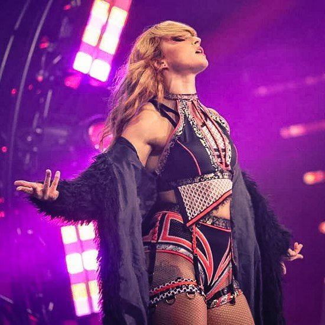
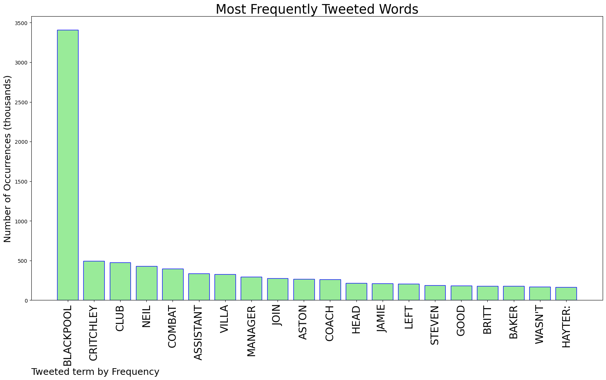
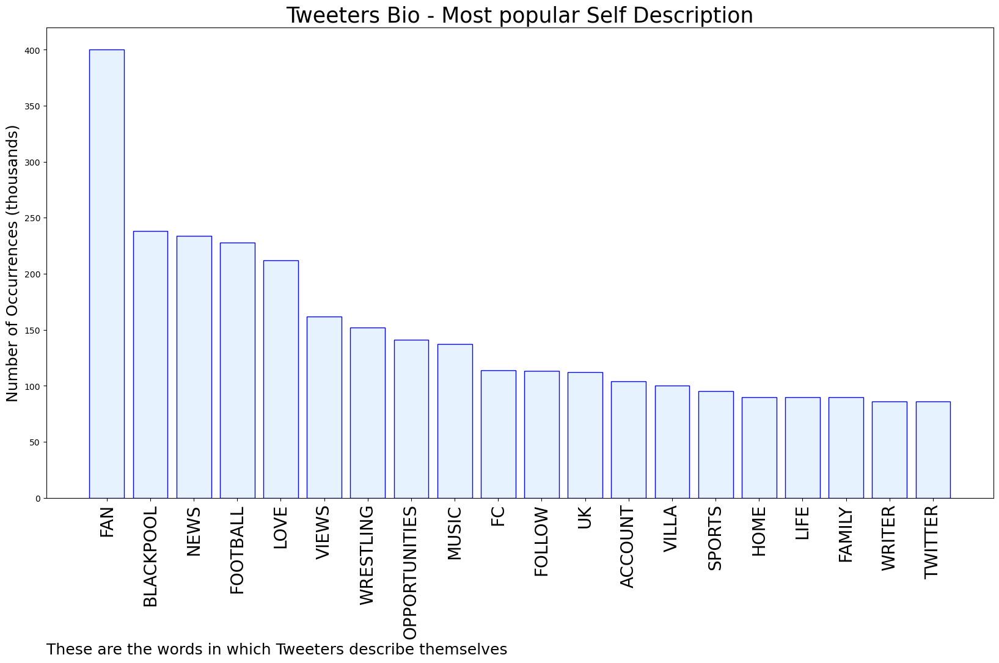
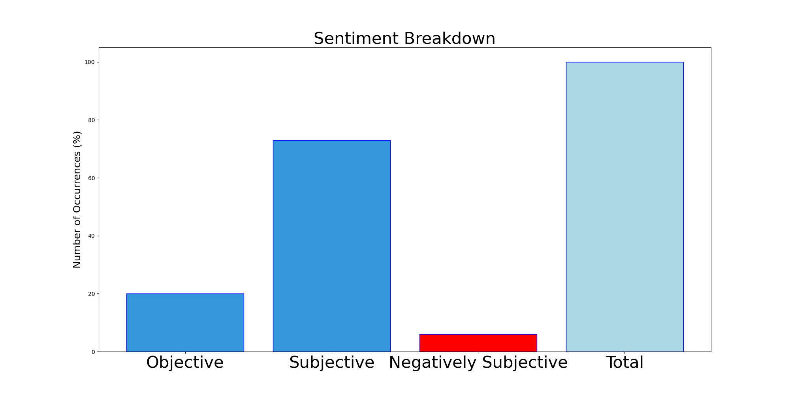

# MURCHIE85 TWITTER PROCESSING 
&#x1F34E; **TOPIC = "Blackpool"**

## AUTOMATED RESEARCH SUMMARY

*note: Image pulled from web automatically, not connected to author.
  
<b> This report is AUTOMATED and not hand crafted, it is designed for pulling metrics on a given keyword or hashtag and performs a series of reporting and analysis.</b>

|                **Sample-Tweets**        |
| :-------------: |
| RT @neiljonesgoal: Neil Critchley leaves Blackpool to become Steven Gerrard's assistant head coach at Aston Villa.#LFC 🔴 |
| #TRUECRIMEDIARY#IRWINMITCHELL #SOLICITORS in tandem with #BEGBIESTRAYNOR GROUP PLC have perverted #Blackpool… https://t.co/IFDHUqPNaM |
| RT @Darkveilpara1: J S Balmer 31st May Today marks the birthday (1831) of Methodist Minister, Reverend James Balmer. A strong advocate fo… |

The most popular user is: **Blackpool_South**

 RT @RoyalFamily: Her Majesty The Queen, the first Monarch in British history to celebrate a Platinum Jubilee.

To mark the beginning of the…

## RELATED METRICS 
| Metric | Value |
| ------------- | ------------- |
| #1 Most tweeted to  | **Fightful** |
| #2 Most tweeted to  | **BlackpoolFC** |
| #3 Most tweeted to  | **visitBlackpool** |
| NewProfiles (less than 10 days) | 0.72%  |
| Tweeters with < 10 followers  | 2.78%|
| Tweeters with > 1000000 followers  | 0.2%  |

## MOST POPULAR TWEET TERMS 

| Popularity Rank  | Term |
| ------------- | ------------- |
| first  | **BLACKPOOL**  |
| second  | **CRITCHLEY**  |
| third  | **CLUB** |
| fourth  | **NEIL**  |
| fifth  | **COMBAT**  |

## Twitter Bio Analysis
### SENTIMENT ANALYSIS

VIEWS WERE : **SUBJECTIVE**  (73.33%) & **NEGATIVELY-SUBJECTIVE** (6.67%) **OBJECTIVE** (20.0%)

### TWEET SAMPLE 
| Random value picked from array |
| ------------- |
|@BlueToffee16 I've just had to tell someone that i can't make it on a trip to Blackpool as i really can't afford it… https://t.co/0TFCde7Is2 |

### MOST RETWEETED 

| The most retweeted user is: **Blackpool_South**  |
| ------------- |
| RT @RoyalFamily: Her Majesty The Queen, the first Monarch in British history to celebrate a Platinum Jubilee.To mark the beginning of the… |

### CONCLUSION & EXTERNAL ANALYSIS

*This is my [Adam McMurchie`s] opinion on the data from the tweets, it serves as no objective truth.Since the tweets themselves are a mixture of fact & opinion. 
Authors analytical summary on request.
**RECOMMENDATIONS** WILL BE UPDATED IN NEXT  24 HOURS  