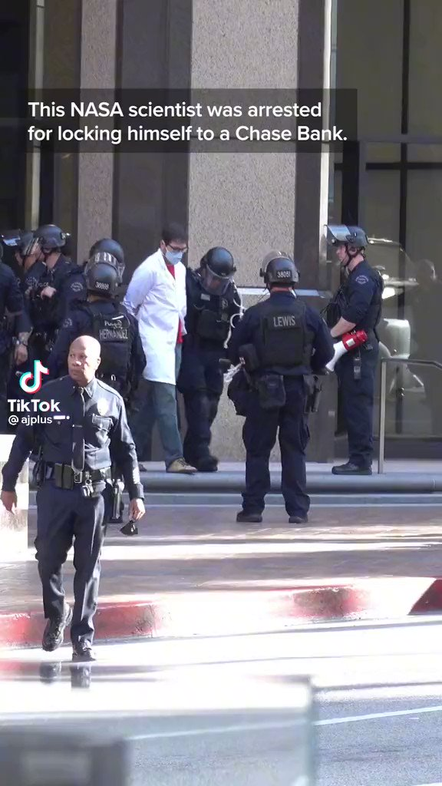
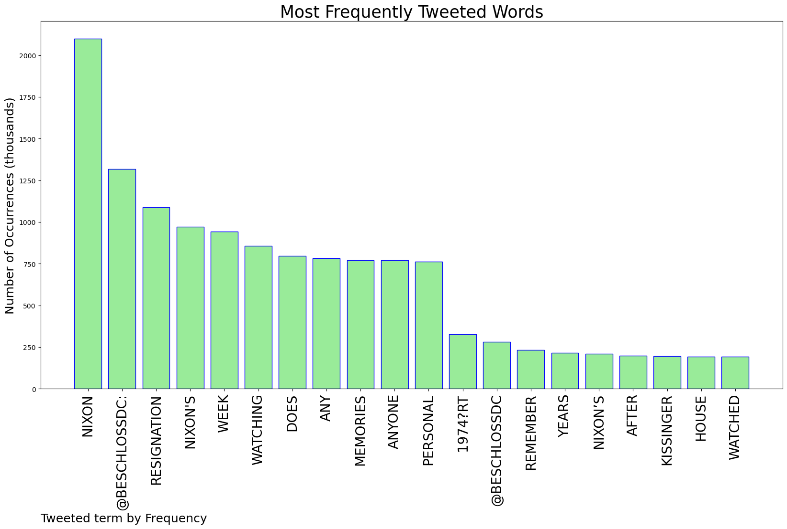
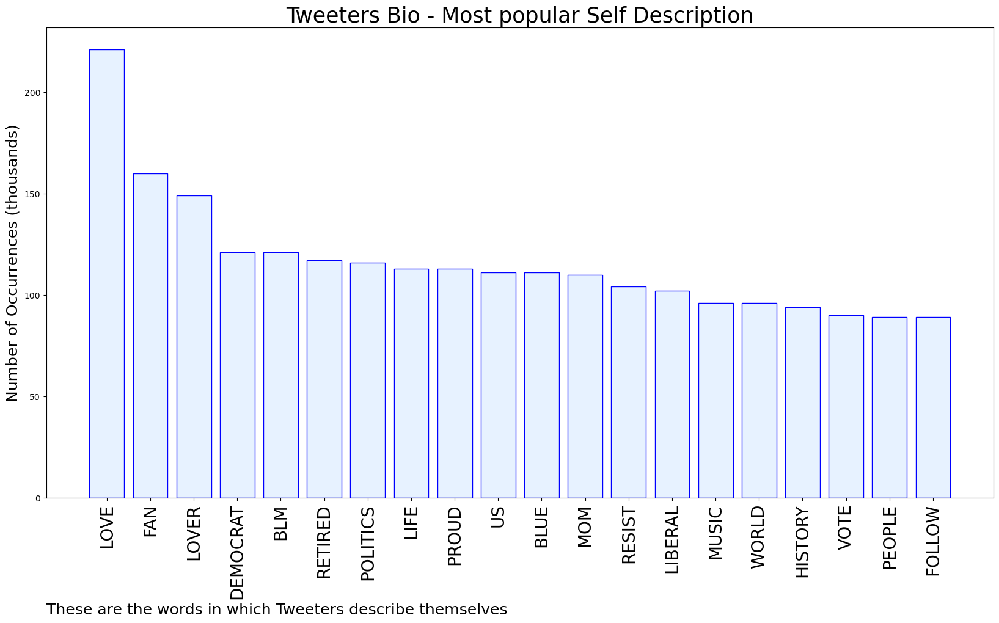

# MURCHIE85 TWITTER PROCESSING 
&#x1F34E; **TOPIC = "Nixon"**

## AUTOMATED RESEARCH SUMMARY

*note: Image pulled from web automatically, not connected to author.
  
<b> This report is AUTOMATED and not hand crafted, it is designed for pulling metrics on a given keyword or hashtag and performs a series of reporting and analysis.</b>

|                **Sample-Tweets**        |
| :-------------: |
| @dick_nixon So many musical let alone cultural contradictions in this. |
| @BeschlossDC Ten years old at the time. Playing football in the street in front of my buddy’s house. Our friend pas… https://t.co/taTIXOBxGE |
| RT @RNCResearch: "In a year and a half, Joe Biden and company have taken the U.S. economy to where it was in the early 1970s — and it took… |

The most popular user is: **romo_nixon**

 RT @ladygaga: What’s fortnight

## RELATED METRICS 
| Metric | Value |
| ------------- | ------------- |
| #1 Most tweeted to  | **BeschlossDC** |
| #2 Most tweeted to  | **dick_nixon** |
| #3 Most tweeted to  | **SpiroAgnewGhost** |
| NewProfiles (less than 10 days) | 0.6%  |
| Tweeters with < 10 followers  | 4.58%|
| Tweeters with > 1000000 followers  | 0.08%  |

## MOST POPULAR TWEET TERMS 

| Popularity Rank  | Term |
| ------------- | ------------- |
| first  | **NIXON**  |
| second  | **@BESCHLOSSDC:**  |
| third  | **RESIGNATION** |
| fourth  | **"NIXONS"**  |
| fifth  | **WEEK**  |

## Twitter Bio Analysis
### SENTIMENT ANALYSIS

VIEWS WERE : **SUBJECTIVE**  (26.67%) & **NEGATIVELY-SUBJECTIVE** (26.67%) **OBJECTIVE** (46.67%)

### TWEET SAMPLE 
| Random value picked from array |
| ------------- |
|RT @AnneFlaherty3JM: @BeschlossDC Not only did I watch it on TV, I saw Frank Zappa at a small venue at the University of Maryland a few day… |

### MOST RETWEETED 

| The most retweeted user is: **romo_nixon**  |
| ------------- |
| RT @ladygaga: What’s fortnight |

### CONCLUSION & EXTERNAL ANALYSIS

*This is my [Adam McMurchie`s] opinion on the data from the tweets, it serves as no objective truth.Since the tweets themselves are a mixture of fact & opinion. 
Authors analytical summary on request.
**RECOMMENDATIONS** WILL BE UPDATED IN NEXT  24 HOURS  