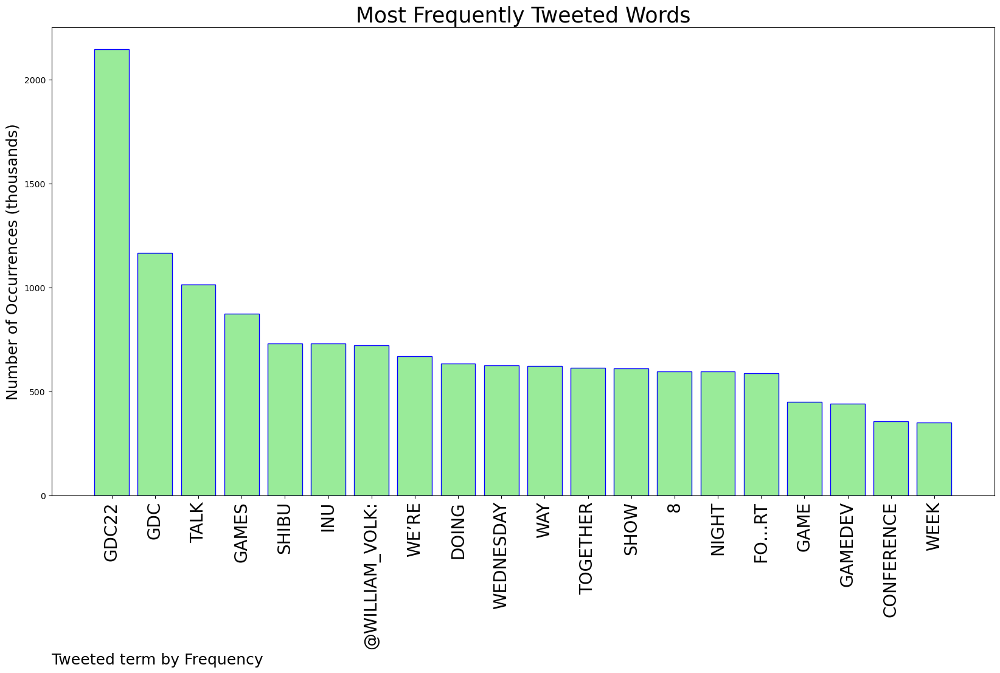
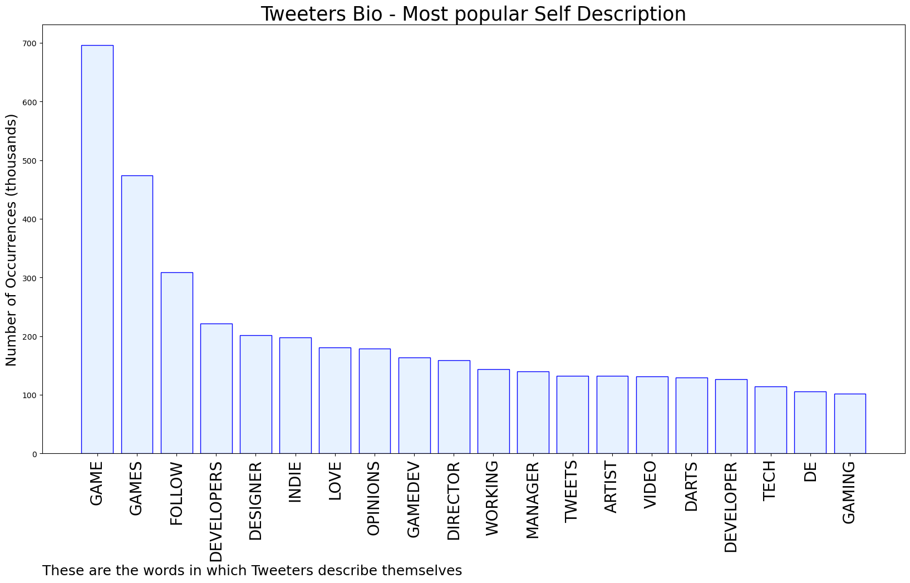

# MURCHIE85 TWITTER PROCESSING 
&#x1F34E; **TOPIC = "#GDC22"**

## AUTOMATED RESEARCH SUMMARY

*note: Image pulled from web automatically, not connected to author.
  
<b> This report is AUTOMATED and not hand crafted, it is designed for pulling metrics on a given keyword or hashtag and performs a series of reporting and analysis.</b>

|                **Sample-Tweets**        |
| :-------------: |
| RT @Dust_Scratch: Are you a publisher or fellow #indiedev at #GDC2022? I'm in the pre-design stage of a couple games, and would love to he… |
| I'll be at #GDC on Tuesday, meeting up with friends and getting ready for my book signing. DM me if you're around!… https://t.co/gh3uHgXXsD |
| The Pocket Sized Hands team will be out at GDC next week, Can't wait to be at a in-person GDC again after years awa… https://t.co/yIIN7R136j |

The most popular user is: **syuzatu0415**

 RT @Official_GDC: The Game Developers Choice Awards at #GDC22 has named Yuji Horii, creator of the legendary 'Dragon Quest' series, as reci…

## RELATED METRICS 
| Metric | Value |
| ------------- | ------------- |
| #1 Most tweeted to  | **william_volk** |
| #2 Most tweeted to  | **Official_GDC** |
| #3 Most tweeted to  | **PhantasmaBot_** |
| NewProfiles (less than 10 days) | 0.65%  |
| Tweeters with < 10 followers  | 3.96%|
| Tweeters with > 1000000 followers  | 0.02%  |

## MOST POPULAR TWEET TERMS 

| Popularity Rank  | Term |
| ------------- | ------------- |
| first  | **GDC22**  |
| second  | **GDC**  |
| third  | **TALK** |
| fourth  | **GAMES**  |
| fifth  | **SHIBU**  |

## Twitter Bio Analysis
### SENTIMENT ANALYSIS

VIEWS WERE : **SUBJECTIVE**  (33.33%) & **NEGATIVELY-SUBJECTIVE** (6.67%) **OBJECTIVE** (60.0%)

### TWEET SAMPLE 
| Random value picked from array |
| ------------- |
|RT @LatinosinGaming: #GDC22 is a few days away! We're highlighting community members who will take part in panels! [THREAD]: https://t.co/W… |

### MOST RETWEETED 

| The most retweeted user is: **syuzatu0415**  |
| ------------- |
| RT @Official_GDC: The Game Developers Choice Awards at #GDC22 has named Yuji Horii, creator of the legendary 'Dragon Quest' series, as reci… |

### CONCLUSION & EXTERNAL ANALYSIS

*This is my [Adam McMurchie`s] opinion on the data from the tweets, it serves as no objective truth.Since the tweets themselves are a mixture of fact & opinion. 
Authors analytical summary on request.
**RECOMMENDATIONS** WILL BE UPDATED IN NEXT  24 HOURS  