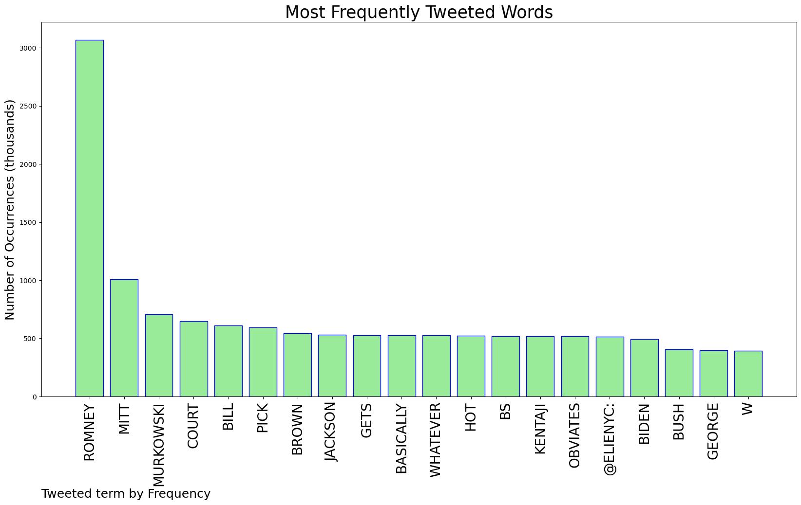
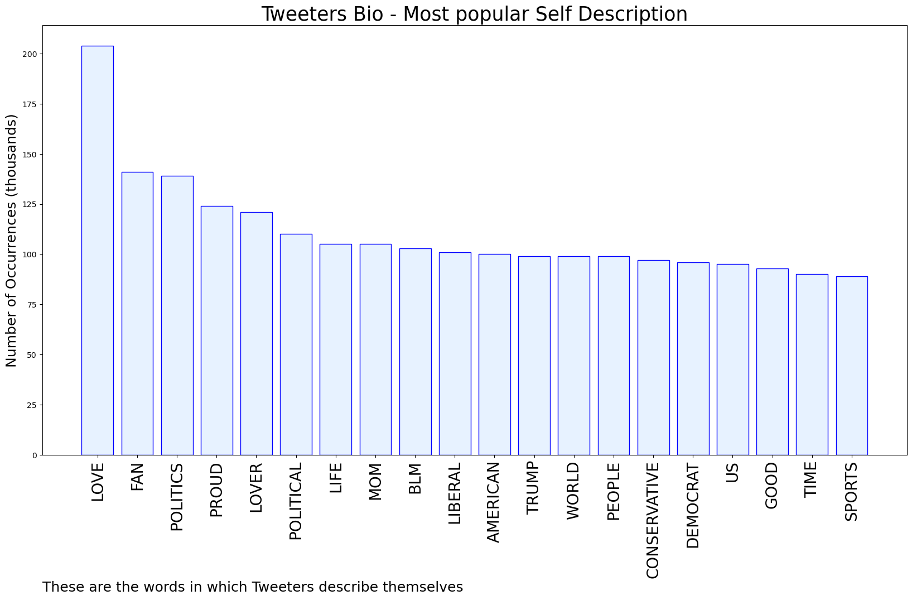
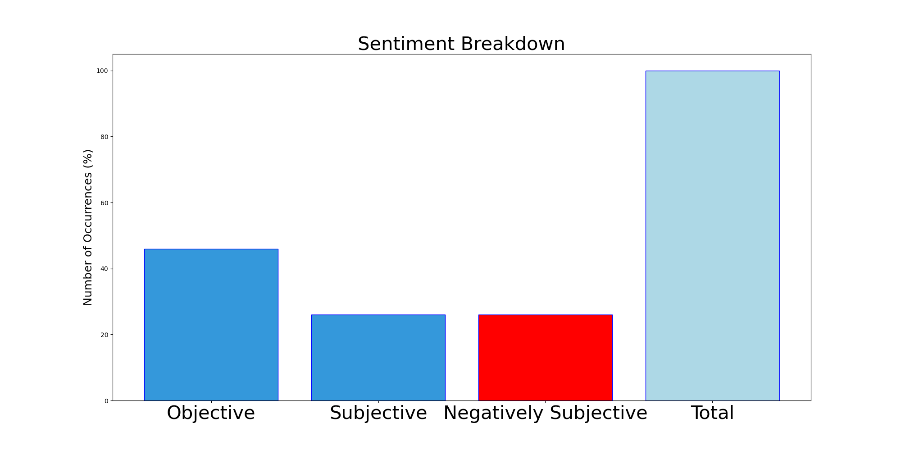

# MURCHIE85 TWITTER PROCESSING 
&#x1F34E; **TOPIC = "Romney"**

## AUTOMATED RESEARCH SUMMARY

*note: Image pulled from web automatically, not connected to author.
  
<b> This report is AUTOMATED and not hand crafted, it is designed for pulling metrics on a given keyword or hashtag and performs a series of reporting and analysis.</b>

|                **Sample-Tweets**        |
| :-------------: |
| RT @JoeConchaTV: For those who broke two ribs laughing at Tom Friedman's proposed Biden-Cheney ticket, the Comedy Cellar is proud to presen… |
| RT @BillKristol: Straightforward from here.June 30: Court overturns Roe.July 1: Breyer resigns, says Court “needs aggressive progressiv… |
| LAST CHANCE: Marsh Network Breakfast Meeting 27th Jan 07.45 Ship Inn, Dymchurch - #Ashford #Folkestone #Romney… https://t.co/kV1ClWamWa |

The most popular user is: **z_cirelli**

 RT @tribelaw: Sinema and Manchin are being outrageous, true, but why don’t people blame supposedly responsible Republican Senators like Col…

## RELATED METRICS 
| Metric | Value |
| ------------- | ------------- |
| #1 Most tweeted to  | **BillKristol** |
| #2 Most tweeted to  | **ElieNYC** |
| #3 Most tweeted to  | **JackPosobiec** |
| NewProfiles (less than 10 days) | 0.58%  |
| Tweeters with < 10 followers  | 3.88%|
| Tweeters with > 1000000 followers  | 0.02%  |

## MOST POPULAR TWEET TERMS 

| Popularity Rank  | Term |
| ------------- | ------------- |
| first  | **ROMNEY**  |
| second  | **MITT**  |
| third  | **MURKOWSKI** |
| fourth  | **COURT**  |
| fifth  | **BILL**  |

## Twitter Bio Analysis
### SENTIMENT ANALYSIS

VIEWS WERE : **SUBJECTIVE**  (26.67%) & **NEGATIVELY-SUBJECTIVE** (26.67%) **OBJECTIVE** (46.67%)

### TWEET SAMPLE 
| Random value picked from array |
| ------------- |
|@JackPosobiec Dont matter. Susan Collins, Murkowski,  Romney, Lindsey Graham are going to vote for whoever is the n… https://t.co/x1zlVaXBkS |

### MOST RETWEETED 

| The most retweeted user is: **z_cirelli**  |
| ------------- |
| RT @tribelaw: Sinema and Manchin are being outrageous, true, but why don’t people blame supposedly responsible Republican Senators like Col… |

### CONCLUSION & EXTERNAL ANALYSIS

*This is my [Adam McMurchie`s] opinion on the data from the tweets, it serves as no objective truth.Since the tweets themselves are a mixture of fact & opinion. 
Authors analytical summary on request.
**RECOMMENDATIONS** WILL BE UPDATED IN NEXT  24 HOURS  