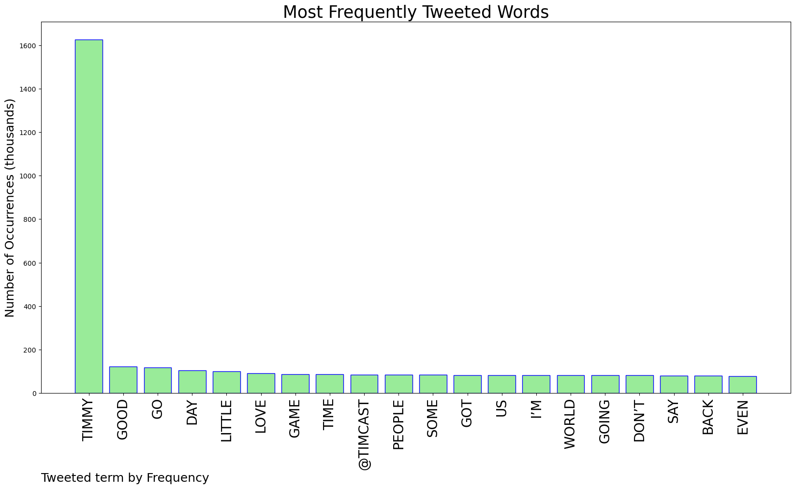
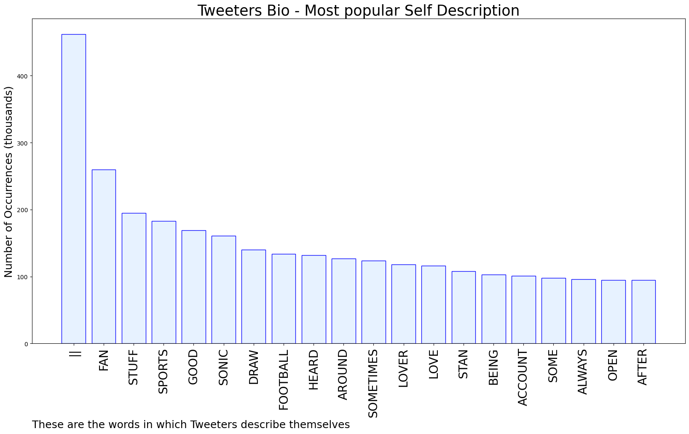

# MURCHIE85 TWITTER PROCESSING 
&#x1F34E; **TOPIC = "Timmy"**

## AUTOMATED RESEARCH SUMMARY

*note: Image pulled from web automatically, not connected to author.
  
<b> This report is AUTOMATED and not hand crafted, it is designed for pulling metrics on a given keyword or hashtag and performs a series of reporting and analysis.</b>

|                **Sample-Tweets**        |
| :-------------: |
| RT @mylovedes2: nothing is wrong with breastfeeding in public, in fact it should be normalized, but what’s NOT normal is being completely t… |
| I sneak and killed Timmy The Bloat at the Limestone Cliffs! ☠️#LastDayOnEarthSurvival#LDoESurvival https://t.co/P1I8UYZqEd |
| @timmydooley Stop patronizing &amp; demeaning the people please Timmy, &amp; btw wagging your finger and and using manipula… https://t.co/9C5EqhKhN0 |

The most popular user is: **timmy_tron**

 RT @mtaibbi: 1. Thread: THE TWITTER FILES

## RELATED METRICS 
| Metric | Value |
| ------------- | ------------- |
| #1 Most tweeted to  | **Timcast** |
| #2 Most tweeted to  | **timmy_l2** |
| #3 Most tweeted to  | **elonmusk** |
| NewProfiles (less than 10 days) | 1.98%  |
| Tweeters with < 10 followers  | 7.74%|
| Tweeters with > 1000000 followers  | 0.1%  |

## MOST POPULAR TWEET TERMS 

| Popularity Rank  | Term |
| ------------- | ------------- |
| first  | **TIMMY**  |
| second  | **GOOD**  |
| third  | **GO** |
| fourth  | **DAY**  |
| fifth  | **LITTLE**  |

## Twitter Bio Analysis
### SENTIMENT ANALYSIS

VIEWS WERE : **SUBJECTIVE**  (33.33%) & **NEGATIVELY-SUBJECTIVE** (20.0%) **OBJECTIVE** (46.67%)

### TWEET SAMPLE 
| Random value picked from array |
| ------------- |
|that’s so sad alexa play timmy trumpet https://t.co/fq0kcRrtgz |

### MOST RETWEETED 

| The most retweeted user is: **timmy_tron**  |
| ------------- |
| RT @mtaibbi: 1. Thread: THE TWITTER FILES |

### CONCLUSION & EXTERNAL ANALYSIS

*This is my [Adam McMurchie`s] opinion on the data from the tweets, it serves as no objective truth.Since the tweets themselves are a mixture of fact & opinion. 
Authors analytical summary on request.
**RECOMMENDATIONS** WILL BE UPDATED IN NEXT  24 HOURS  