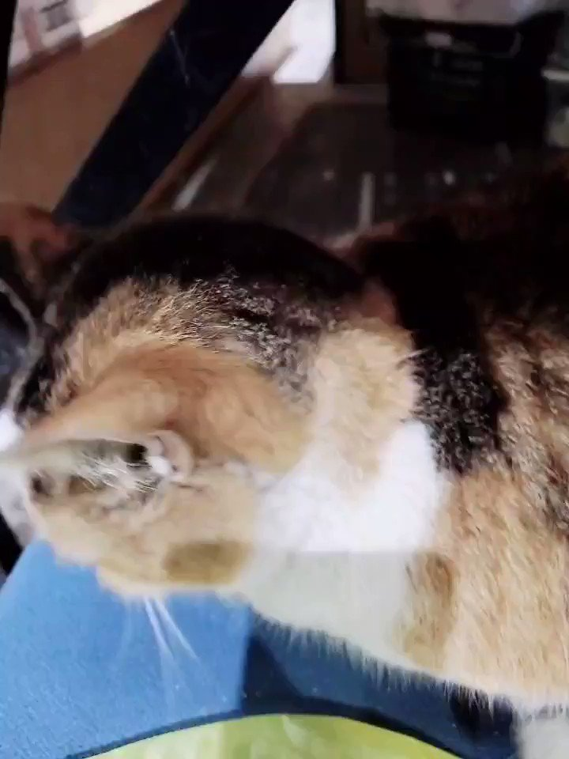
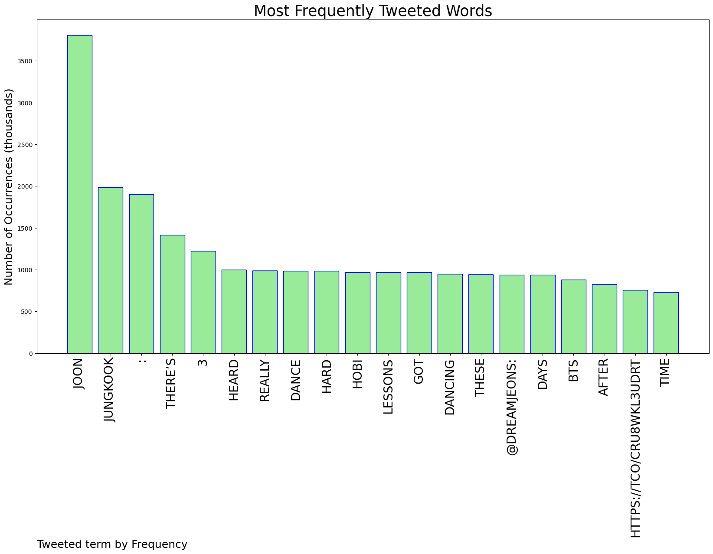
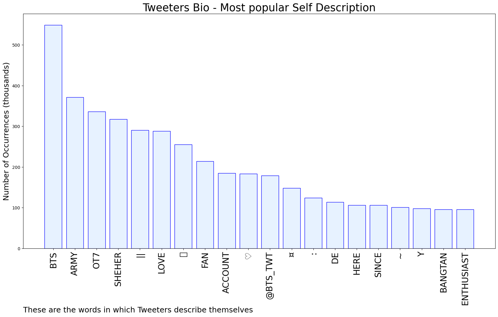

# MURCHIE85 TWITTER PROCESSING 
&#x1F34E; **TOPIC = "joon"**

## AUTOMATED RESEARCH SUMMARY

*note: Image pulled from web automatically, not connected to author.
  
<b> This report is AUTOMATED and not hand crafted, it is designed for pulling metrics on a given keyword or hashtag and performs a series of reporting and analysis.</b>

|                **Sample-Tweets**        |
| :-------------: |
| RT @bts7oclock: joon reading a comment "seeing your muscles gets me excited" yoonmin :  https://t.co/wHPXyvmrjR |
| RT @dreamjeons: hobi : jungkook is dancing really hard these daysjoon : i heard jungkook got dance lessons https://t.co/cRU8WkL3ud |
| @sseasaltrio @c2gnyu get some pink whutney |

The most popular user is: **TKlabooth**

 RT @BTS_twt: v's tweet was like..
- joon https://t.co/e7zB9MXFkz

## RELATED METRICS 
| Metric | Value |
| ------------- | ------------- |
| #1 Most tweeted to  | **dreamjeons** |
| #2 Most tweeted to  | **pjmvelvets** |
| #3 Most tweeted to  | **knjgIoss** |
| NewProfiles (less than 10 days) | 0.58%  |
| Tweeters with < 10 followers  | 6.06%|
| Tweeters with > 1000000 followers  | 0.0%  |

## MOST POPULAR TWEET TERMS 

| Popularity Rank  | Term |
| ------------- | ------------- |
| first  | **JOON**  |
| second  | **JUNGKOOK**  |
| third  | **:** |
| fourth  | **THERE’S**  |
| fifth  | **3**  |

## Twitter Bio Analysis
### SENTIMENT ANALYSIS

VIEWS WERE : **SUBJECTIVE**  (13.33%) & **NEGATIVELY-SUBJECTIVE** (20.0%) **OBJECTIVE** (66.67%)

### TWEET SAMPLE 
| Random value picked from array |
| ------------- |
|RT @420JOON: the way joon looked around after failing to open the walnut with his hand like “damn i hope no one saw that” https://t.co/xIBG… |

### MOST RETWEETED 

| The most retweeted user is: **TKlabooth**  |
| ------------- |
| RT @BTS_twt: v's tweet was like..- joon https://t.co/e7zB9MXFkz |

### CONCLUSION & EXTERNAL ANALYSIS

*This is my [Adam McMurchie`s] opinion on the data from the tweets, it serves as no objective truth.Since the tweets themselves are a mixture of fact & opinion. 
Authors analytical summary on request.
**RECOMMENDATIONS** WILL BE UPDATED IN NEXT  24 HOURS  