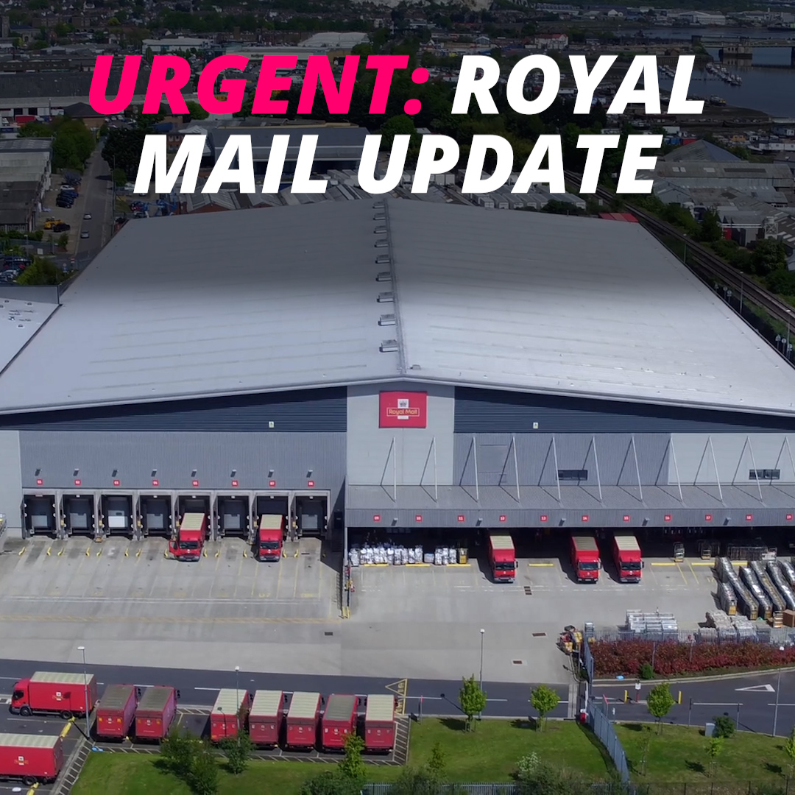
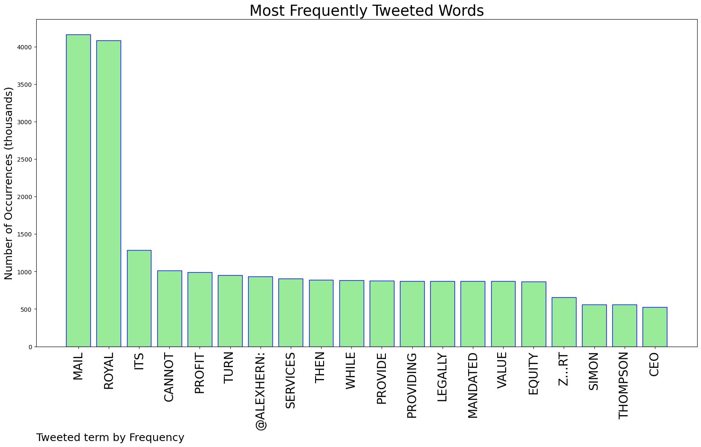
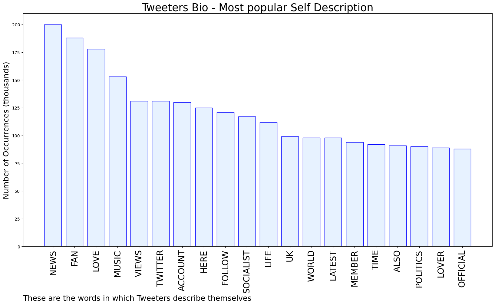

# MURCHIE85 TWITTER PROCESSING 
&#x1F34E; **TOPIC = "Royal Mail"**

## AUTOMATED RESEARCH SUMMARY

*note: Image pulled from web automatically, not connected to author.
  
<b> This report is AUTOMATED and not hand crafted, it is designed for pulling metrics on a given keyword or hashtag and performs a series of reporting and analysis.</b>

|                **Sample-Tweets**        |
| :-------------: |
| RT @alexhern: If Royal Mail cannot turn a profit while providing the services it is legally mandated to provide, then its equity value is z… |
| RT @alexhern: If Royal Mail cannot turn a profit while providing the services it is legally mandated to provide, then its equity value is z… |
| RT @CWUnews: We will have a full update on negotiations for our BT and Openreach members tomorrow. We will have an update for Royal Mail… |

The most popular user is: **moirabriggs14**

 RT @DaveWardGS: I am asking all of my followers to RT this thread so as many people as possible know the truth about the Royal Mail Group s…

## RELATED METRICS 
| Metric | Value |
| ------------- | ------------- |
| #1 Most tweeted to  | **alexhern** |
| #2 Most tweeted to  | **CWUnews** |
| #3 Most tweeted to  | **SaulStaniforth** |
| NewProfiles (less than 10 days) | 0.74%  |
| Tweeters with < 10 followers  | 3.86%|
| Tweeters with > 1000000 followers  | 0.42%  |

## MOST POPULAR TWEET TERMS 

| Popularity Rank  | Term |
| ------------- | ------------- |
| first  | **MAIL**  |
| second  | **ROYAL**  |
| third  | **ITS** |
| fourth  | **CANNOT**  |
| fifth  | **PROFIT**  |

## Twitter Bio Analysis
### SENTIMENT ANALYSIS

VIEWS WERE : **SUBJECTIVE**  (40.0%) & **NEGATIVELY-SUBJECTIVE** (6.67%) **OBJECTIVE** (53.33%)

### TWEET SAMPLE 
| Random value picked from array |
| ------------- |
|RT @alexhern: If Royal Mail cannot turn a profit while providing the services it is legally mandated to provide, then its equity value is z… |

### MOST RETWEETED 

| The most retweeted user is: **moirabriggs14**  |
| ------------- |
| RT @DaveWardGS: I am asking all of my followers to RT this thread so as many people as possible know the truth about the Royal Mail Group s… |

### CONCLUSION & EXTERNAL ANALYSIS

*This is my [Adam McMurchie`s] opinion on the data from the tweets, it serves as no objective truth.Since the tweets themselves are a mixture of fact & opinion. 
Authors analytical summary on request.
**RECOMMENDATIONS** WILL BE UPDATED IN NEXT  24 HOURS  