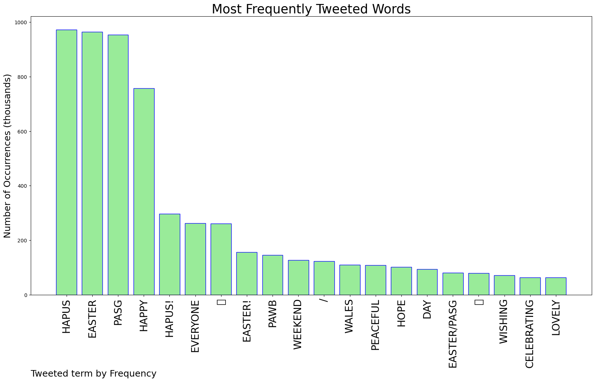
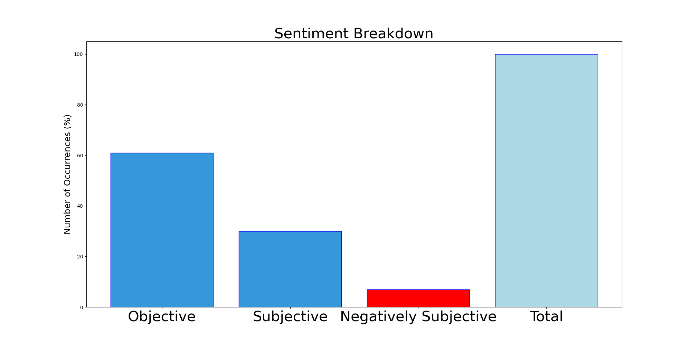

# MURCHIE85 TWITTER PROCESSING 
&#x1F34E; **TOPIC = "Pasg Hapus"**

## AUTOMATED RESEARCH SUMMARY

*note: Image pulled from web automatically, not connected to author.
  
<b> This report is AUTOMATED and not hand crafted, it is designed for pulling metrics on a given keyword or hashtag and performs a series of reporting and analysis.</b>

|                **Sample-Tweets**        |
| :-------------: |
| RT @LouiseScott1377: Bore da pasg hapus Happy easter to my twitter faves 💗🐣@missAtkinson456 @Spyderhed1 @whitey2404 @LGalloway77 @gri… |
| RT @FOR_Cardiff: #HappyEaster! Pasg Hapus 🐣 The Dino Discovery Trail in @StDavidsCardiff is closed today but will reopen tomorrow at 9:30am… |
| Pasg Hapus / Happy Easter from the team at RNC to everyone celebrating. |

The most popular user is: **snowdoneryri**

 RT @JudyCorbett: Pasg hapus pawb. Have a peaceful Easter weekend everyone.
Open/Ar agor 11am-4pm. https://t.co/bhJmJSV1LQ

## RELATED METRICS 
| Metric | Value |
| ------------- | ------------- |
| #1 Most tweeted to  | **JudyCorbett** |
| #2 Most tweeted to  | **TheGreenParty** |
| #3 Most tweeted to  | **YesBridgend** |
| NewProfiles (less than 10 days) | 0.65%  |
| Tweeters with < 10 followers  | 2.27%|
| Tweeters with > 1000000 followers  | 0.0%  |

## MOST POPULAR TWEET TERMS 

| Popularity Rank  | Term |
| ------------- | ------------- |
| first  | **HAPUS**  |
| second  | **EASTER**  |
| third  | **PASG** |
| fourth  | **HAPPY**  |
| fifth  | **HAPUS!**  |

## Twitter Bio Analysis
### SENTIMENT ANALYSIS

VIEWS WERE : **SUBJECTIVE**  (30.77%) & **NEGATIVELY-SUBJECTIVE** (7.69%) **OBJECTIVE** (61.54%)

### TWEET SAMPLE 
| Random value picked from array |
| ------------- |
|@liseymacd Morning! How glorious ❤️ Pasg hapus https://t.co/WitqvvQPYh |

### MOST RETWEETED 

| The most retweeted user is: **snowdoneryri**  |
| ------------- |
| RT @JudyCorbett: Pasg hapus pawb. Have a peaceful Easter weekend everyone.Open/Ar agor 11am-4pm. https://t.co/bhJmJSV1LQ |

### CONCLUSION & EXTERNAL ANALYSIS

*This is my [Adam McMurchie`s] opinion on the data from the tweets, it serves as no objective truth.Since the tweets themselves are a mixture of fact & opinion. 
Authors analytical summary on request.
**RECOMMENDATIONS** WILL BE UPDATED IN NEXT  24 HOURS  