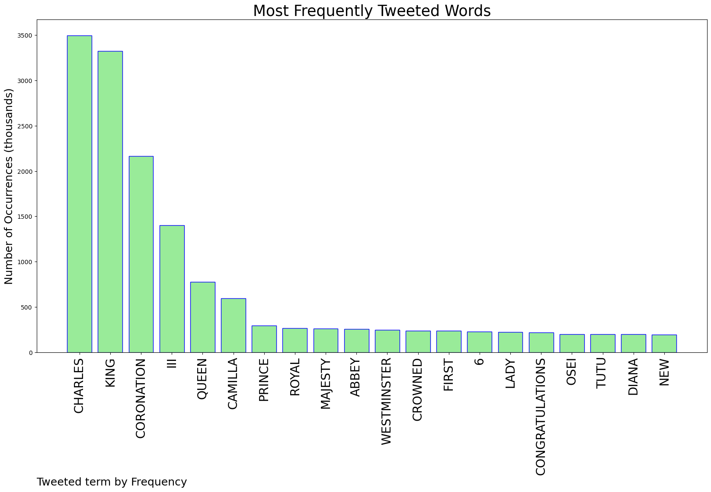
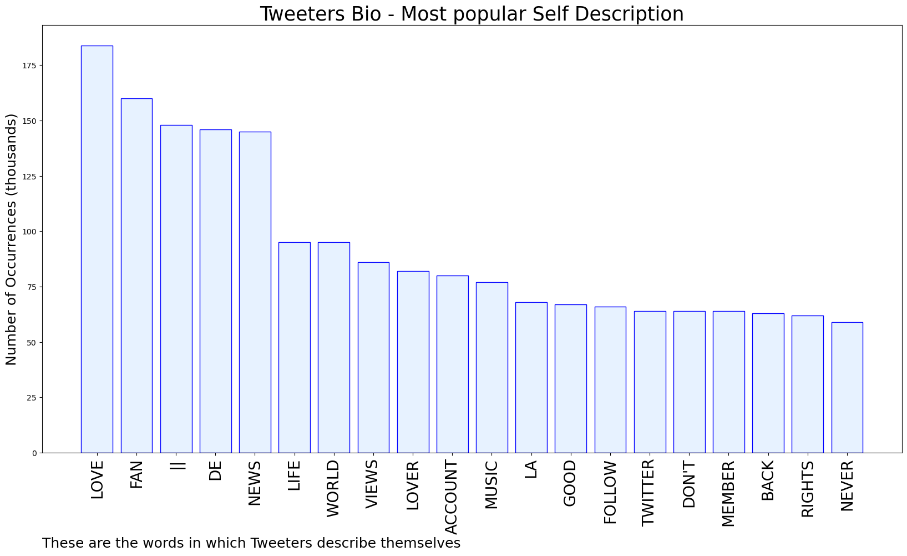

# MURCHIE85 TWITTER PROCESSING 
&#x1F34E; **TOPIC = "Charles"**

## AUTOMATED RESEARCH SUMMARY

*note: Image pulled from web automatically, not connected to author.
  
<b> This report is AUTOMATED and not hand crafted, it is designed for pulling metrics on a given keyword or hashtag and performs a series of reporting and analysis.</b>

|                **Sample-Tweets**        |
| :-------------: |
| RT @EmbSpainUK: 🇬🇧🇪🇸King Felipe and Queen Letizia leaving the Embassy to the #Coronation  of King Charles and Queen Consort Camila  https… |
| Canada announces plans to place King Charles on $20 bill, coins https://t.co/A1oVxJm4lh https://t.co/ENDn5RjVqg |
| RT @fofenthusiast: WHO CARES ABOUT KING CHARLES THE REAL KING CONAN GRAY IS COMING https://t.co/QNjr6ePsEP |

The most popular user is: **abu_xales**

 RT @Lowkey0nline: "I'm with all victims of slavery, colonialism, and imperialism... those eggs are the only justice those people will see..…

## RELATED METRICS 
| Metric | Value |
| ------------- | ------------- |
| #1 Most tweeted to  | **RoyalFamily** |
| #2 Most tweeted to  | **Spriter99880** |
| #3 Most tweeted to  | **nytimes** |
| NewProfiles (less than 10 days) | 0.2%  |
| Tweeters with < 10 followers  | 4.52%|
| Tweeters with > 1000000 followers  | 0.44%  |

## MOST POPULAR TWEET TERMS 

| Popularity Rank  | Term |
| ------------- | ------------- |
| first  | **CHARLES**  |
| second  | **KING**  |
| third  | **CORONATION** |
| fourth  | **III**  |
| fifth  | **QUEEN**  |

## Twitter Bio Analysis
### SENTIMENT ANALYSIS

VIEWS WERE : **SUBJECTIVE**  (20.0%) & **NEGATIVELY-SUBJECTIVE** (13.33%) **OBJECTIVE** (66.67%)

### TWEET SAMPLE 
| Random value picked from array |
| ------------- |
|RT @nytimes: "Not my king!"Anti-monarchy protesters chanted and booed as King Charles III's procession passed Trafalgar Square in London… |

### MOST RETWEETED 

| The most retweeted user is: **abu_xales**  |
| ------------- |
| RT @Lowkey0nline: "I'm with all victims of slavery, colonialism, and imperialism... those eggs are the only justice those people will see..… |

### CONCLUSION & EXTERNAL ANALYSIS

*This is my [Adam McMurchie`s] opinion on the data from the tweets, it serves as no objective truth.Since the tweets themselves are a mixture of fact & opinion. 
Authors analytical summary on request.
**RECOMMENDATIONS** WILL BE UPDATED IN NEXT  24 HOURS  