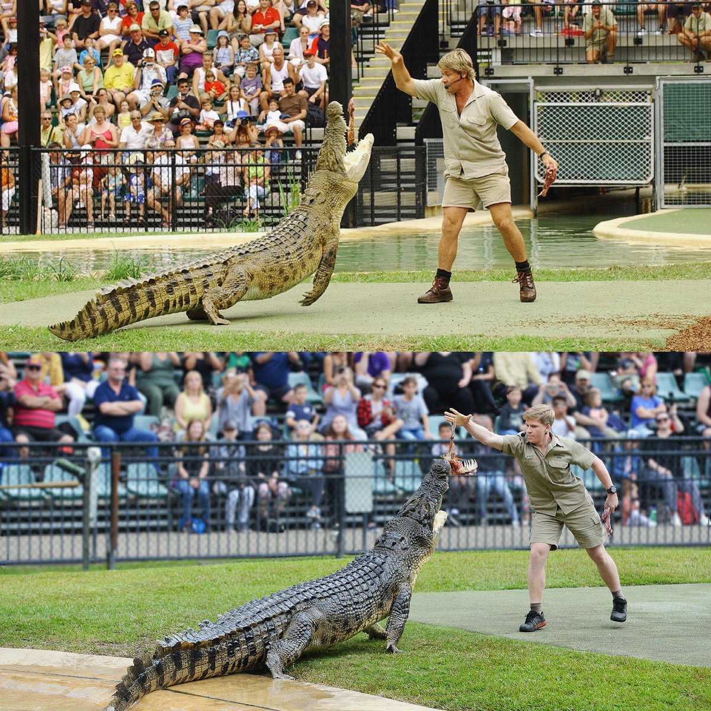
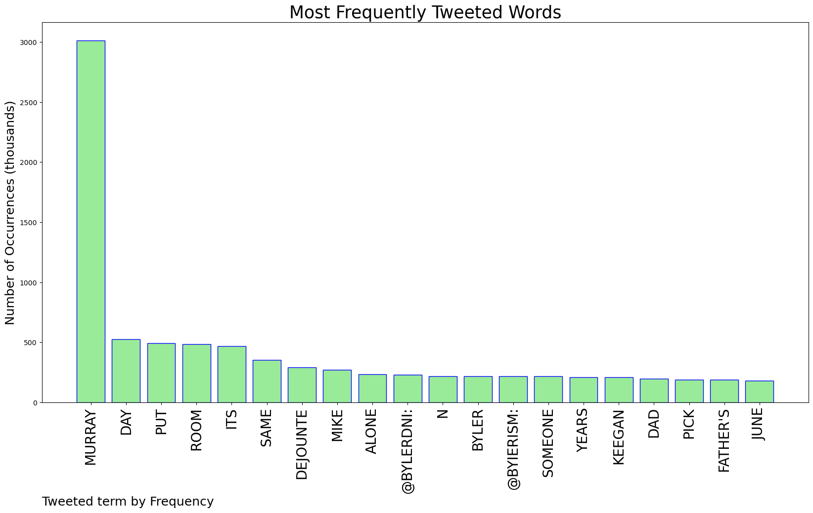
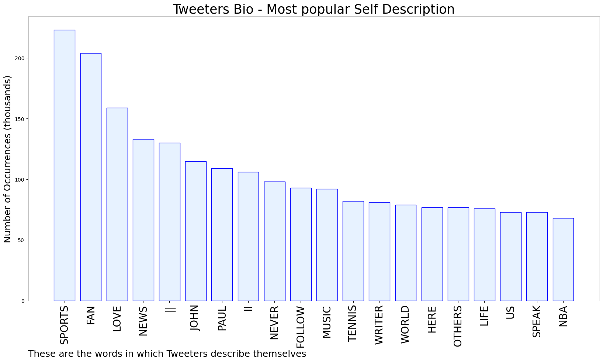

# MURCHIE85 TWITTER PROCESSING 
&#x1F34E; **TOPIC = "Murray"**

## AUTOMATED RESEARCH SUMMARY

*note: Image pulled from web automatically, not connected to author.
  
<b> This report is AUTOMATED and not hand crafted, it is designed for pulling metrics on a given keyword or hashtag and performs a series of reporting and analysis.</b>

|                **Sample-Tweets**        |
| :-------------: |
| RT @scotlibdems: Susan Murray is our candidate to be East Dunbartonshire's next MP.The SNP have been awful for Scotland. Meanwhile the Co… |
| RT @danielvallverdu: A few slam 🏆’s and myself.Today was a good day!@stanwawrinka @andy_murray #Ivan@Wimbledon https://t.co/qlTYtyRfCz |
| RT @HighlyClutch: ICYMI: It was not a good weekend for Grayson Murray. https://t.co/YRdi0Dp9pQ |

The most popular user is: **mimisterrr_**

 RT @RobertIrwin: Dad and me feeding Murray... same place, same croc - two photos 15 years apart ❤️🐊 https://t.co/9Ybp5AnTOI

## RELATED METRICS 
| Metric | Value |
| ------------- | ------------- |
| #1 Most tweeted to  | **bylerDNI** |
| #2 Most tweeted to  | **byIerism** |
| #3 Most tweeted to  | **BLKAmericans_** |
| NewProfiles (less than 10 days) | 0.92%  |
| Tweeters with < 10 followers  | 6.64%|
| Tweeters with > 1000000 followers  | 0.18%  |

## MOST POPULAR TWEET TERMS 

| Popularity Rank  | Term |
| ------------- | ------------- |
| first  | **MURRAY**  |
| second  | **DAY**  |
| third  | **PUT** |
| fourth  | **ROOM**  |
| fifth  | **ITS**  |

## Twitter Bio Analysis
### SENTIMENT ANALYSIS

VIEWS WERE : **SUBJECTIVE**  (20.0%) & **NEGATIVELY-SUBJECTIVE** (6.67%) **OBJECTIVE** (73.33%)

### TWEET SAMPLE 
| Random value picked from array |
| ------------- |
|(1/2) We are #Shadproud of #Shad2004 Robynne Murray and her team's award-winning thermoplastic resin that can be us… https://t.co/WzML44idgt |

### MOST RETWEETED 

| The most retweeted user is: **mimisterrr_**  |
| ------------- |
| RT @RobertIrwin: Dad and me feeding Murray... same place, same croc - two photos 15 years apart ❤️🐊 https://t.co/9Ybp5AnTOI |

### CONCLUSION & EXTERNAL ANALYSIS

*This is my [Adam McMurchie`s] opinion on the data from the tweets, it serves as no objective truth.Since the tweets themselves are a mixture of fact & opinion. 
Authors analytical summary on request.
**RECOMMENDATIONS** WILL BE UPDATED IN NEXT  24 HOURS  