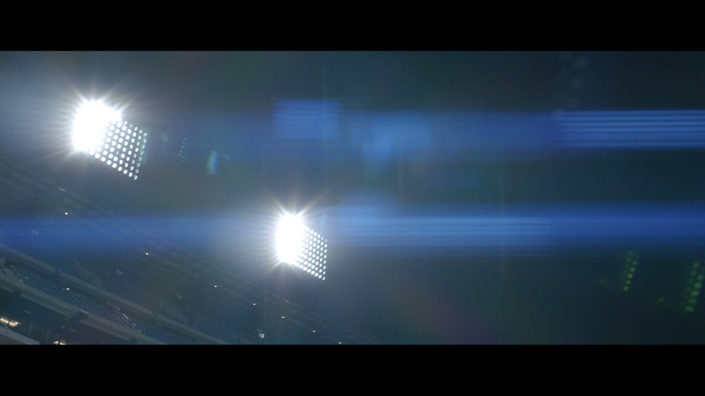
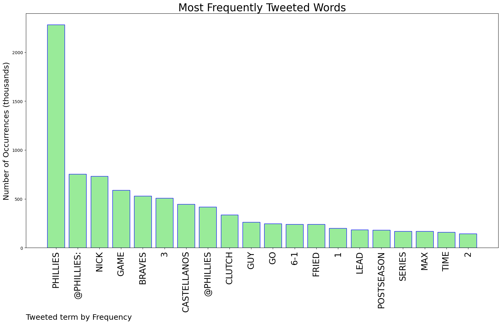
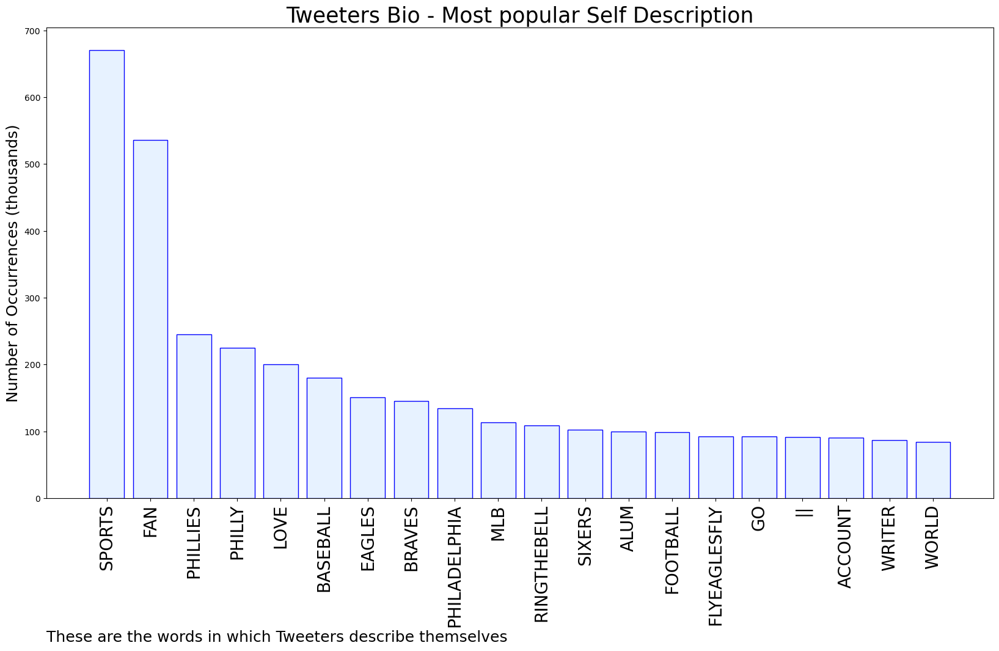

# MURCHIE85 TWITTER PROCESSING 
&#x1F34E; **TOPIC = "Phillies"**

## AUTOMATED RESEARCH SUMMARY

*note: Image pulled from web automatically, not connected to author.
  
<b> This report is AUTOMATED and not hand crafted, it is designed for pulling metrics on a given keyword or hashtag and performs a series of reporting and analysis.</b>

|                **Sample-Tweets**        |
| :-------------: |
| RT @MrMatthewCFB: Nick Castellanos - Philadelphia Phillies (1) Grand Slam |
| Phillies puttin' the PH in Phightin'! #RedOctober #RingtheBell #TomahawkSTOP |
| RT @Phillies: Up by 3.#RingTheBell x @Toyota https://t.co/tzHlZ4ZenB |

The most popular user is: **OzzieTheCop**

 RT @Phillies: Own it. Embrace it. Believe it.

Welcome to #RedOctober. https://t.co/meVzc5Ynru

## RELATED METRICS 
| Metric | Value |
| ------------- | ------------- |
| #1 Most tweeted to  | **Phillies** |
| #2 Most tweeted to  | **budweiserusa** |
| #3 Most tweeted to  | **MattGelb** |
| NewProfiles (less than 10 days) | 0.38%  |
| Tweeters with < 10 followers  | 3.56%|
| Tweeters with > 1000000 followers  | 0.16%  |

## MOST POPULAR TWEET TERMS 

| Popularity Rank  | Term |
| ------------- | ------------- |
| first  | **PHILLIES**  |
| second  | **@PHILLIES:**  |
| third  | **NICK** |
| fourth  | **GAME**  |
| fifth  | **BRAVES**  |

## Twitter Bio Analysis
### SENTIMENT ANALYSIS

VIEWS WERE : **SUBJECTIVE**  (40.0%) & **NEGATIVELY-SUBJECTIVE** (20.0%) **OBJECTIVE** (40.0%)

### TWEET SAMPLE 
| Random value picked from array |
| ------------- |
|Wow the Phillies jumped all over Fried. |

### MOST RETWEETED 

| The most retweeted user is: **OzzieTheCop**  |
| ------------- |
| RT @Phillies: Own it. Embrace it. Believe it.Welcome to #RedOctober. https://t.co/meVzc5Ynru |

### CONCLUSION & EXTERNAL ANALYSIS

*This is my [Adam McMurchie`s] opinion on the data from the tweets, it serves as no objective truth.Since the tweets themselves are a mixture of fact & opinion. 
Authors analytical summary on request.
**RECOMMENDATIONS** WILL BE UPDATED IN NEXT  24 HOURS  