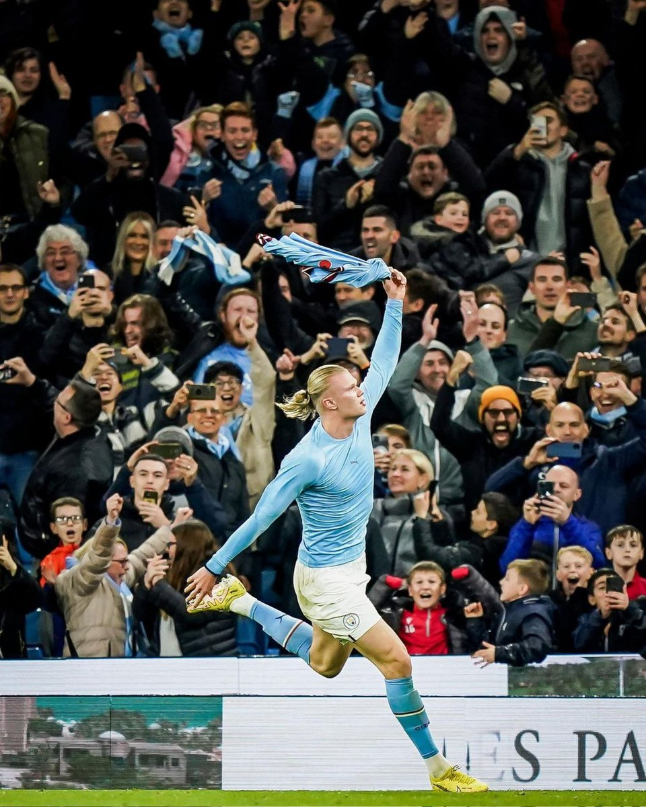
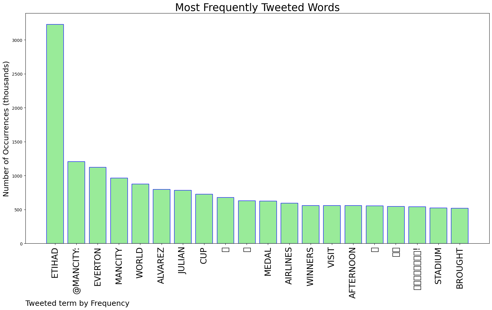
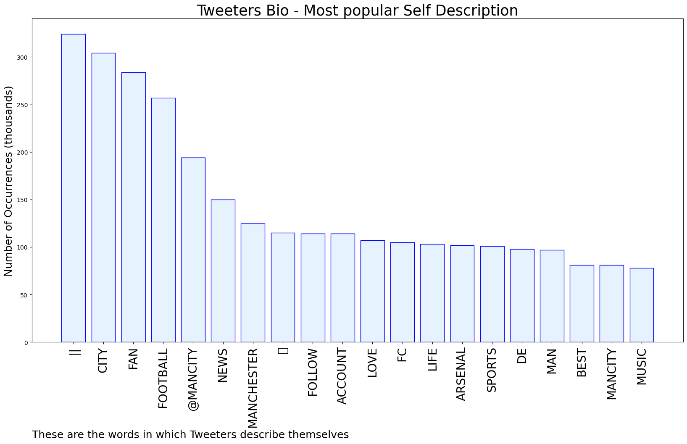

# MURCHIE85 TWITTER PROCESSING 
&#x1F34E; **TOPIC = "Etihad"**

## AUTOMATED RESEARCH SUMMARY

*note: Image pulled from web automatically, not connected to author.
  
<b> This report is AUTOMATED and not hand crafted, it is designed for pulling metrics on a given keyword or hashtag and performs a series of reporting and analysis.</b>

|                **Sample-Tweets**        |
| :-------------: |
| @EFCdaily_ We picked up points at the Etihad, what else can I tell you really |
| RT @ManCity: Arrived at the Etihad! 👋@OKX https://t.co/g9nnmkPI1q |
| RT @theworldindex: Best Airlines In The World:1.🇸🇬 Singapore Airlines2.🇹🇷 Turkish Airlines3.🇶🇦 Qatar Airways4.🇦🇪 Emirates5.🇦🇪 Etihad… |

The most popular user is: **markzuez**

 RT @ErlingHaaland: Goose bumps 💙 Etihad! #mancity https://t.co/WY8MXvnV1w

## RELATED METRICS 
| Metric | Value |
| ------------- | ------------- |
| #1 Most tweeted to  | **ManCity** |
| #2 Most tweeted to  | **goal** |
| #3 Most tweeted to  | **premierleague** |
| NewProfiles (less than 10 days) | 1.12%  |
| Tweeters with < 10 followers  | 4.84%|
| Tweeters with > 1000000 followers  | 0.58%  |

## MOST POPULAR TWEET TERMS 

| Popularity Rank  | Term |
| ------------- | ------------- |
| first  | **ETIHAD**  |
| second  | **@MANCITY:**  |
| third  | **EVERTON** |
| fourth  | **MANCITY**  |
| fifth  | **WORLD**  |

## Twitter Bio Analysis
### SENTIMENT ANALYSIS

VIEWS WERE : **SUBJECTIVE**  (20.0%) & **NEGATIVELY-SUBJECTIVE** (6.67%) **OBJECTIVE** (73.33%)

### TWEET SAMPLE 
| Random value picked from array |
| ------------- |
|@_lukerimmer Mental - that said same thing for the last Derby at Etihad. City also took the piss for that with tick… https://t.co/UtRuvvfEYj |

### MOST RETWEETED 

| The most retweeted user is: **markzuez**  |
| ------------- |
| RT @ErlingHaaland: Goose bumps 💙 Etihad! #mancity https://t.co/WY8MXvnV1w |

### CONCLUSION & EXTERNAL ANALYSIS

*This is my [Adam McMurchie`s] opinion on the data from the tweets, it serves as no objective truth.Since the tweets themselves are a mixture of fact & opinion. 
Authors analytical summary on request.
**RECOMMENDATIONS** WILL BE UPDATED IN NEXT  24 HOURS  