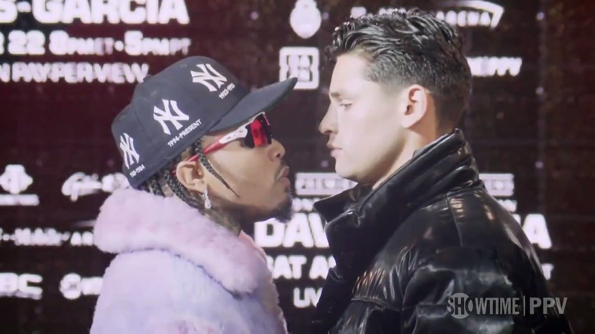
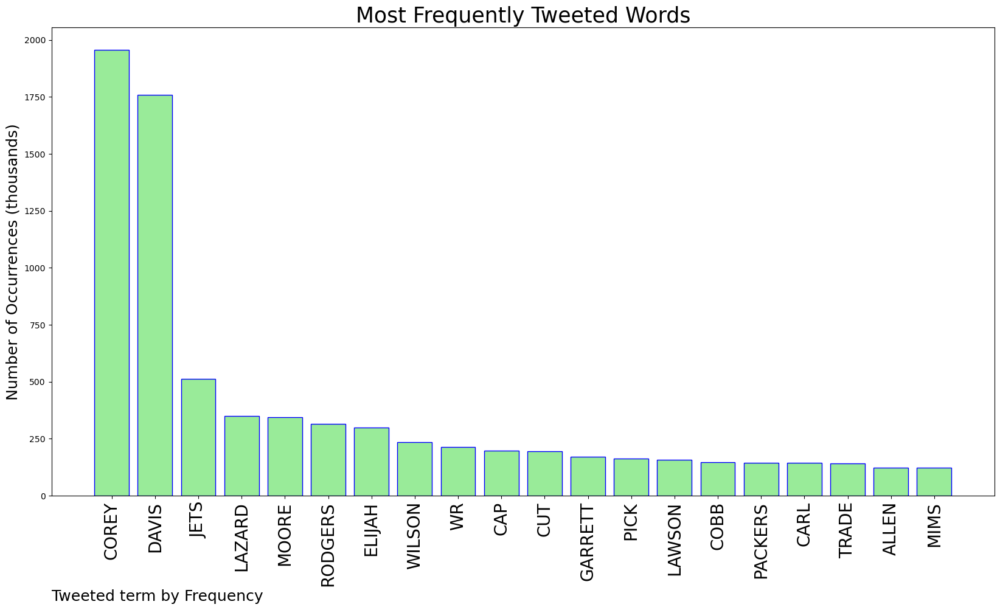
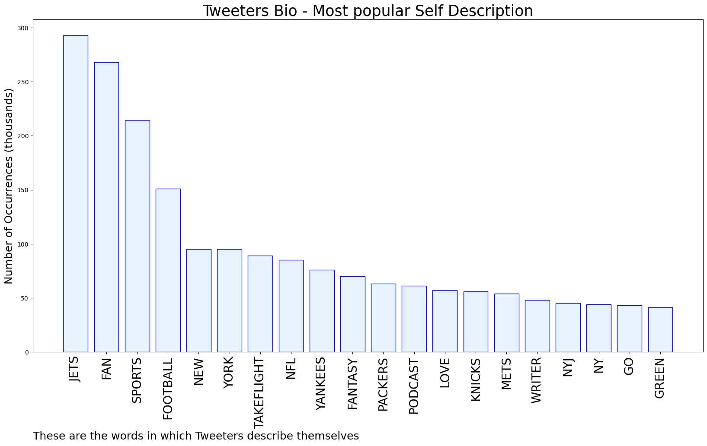

# MURCHIE85 TWITTER PROCESSING 
&#x1F34E; **TOPIC = "Corey Davis"**

## AUTOMATED RESEARCH SUMMARY

*note: Image pulled from web automatically, not connected to author.
  
<b> This report is AUTOMATED and not hand crafted, it is designed for pulling metrics on a given keyword or hashtag and performs a series of reporting and analysis.</b>

|                **Sample-Tweets**        |
| :-------------: |
| Corey Davis and Garrett Wilson are already there. If we can go get Elijah Moore or Braxton Berrios, it may be the f… https://t.co/qOWaiMJo7n |
| Bring Corey Davis home. https://t.co/MeQyrCkdEt |
| RT @SpyroKush: I’d cut Corey Davis for him and not think twice tbh. We’d lose a little bit in blocking but the reliable and explosiveness w… |

The most popular user is: **corey_scottjr**

 RT @HappyPunchPromo: Gervonta Davis and Ryan Garcia face off for the first time 👀 #DavisGarcia https://t.co/pJ4sgmTWeb

## RELATED METRICS 
| Metric | Value |
| ------------- | ------------- |
| #1 Most tweeted to  | **Peter_Bukowski** |
| #2 Most tweeted to  | **uSTADIUM** |
| #3 Most tweeted to  | **BuffaloJetFan** |
| NewProfiles (less than 10 days) | 0.24%  |
| Tweeters with < 10 followers  | 7.23%|
| Tweeters with > 1000000 followers  | 0.0%  |

## MOST POPULAR TWEET TERMS 

| Popularity Rank  | Term |
| ------------- | ------------- |
| first  | **COREY**  |
| second  | **DAVIS**  |
| third  | **JETS** |
| fourth  | **LAZARD**  |
| fifth  | **MOORE**  |

## Twitter Bio Analysis
### SENTIMENT ANALYSIS

VIEWS WERE : **SUBJECTIVE**  (53.33%) & **NEGATIVELY-SUBJECTIVE** (33.33%) **OBJECTIVE** (13.33%)

### TWEET SAMPLE 
| Random value picked from array |
| ------------- |
|@MySportsUpdate Idk what he talking about bout Raiders can have Corey Davis and a 7th |

### MOST RETWEETED 

| The most retweeted user is: **corey_scottjr**  |
| ------------- |
| RT @HappyPunchPromo: Gervonta Davis and Ryan Garcia face off for the first time 👀 #DavisGarcia https://t.co/pJ4sgmTWeb |

### CONCLUSION & EXTERNAL ANALYSIS

*This is my [Adam McMurchie`s] opinion on the data from the tweets, it serves as no objective truth.Since the tweets themselves are a mixture of fact & opinion. 
Authors analytical summary on request.
**RECOMMENDATIONS** WILL BE UPDATED IN NEXT  24 HOURS  