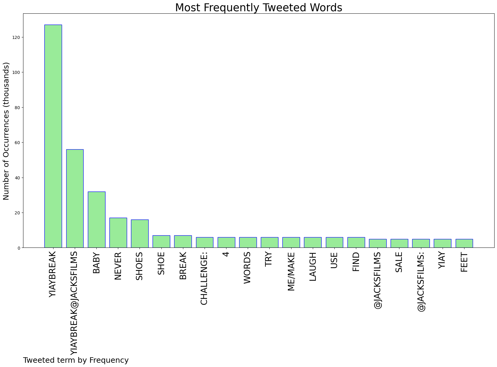
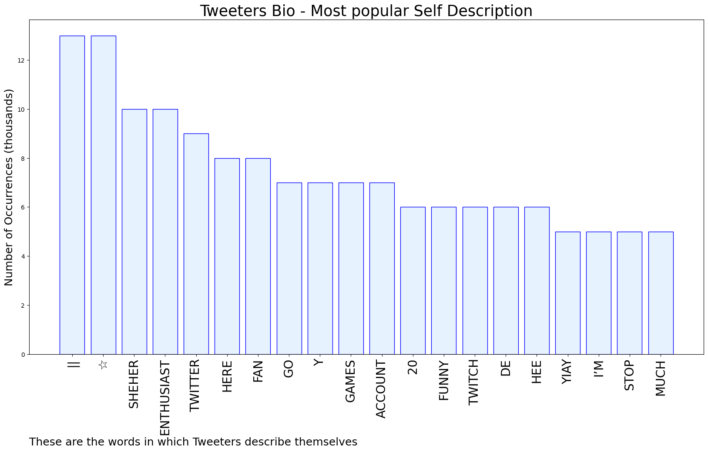

# MURCHIE85 TWITTER PROCESSING 
&#x1F34E; **TOPIC = "#YIAYbreak"**

## AUTOMATED RESEARCH SUMMARY

*note: Image pulled from web automatically, not connected to author.
  
<b> This report is AUTOMATED and not hand crafted, it is designed for pulling metrics on a given keyword or hashtag and performs a series of reporting and analysis.</b>

|                **Sample-Tweets**        |
| :-------------: |
| @jacksfilms "Mom, I'm a youtuber"😔 #YIAYbreak |
| @jacksfilms #YIAYbreak Oh no, they're hot! https://t.co/QcvlCuCF77 |
| @jacksfilms #YIAYbreak how to win arguments https://t.co/LoMjmHdC4n |

The most popular user is: **yeet12362**

 RT @jacksfilms: YIAY challenge: In just 4 words, try to break me/make me laugh. Use #YIAYbreak so we can find ya!

## RELATED METRICS 
| Metric | Value |
| ------------- | ------------- |
| #1 Most tweeted to  | **jacksfilms** |
| #2 Most tweeted to  | **fortfunvol2** |
| #3 Most tweeted to  | **MichelleMcNeaI** |
| NewProfiles (less than 10 days) | 3.02%  |
| Tweeters with < 10 followers  | 24.12%|
| Tweeters with > 1000000 followers  | 0.5%  |

## MOST POPULAR TWEET TERMS 

| Popularity Rank  | Term |
| ------------- | ------------- |
| first  | **YIAYBREAK**  |
| second  | **YIAYBREAK@JACKSFILMS**  |
| third  | **BABY** |
| fourth  | **NEVER**  |
| fifth  | **SHOES**  |

## Twitter Bio Analysis
### SENTIMENT ANALYSIS

VIEWS WERE : **SUBJECTIVE**  (20.0%) & **NEGATIVELY-SUBJECTIVE** (0.0%) **OBJECTIVE** (80.0%)

### TWEET SAMPLE 
| Random value picked from array |
| ------------- |
|@jacksfilms #YIAYbreak NFT is worth something |

### MOST RETWEETED 

| The most retweeted user is: **yeet12362**  |
| ------------- |
| RT @jacksfilms: YIAY challenge: In just 4 words, try to break me/make me laugh. Use #YIAYbreak so we can find ya! |

### CONCLUSION & EXTERNAL ANALYSIS

*This is my [Adam McMurchie`s] opinion on the data from the tweets, it serves as no objective truth.Since the tweets themselves are a mixture of fact & opinion. 
Authors analytical summary on request.
**RECOMMENDATIONS** WILL BE UPDATED IN NEXT  24 HOURS  