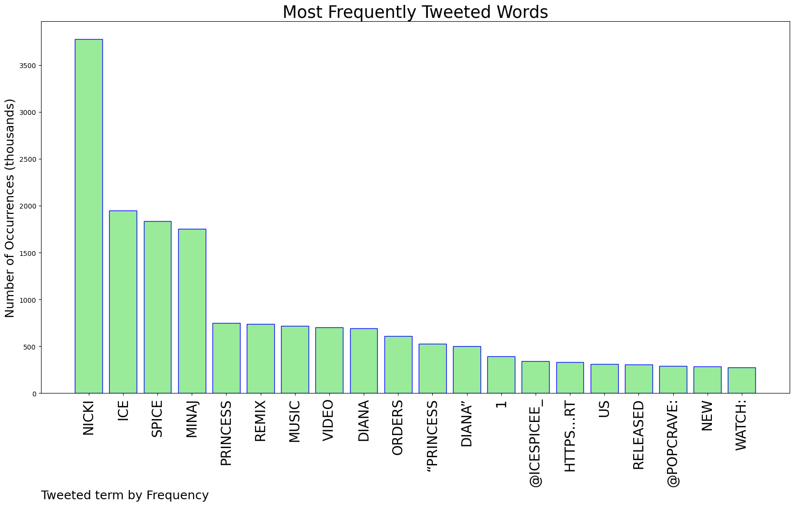
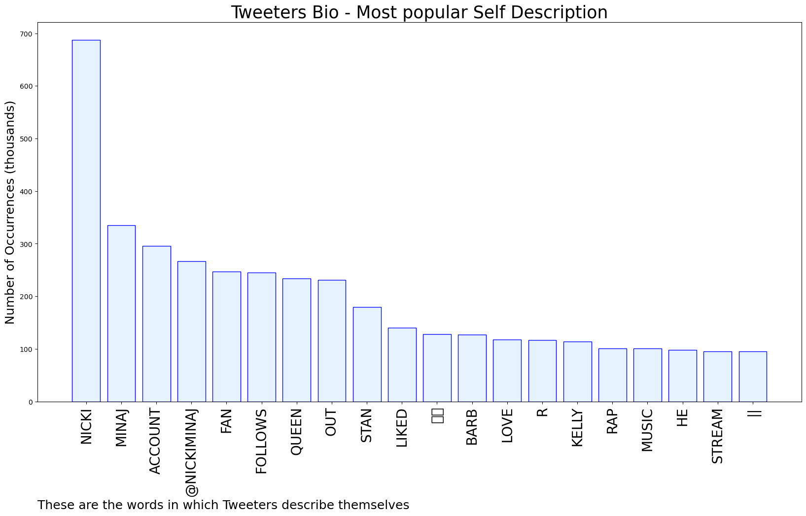
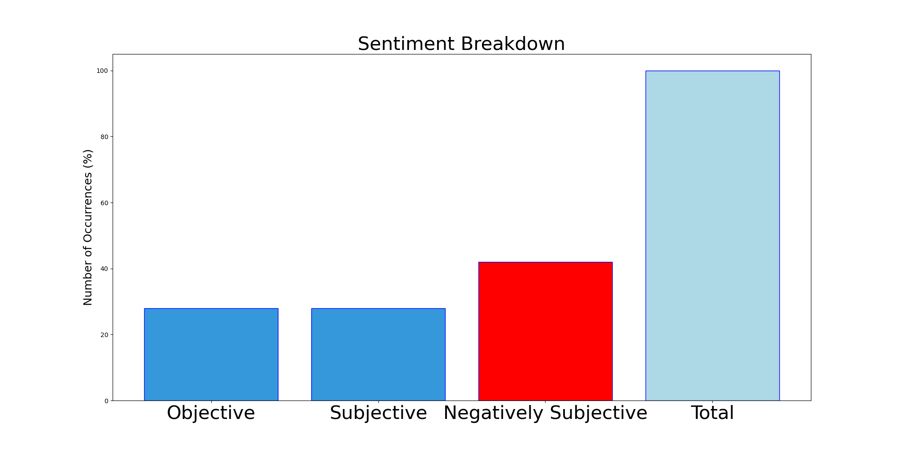

# MURCHIE85 TWITTER PROCESSING 
&#x1F34E; **TOPIC = "Nicki"**

## AUTOMATED RESEARCH SUMMARY

*note: Image pulled from web automatically, not connected to author.
  
<b> This report is AUTOMATED and not hand crafted, it is designed for pulling metrics on a given keyword or hashtag and performs a series of reporting and analysis.</b>

|                **Sample-Tweets**        |
| :-------------: |
| RT @nickisoicy: Stop scrolling it’s Nicki Minaj https://t.co/oMAolcF2CH |
| Apple Music US  https://t.co/wId6Xz6gv5…#3 Princess Diana, @icespicee_ &amp; @NICKIMINAJ — (+24) *new peak* https://t.co/l5XkG4ZiQf |
| RT @upblissed: watch yo tone when u speak to me nicki knows me🤦🏾‍♂️ |

The most popular user is: **nicki_t_daj**

 RT @MorissaSchwartz: Imagine her playing fetch with her dogs 😆 https://t.co/fkKNxBw9B0

## RELATED METRICS 
| Metric | Value |
| ------------- | ------------- |
| #1 Most tweeted to  | **NICKIMINAJ** |
| #2 Most tweeted to  | **icespicee_** |
| #3 Most tweeted to  | **PopCrave** |
| NewProfiles (less than 10 days) | 0.38%  |
| Tweeters with < 10 followers  | 3.7%|
| Tweeters with > 1000000 followers  | 0.04%  |

## MOST POPULAR TWEET TERMS 

| Popularity Rank  | Term |
| ------------- | ------------- |
| first  | **NICKI**  |
| second  | **ICE**  |
| third  | **SPICE** |
| fourth  | **MINAJ**  |
| fifth  | **PRINCESS**  |

## Twitter Bio Analysis
### SENTIMENT ANALYSIS

VIEWS WERE : **SUBJECTIVE**  (28.57%) & **NEGATIVELY-SUBJECTIVE** (42.86%) **OBJECTIVE** (28.57%)

### TWEET SAMPLE 
| Random value picked from array |
| ------------- |
|Princess Diana (feat. Nicki Minaj) - SingleIce SpiceApple Music https://t.co/Kn8ZMTmhw4 #ad https://t.co/1YKWIrFEmE |

### MOST RETWEETED 

| The most retweeted user is: **nicki_t_daj**  |
| ------------- |
| RT @MorissaSchwartz: Imagine her playing fetch with her dogs 😆 https://t.co/fkKNxBw9B0 |

### CONCLUSION & EXTERNAL ANALYSIS

*This is my [Adam McMurchie`s] opinion on the data from the tweets, it serves as no objective truth.Since the tweets themselves are a mixture of fact & opinion. 
Authors analytical summary on request.
**RECOMMENDATIONS** WILL BE UPDATED IN NEXT  24 HOURS  