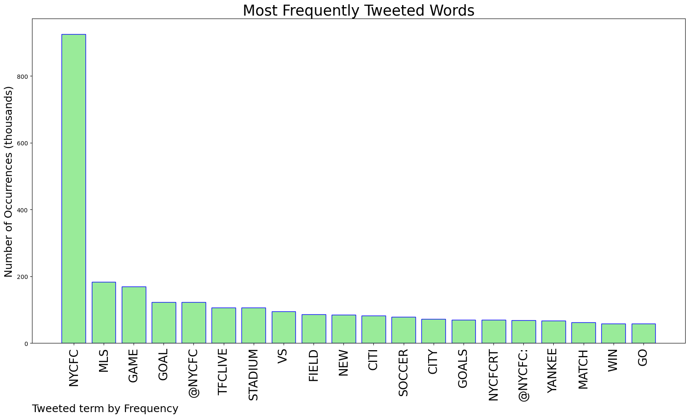
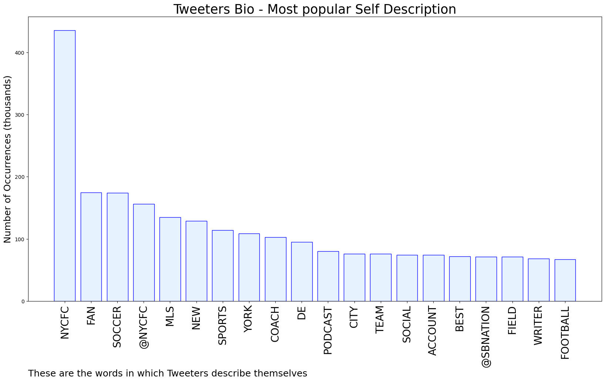

# MURCHIE85 TWITTER PROCESSING 
&#x1F34E; **TOPIC = "#NYCFC"**

## AUTOMATED RESEARCH SUMMARY

*note: Image pulled from web automatically, not connected to author.
  
<b> This report is AUTOMATED and not hand crafted, it is designed for pulling metrics on a given keyword or hashtag and performs a series of reporting and analysis.</b>

|                **Sample-Tweets**        |
| :-------------: |
| @NYCFC Not when how slow the subways run on the weekends and all the fear and anxiety the riders have to face in th… https://t.co/oGa8Wm3Xpz |
| Taty is truly a menace 😜 #NYCFC https://t.co/wOqRHLWCNG |
| How are European clubs not driving a Brinks truck straight to #NYCFC’s front office for Taty??? |

The most popular user is: **horvathszn**

 RT @NYCFC: Yesterday was epic #NYCFC https://t.co/JA5yvo96zZ

## RELATED METRICS 
| Metric | Value |
| ------------- | ------------- |
| #1 Most tweeted to  | **NYCFC** |
| #2 Most tweeted to  | **GlennCrooks** |
| #3 Most tweeted to  | **MLS** |
| NewProfiles (less than 10 days) | 0.12%  |
| Tweeters with < 10 followers  | 2.44%|
| Tweeters with > 1000000 followers  | 0.18%  |

## MOST POPULAR TWEET TERMS 

| Popularity Rank  | Term |
| ------------- | ------------- |
| first  | **NYCFC**  |
| second  | **MLS**  |
| third  | **GAME** |
| fourth  | **GOAL**  |
| fifth  | **@NYCFC**  |

## Twitter Bio Analysis
### SENTIMENT ANALYSIS

VIEWS WERE : **SUBJECTIVE**  (46.67%) & **NEGATIVELY-SUBJECTIVE** (13.33%) **OBJECTIVE** (40.0%)

### TWEET SAMPLE 
| Random value picked from array |
| ------------- |
|RT @NYCFCCityBoys: Some people grow up with a security blanket. Tayvon Gray has a security security. #NYCFC @tayvongray4 https://t.co/cbFtQ… |

### MOST RETWEETED 

| The most retweeted user is: **horvathszn**  |
| ------------- |
| RT @NYCFC: Yesterday was epic #NYCFC https://t.co/JA5yvo96zZ |

### CONCLUSION & EXTERNAL ANALYSIS

*This is my [Adam McMurchie`s] opinion on the data from the tweets, it serves as no objective truth.Since the tweets themselves are a mixture of fact & opinion. 
Authors analytical summary on request.
**RECOMMENDATIONS** WILL BE UPDATED IN NEXT  24 HOURS  