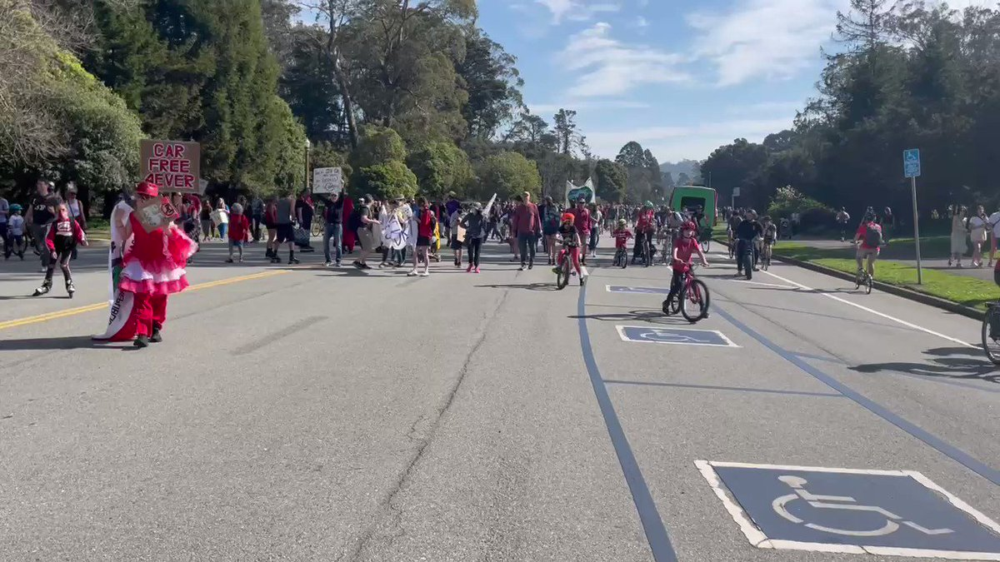
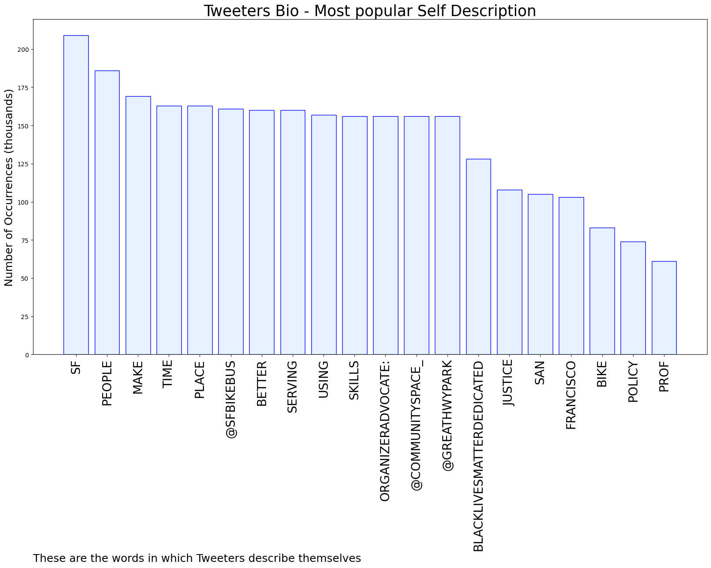

# MURCHIE85 TWITTER PROCESSING 
&#x1F34E; **TOPIC = "#CarFreeJFK"**

## AUTOMATED RESEARCH SUMMARY

*note: Image pulled from web automatically, not connected to author.
  
<b> This report is AUTOMATED and not hand crafted, it is designed for pulling metrics on a given keyword or hashtag and performs a series of reporting and analysis.</b>

|                **Sample-Tweets**        |
| :-------------: |
| RT @MaloneRuth: Incredible turnout for #CarFreeJFK this morning! Time to move forward. #NoGoingBack https://t.co/HD410zUPL1 |
| RT @LukeBornheimer: @davewongillies Help make #CarFreeJFK permanent in less than a minute before the final vote on Tuesday:1⃣ Send an ema… |
| RT @RafaelMandelman: We're on! Next Tues 4/26 at 9am, San Francisco Board of Supervisors will convene a joint session with SFCTA for a vote… |

The most popular user is: **jwdmeow**

 RT @hknightsf: No better place to be on a sunny, spring day in San Francisco than Golden Gate Park — and #CarFreeJFK. The Board of Supervis…

## RELATED METRICS 
| Metric | Value |
| ------------- | ------------- |
| #1 Most tweeted to  | **walksf** |
| #2 Most tweeted to  | **hknightsf** |
| #3 Most tweeted to  | **sfbike** |
| NewProfiles (less than 10 days) | 0.0%  |
| Tweeters with < 10 followers  | 0.57%|
| Tweeters with > 1000000 followers  | 0.0%  |

## MOST POPULAR TWEET TERMS 

| Popularity Rank  | Term |
| ------------- | ------------- |
| first  | **CARFREEJFK**  |
| second  | **PERMANENT**  |
| third  | **THAN** |
| fourth  | **MAKE**  |
| fifth  | **HELP**  |

## Twitter Bio Analysis
### SENTIMENT ANALYSIS

VIEWS WERE : **SUBJECTIVE**  (46.67%) & **NEGATIVELY-SUBJECTIVE** (13.33%) **OBJECTIVE** (40.0%)

### TWEET SAMPLE 
| Random value picked from array |
| ------------- |
|RT @ewan_sf: This Tuesday the Board of Supervisors will decide the future of #CarFreeJFK.JFK has become a community resource, with people… |

### MOST RETWEETED 

| The most retweeted user is: **jwdmeow**  |
| ------------- |
| RT @hknightsf: No better place to be on a sunny, spring day in San Francisco than Golden Gate Park — and #CarFreeJFK. The Board of Supervis… |

### CONCLUSION & EXTERNAL ANALYSIS

*This is my [Adam McMurchie`s] opinion on the data from the tweets, it serves as no objective truth.Since the tweets themselves are a mixture of fact & opinion. 
Authors analytical summary on request.
**RECOMMENDATIONS** WILL BE UPDATED IN NEXT  24 HOURS  