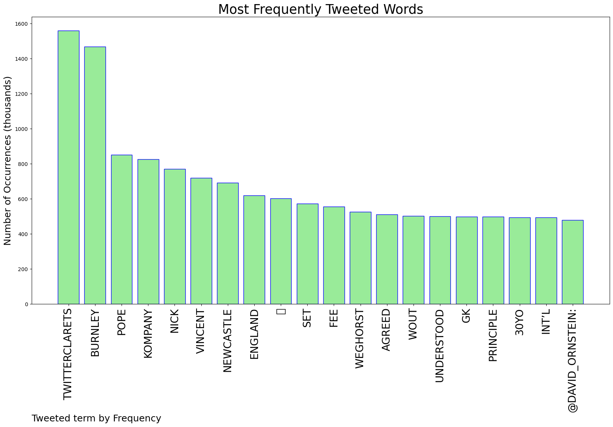
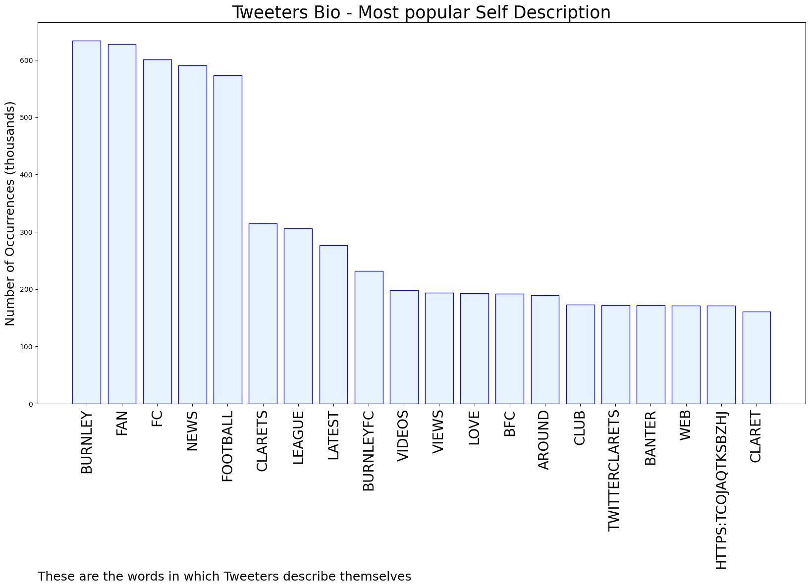

# MURCHIE85 TWITTER PROCESSING 
&#x1F34E; **TOPIC = "#twitterclarets"**

## AUTOMATED RESEARCH SUMMARY

*note: Image pulled from web automatically, not connected to author.
  
<b> This report is AUTOMATED and not hand crafted, it is designed for pulling metrics on a given keyword or hashtag and performs a series of reporting and analysis.</b>

|                **Sample-Tweets**        |
| :-------------: |
| RT @ClaretXtra: 🚨🗞| Burnley are absolutely determined to not let Nathan Collins leave the club this summer.[Credit - @adjones_journo]#T… |
| “Possession with impact,” is how Kompany described his style to Rio Ferdinand’s Five podcast last year. “I include… https://t.co/7cSXFgcorC |
| Michael Duff is the new Barnsley manager #BurnleyFC #Clarets #BFC #twitterclarets | Up The Clarets https://t.co/JJAc1NCvwX |

The most popular user is: **og_numbnuts**

 RT @David_Ornstein: 🚨 Newcastle understood to have agreed fee in principle with Burnley for Nick Pope. 30yo England int’l GK now set to und…

## RELATED METRICS 
| Metric | Value |
| ------------- | ------------- |
| #1 Most tweeted to  | **David_Ornstein** |
| #2 Most tweeted to  | **TheFLZone** |
| #3 Most tweeted to  | **ClaretXtra** |
| NewProfiles (less than 10 days) | 0.66%  |
| Tweeters with < 10 followers  | 2.58%|
| Tweeters with > 1000000 followers  | 0.02%  |

## MOST POPULAR TWEET TERMS 

| Popularity Rank  | Term |
| ------------- | ------------- |
| first  | **TWITTERCLARETS**  |
| second  | **BURNLEY**  |
| third  | **POPE** |
| fourth  | **KOMPANY**  |
| fifth  | **NICK**  |

## Twitter Bio Analysis
### SENTIMENT ANALYSIS

VIEWS WERE : **SUBJECTIVE**  (40.0%) & **NEGATIVELY-SUBJECTIVE** (13.33%) **OBJECTIVE** (46.67%)

### TWEET SAMPLE 
| Random value picked from array |
| ------------- |
|RT @boote2012: Wout Weghorst PL Highlights 2022 #twitterclarets https://t.co/0LpYUJ1Vm5 |

### MOST RETWEETED 

| The most retweeted user is: **og_numbnuts**  |
| ------------- |
| RT @David_Ornstein: 🚨 Newcastle understood to have agreed fee in principle with Burnley for Nick Pope. 30yo England int’l GK now set to und… |

### CONCLUSION & EXTERNAL ANALYSIS

*This is my [Adam McMurchie`s] opinion on the data from the tweets, it serves as no objective truth.Since the tweets themselves are a mixture of fact & opinion. 
Authors analytical summary on request.
**RECOMMENDATIONS** WILL BE UPDATED IN NEXT  24 HOURS  