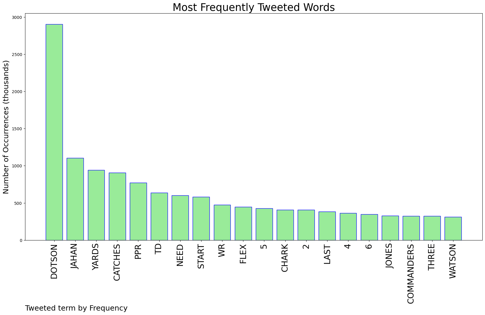
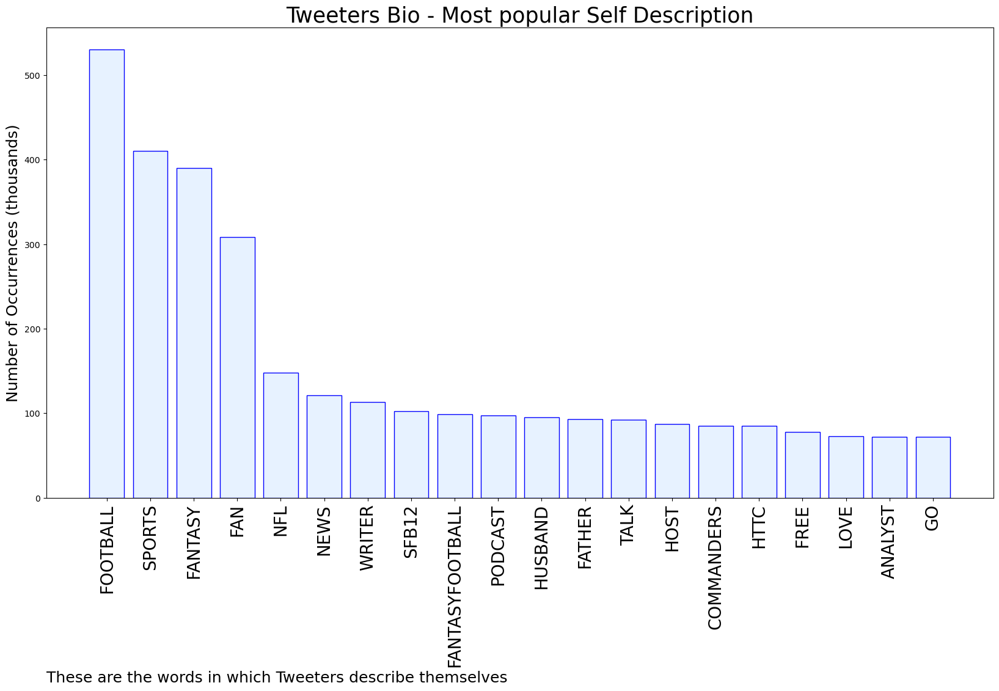

# MURCHIE85 TWITTER PROCESSING 
&#x1F34E; **TOPIC = "Dotson"**

## AUTOMATED RESEARCH SUMMARY

*note: Image pulled from web automatically, not connected to author.
  
<b> This report is AUTOMATED and not hand crafted, it is designed for pulling metrics on a given keyword or hashtag and performs a series of reporting and analysis.</b>

|                **Sample-Tweets**        |
| :-------------: |
| @Robabernathy25 Dotson safest. Davis the HR swing |
| @ZBrook @FFToday Need 2 z Jones, Dotson, and mcclaurin .5 ppr |
| @JPFinlayNBCS Terry or Jon Allen. Dotson right up there with them along with Payne. Unless your talking about who c… https://t.co/U9bHk4FwFQ |

The most popular user is: **2real_Dotson**

 RT @onlycaelik: “approved” “accepted” “congratulations” all 2023.

## RELATED METRICS 
| Metric | Value |
| ------------- | ------------- |
| #1 Most tweeted to  | **FieldYates** |
| #2 Most tweeted to  | **NFLFantasy** |
| #3 Most tweeted to  | **FantasyPros** |
| NewProfiles (less than 10 days) | 0.96%  |
| Tweeters with < 10 followers  | 13.4%|
| Tweeters with > 1000000 followers  | 0.0%  |

## MOST POPULAR TWEET TERMS 

| Popularity Rank  | Term |
| ------------- | ------------- |
| first  | **DOTSON**  |
| second  | **JAHAN**  |
| third  | **YARDS** |
| fourth  | **CATCHES**  |
| fifth  | **PPR**  |

## Twitter Bio Analysis
### SENTIMENT ANALYSIS

VIEWS WERE : **SUBJECTIVE**  (26.67%) & **NEGATIVELY-SUBJECTIVE** (20.0%) **OBJECTIVE** (53.33%)

### TWEET SAMPLE 
| Random value picked from array |
| ------------- |
|@Ethan_P11 @AdamSchefter Get Dotson. |

### MOST RETWEETED 

| The most retweeted user is: **2real_Dotson**  |
| ------------- |
| RT @onlycaelik: “approved” “accepted” “congratulations” all 2023. |

### CONCLUSION & EXTERNAL ANALYSIS

*This is my [Adam McMurchie`s] opinion on the data from the tweets, it serves as no objective truth.Since the tweets themselves are a mixture of fact & opinion. 
Authors analytical summary on request.
**RECOMMENDATIONS** WILL BE UPDATED IN NEXT  24 HOURS  