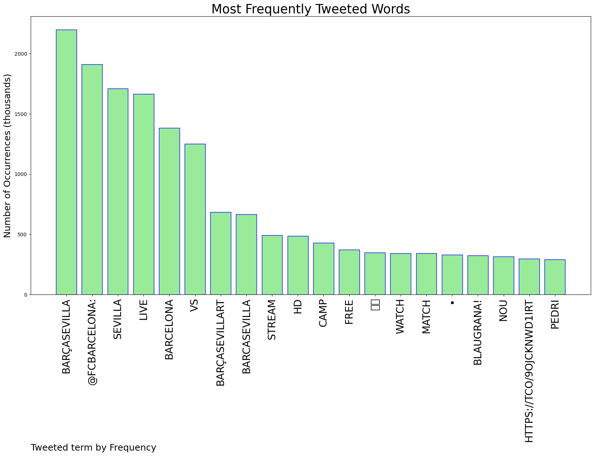
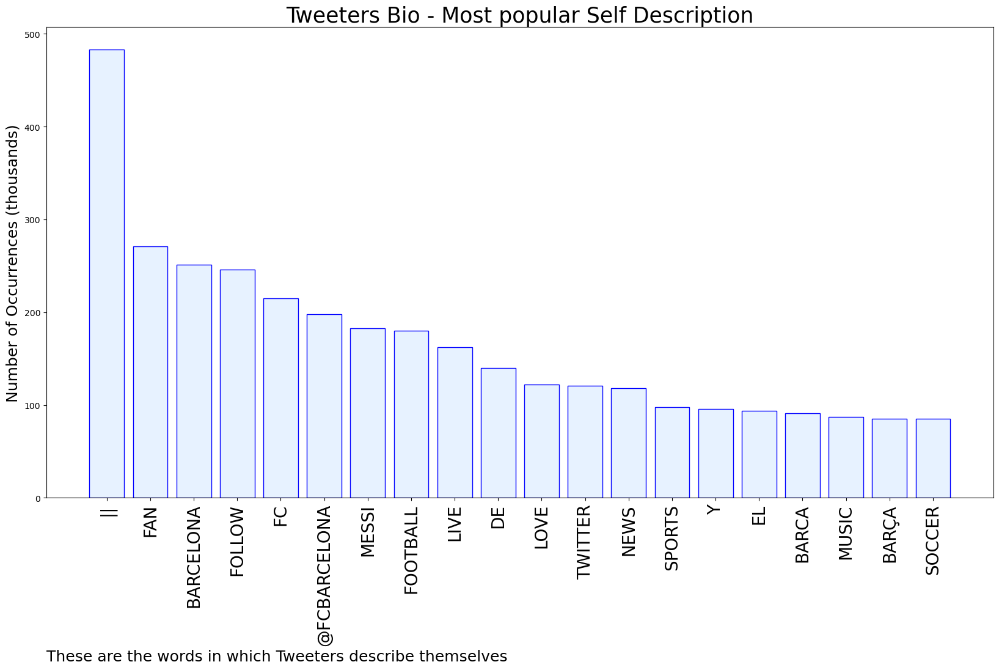

# MURCHIE85 TWITTER PROCESSING 
&#x1F34E; **TOPIC = "#BarcaSevilla"**

## AUTOMATED RESEARCH SUMMARY

*note: Image pulled from web automatically, not connected to author.
  
<b> This report is AUTOMATED and not hand crafted, it is designed for pulling metrics on a given keyword or hashtag and performs a series of reporting and analysis.</b>

|                **Sample-Tweets**        |
| :-------------: |
| Tough to break down Sevilla. Best defense in the league this season. #BarcaSevilla |
| ⚽️LIVE HD MATCH ⚽️Barcelona vs Sevilla En vivoFC Barcelona vs. Sevilla FCLive Streaming Link:Live ​LINK 1&gt;&gt;… https://t.co/0uBHtR16Iw |
| RT @FCBarcelona: 🖥 A guide to worldwide kick-off times and broadcasters for #BarçaSevilla |

The most popular user is: **mo_showtime**

 RT @FCBarcelona: It's been two long weeks ...
#BarçaSevilla https://t.co/W69K0REsAX

## RELATED METRICS 
| Metric | Value |
| ------------- | ------------- |
| #1 Most tweeted to  | **FCBarcelona** |
| #2 Most tweeted to  | **BarcaTimes** |
| #3 Most tweeted to  | **FerranTorres20** |
| NewProfiles (less than 10 days) | 1.82%  |
| Tweeters with < 10 followers  | 9.12%|
| Tweeters with > 1000000 followers  | 0.28%  |

## MOST POPULAR TWEET TERMS 

| Popularity Rank  | Term |
| ------------- | ------------- |
| first  | **BARÇASEVILLA**  |
| second  | **@FCBARCELONA:**  |
| third  | **SEVILLA** |
| fourth  | **LIVE**  |
| fifth  | **BARCELONA**  |

## Twitter Bio Analysis
### SENTIMENT ANALYSIS

VIEWS WERE : **SUBJECTIVE**  (53.33%) & **NEGATIVELY-SUBJECTIVE** (6.67%) **OBJECTIVE** (40.0%)

### TWEET SAMPLE 
| Random value picked from array |
| ------------- |
|For a moment I was worried man 😭😭😭, Busq scared me #BarcaSevilla |

### MOST RETWEETED 

| The most retweeted user is: **mo_showtime**  |
| ------------- |
| RT @FCBarcelona: It's been two long weeks ...#BarçaSevilla https://t.co/W69K0REsAX |

### CONCLUSION & EXTERNAL ANALYSIS

*This is my [Adam McMurchie`s] opinion on the data from the tweets, it serves as no objective truth.Since the tweets themselves are a mixture of fact & opinion. 
Authors analytical summary on request.
**RECOMMENDATIONS** WILL BE UPDATED IN NEXT  24 HOURS  