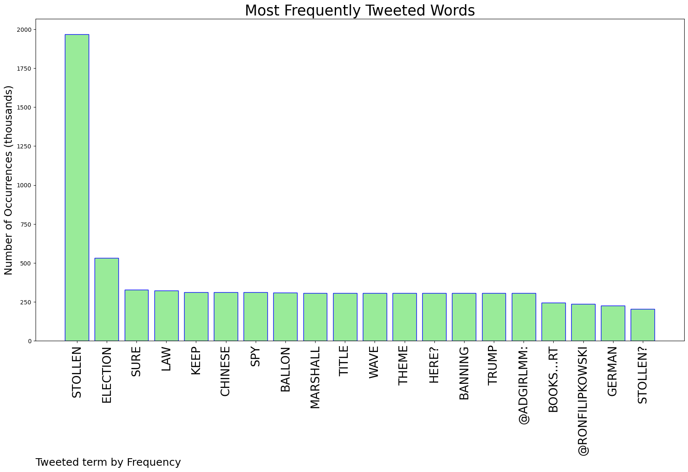
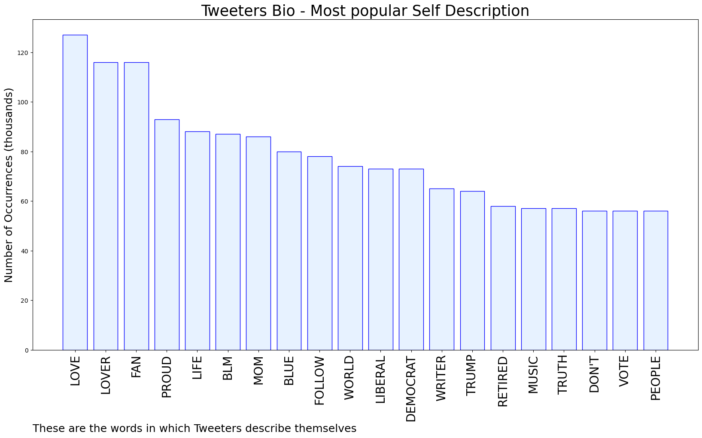

# MURCHIE85 TWITTER PROCESSING 
&#x1F34E; **TOPIC = "Stollen"**

## AUTOMATED RESEARCH SUMMARY

*note: Image pulled from web automatically, not connected to author.
  
<b> This report is AUTOMATED and not hand crafted, it is designed for pulling metrics on a given keyword or hashtag and performs a series of reporting and analysis.</b>

|                **Sample-Tweets**        |
| :-------------: |
| @RonFilipkowski Isn’t stollen a cake/bread? |
| @KellDA Isn't there a type of bread/dessert called a stollen? |
| RT @3Dman44: @RepSwalwell He could take an "L" from his dad's "STOLLEN" and all will be well. |

The most popular user is: **_elmolina_**

 RT @StephenKing: Trump writes that the election was stollen.
😂

## RELATED METRICS 
| Metric | Value |
| ------------- | ------------- |
| #1 Most tweeted to  | **RonFilipkowski** |
| #2 Most tweeted to  | **adgirlMM** |
| #3 Most tweeted to  | **KellDA** |
| NewProfiles (less than 10 days) | 0.84%  |
| Tweeters with < 10 followers  | 8.81%|
| Tweeters with > 1000000 followers  | 0.05%  |

## MOST POPULAR TWEET TERMS 

| Popularity Rank  | Term |
| ------------- | ------------- |
| first  | **STOLLEN**  |
| second  | **ELECTION**  |
| third  | **SURE** |
| fourth  | **LAW**  |
| fifth  | **KEEP**  |

## Twitter Bio Analysis
### SENTIMENT ANALYSIS

VIEWS WERE : **SUBJECTIVE**  (26.67%) & **NEGATIVELY-SUBJECTIVE** (20.0%) **OBJECTIVE** (53.33%)

### TWEET SAMPLE 
| Random value picked from array |
| ------------- |
|RT @JKash000: No need to watch.  I know the State of the Union:  STOLLEN!!! |

### MOST RETWEETED 

| The most retweeted user is: **_elmolina_**  |
| ------------- |
| RT @StephenKing: Trump writes that the election was stollen.😂 |

### CONCLUSION & EXTERNAL ANALYSIS

*This is my [Adam McMurchie`s] opinion on the data from the tweets, it serves as no objective truth.Since the tweets themselves are a mixture of fact & opinion. 
Authors analytical summary on request.
**RECOMMENDATIONS** WILL BE UPDATED IN NEXT  24 HOURS  